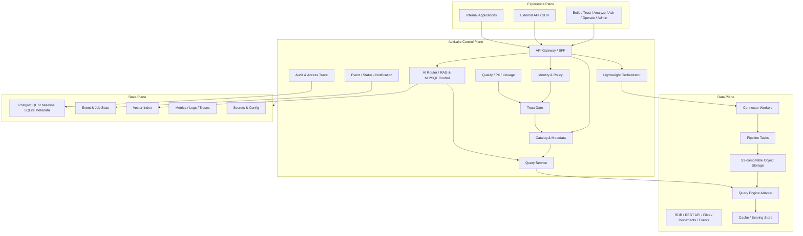

# 02. 아키텍처

## 1) 아키텍처 원칙

AskLake 아키텍처는 현재 구현 baseline과 Target Architecture를 분리해 기록한다.
현재 baseline은 실제 동작하는 코드와 검증 증거를 설명하고, Target Architecture는 `Trusted Dataset -> Query/Ask -> Evidence -> Recovery` 신뢰 루프를 완성하기 위한 방향을 설명한다.

핵심 원칙:

- UI와 외부 client는 개별 엔진에 직접 접근하지 않고 AskLake API를 통해 명령한다.
- AskLake Control Plane은 dataset 상태, policy, quality, lineage, audit, AI evidence를 직접 소유한다.
- 실행 엔진, query engine, object storage, vector store, LLM은 교체 가능한 adapter 뒤에 둔다.
- current baseline은 target을 제한하지 않으며, target은 current implementation status를 명확히 표시한다.
- 비용, 권한, production 영향이 있는 cloud resource는 approval gate 뒤에만 생성한다.

## 2) Current Implementation Baseline

현재 구현 baseline은 M0~M5와 이후 구조 정렬에서 완료된 동작이다.

| 영역 | 현재 상태 | 증거/비고 |
| --- | --- | --- |
| Runtime | FastAPI backend + React/Vite frontend | Docker Compose와 health smoke 가능 |
| Metadata | SQLite-backed `MetadataStore` | source/catalog/pipeline/run metadata 저장 |
| Source | CSV/local file source | `samples/orders.csv` 기반 demo |
| Pipeline | `PipelineService` 동기 실행 | `select_fields` transform 중심 |
| Result storage | local CSV `ResultStore` | result dataset metadata가 catalog에 연결 |
| Catalog | list/detail, schema, row count, sample, status | `ready` 중심 baseline contract |
| Infra | CI, Docker, Kubernetes manifest, AWS approval checklist | 실제 AWS resource 없음 |

### Backend Layering

```text
backend/app/
  api/       HTTP router와 HTTP error mapping
  services/  use case orchestration
  ports/     MetadataStore, SourceConnector, ResultStore 같은 Protocol/interface
  adapters/  SQLite, CSV, future Postgres/Mongo/S3 구현체
  domain/    API/domain schema와 value object
  core/      settings, dependency container, app factory
```

의존 방향:

```text
api -> services -> ports/domain
adapters -> ports/domain
core -> api/services/adapters
```

### Frontend Layering

```text
frontend/src/
  api/               resource별 backend client와 shared http client
  app/               app shell, route mapping, and global styles
  components/        shared UI components
  design-system/     UI tokens and reusable primitive components
  features/catalog/  source form, catalog list/detail, catalog state hook
  features/pipeline/ pipeline run panel and run state hook
```

## 3) Target Architecture

Target Architecture는 Experience Plane, AskLake Control Plane, Data Plane, State Plane, Deployment Plane으로 구분한다.



## 4) Control Plane 책임

Control Plane은 AskLake 제품 고유 영역이다.
엔진이 교체되어도 사용자와 자산의 상태 모델은 유지되어야 한다.

| 컴포넌트 | 책임 | Current status |
| --- | --- | --- |
| API Gateway / BFF | UI/API 요청의 단일 진입점, auth, command routing | health/source/catalog/pipeline API baseline |
| Identity & Policy | RBAC, masking, AI access, access request | Target |
| Trust Gate | quality, freshness, PII, owner, policy, approval 조건 관리 | Target R1 |
| Catalog & Metadata | dataset, schema, owner, status, usage metadata | baseline catalog 있음, target 확장 필요 |
| Lightweight Orchestrator | DAG, schedule, retry, rerun, backfill, idempotent commit | baseline `PipelineService`, target 확장 필요 |
| Quality / PII / Lineage | 품질 규칙, PII 후보, lineage graph, impact analysis | Target |
| Query Service | SQL guard, policy preflight, result/history/evidence | Target |
| AI Router / RAG Control | SQL/RAG/Hybrid/Unsupported routing, retrieval policy | Target |
| Audit & Access Trace | user, query, data, AI, policy decision 기록 | Target |
| Event / Status / Notification | async job, health, alert, incident 상태 | Target |

## 5) Data Plane

Data Plane은 실제 데이터 이동과 계산을 수행한다.
대용량/복합 데이터셋을 수집, 변환, 정규화, 저장, 검산하는 실행 경로이며, Control Plane이 명령, 정책, 상태, evidence를 관리하고 Data Plane은 adapter로 교체 가능해야 한다.

| 영역 | Target | Current baseline |
| --- | --- | --- |
| Source connectors | RDB, REST API, CSV/JSON/Parquet, S3-compatible storage, documents, event replay 후보 | CSV/local file |
| Pipeline tasks | Source, Transform/Normalize/Aggregate, Quality, Load/Sink, Retry, Rerun, Backfill, row count/bytes/duration evidence | `select_fields` transform |
| Object storage | S3-compatible Raw/Curated zone, Parquet partitions, output path evidence | local CSV output |
| Query engine | 검산과 분석용 adapter 경계, Trino/Athena/local engine 후보 | 없음 |
| Serving | Result cache, serving store, dashboard/API output | 없음 |
| Vector/RAG | metadata/document/metric 중심 index | 없음 |

Kafka, CDC, Flink, external Airflow adapter, 전용 Vector DB는 Target MVP의 필수 baseline으로 취급하지 않는다.
각 기능은 실제 SLA, 비용, 운영 근거가 있을 때 Decision Phase 뒤에 확장한다.

## 6) State Plane

State Plane은 Control Plane이 신뢰 상태를 유지하기 위해 필요한 영속 상태다.

| 상태 | 설명 | 비고 |
| --- | --- | --- |
| Metadata DB | catalog, dataset, schema, owner, policy, approval, audit pointer | current SQLite, target PostgreSQL 후보 |
| Job/Event State | run, task, outbox, idempotency key, backfill range | target R2 |
| Audit Event | user, role, purpose, resource, action, policy result | target |
| Retrieval Trace | question, route, query execution, chunk, model/prompt version | target R5 |
| Vector Index | metadata, metric, document 중심 index | external DB 여부 Decision 필요 |
| Secrets & Config | credential reference, provider, environment config | secret 값 commit 금지 |

## 7) 핵심 상태 모델

Target MVP는 상태 혼합을 피한다.

| 대상 | 상태 |
| --- | --- |
| Pipeline Version | `Draft`, `Validating`, `Approval Pending`, `Approved`, `Deploying`, `Active`, `Suspended`, `Archived` |
| Run / Task | `Queued`, `Running`, `Succeeded`, `Partially Succeeded`, `Failed`, `Cancelled` |
| Dataset | `Draft`, `Verifying`, `Trusted`, `Degraded`, `Blocked`, `Archived` |
| Approval | `Pending`, `Changes Requested`, `Approved`, `Rejected`, `Cancelled`, `Expired` |
| RAG Index | `Not Configured`, `Draft`, `Building`, `Ready`, `Stale`, `Failed`, `Disabled` |

Current baseline의 catalog `ready` status는 baseline contract로 보존한다.
Target MVP 구현 시에는 dataset trust status로 확장하거나 migration path를 정의한다.

## 8) Target MVP 핵심 흐름

### 흐름 A. Current Baseline

```text
1. User -> UI: CSV/local source 등록
2. UI -> API: source metadata 저장
3. API -> MetadataStore: schema/row count/sample 저장
4. User -> UI: select_fields pipeline run 실행
5. PipelineService -> ResultStore: local CSV 결과 저장
6. API -> Catalog: result dataset metadata 기록
7. UI -> User: run status와 catalog result 표시
```

### 흐름 B. Trusted Dataset 게시

```text
1. User -> Source API: source 연결과 schema discovery 요청
2. Data Plane -> Pipeline Task: schema inference/user override, transform/normalize/load 실행
3. Data Plane -> Object Storage: Parquet 또는 S3-compatible output 저장
4. Query Adapter -> Dataset Evidence: row count, bytes, duration, SQL 검산 기록
5. Control Plane -> Catalog: dataset draft 생성
6. Trust Gate -> Quality/PII/Policy: 필수 gate 평가
7. Steward -> Approval: 변경 diff와 영향 자산 검토
8. Control Plane -> Dataset: 조건 통과 시 Trusted 게시
9. Audit Event: 변경, 승인, 정책 결과 기록
```

### 흐름 C. Query/Ask와 Evidence

```text
1. User -> Query/Ask: 질문 또는 SQL 실행
2. Control Plane -> Policy: 권한, masking, scan/cost preflight
3. Query Service -> Query Engine: 허용된 데이터만 실행
4. AI Router -> RAG/NL2SQL: SQL/RAG/Hybrid/Unsupported route 결정
5. Evidence Policy -> Response: SQL, dataset, metric, document, freshness, lineage, trace 연결
6. Audit Event: 질문, 검색, SQL, 접근 결정, 답변 기록
```

### 흐름 D. Recovery

```text
1. Pipeline/Quality/Schema event가 실패를 기록
2. Status Center가 영향 dataset, dashboard, AI index, answer 후보를 표시
3. Dataset이 Degraded 또는 Blocked로 전환
4. User가 retry/rerun/backfill 범위와 idempotency key를 확인
5. 성공 후 quality와 freshness를 재검증하고 Trusted 상태를 복구
6. Incident, audit, notification 기록
```

## 9) 외부 연동

| 연동 | 목적 | 실패 대응 |
| --- | --- | --- |
| GitHub Issues / PRs | 작업 추적과 merge 후 issue close | PR 템플릿과 `sync.md`에서 closing keyword 확인 |
| GitHub Project / Notion sync | 보드 상태 동기화 | `.github/workflows/notion-issue-sync.yml` 결과와 secrets 설정 확인 |
| GitHub Actions | CI/CD 실행 | 실패 job log를 확인하고 배포를 중단 |
| Docker / Compose | current baseline local/container 실행 | `scripts/smoke-container-app.sh` 실패 시 완료 보류 |
| Kubernetes / Helm | target dev-lite packaging 후보 | secret 없는 manifest/helm validation 먼저, real deploy는 approval gate |
| AWS 후보 | ECR/EKS/S3/RDS 등 target runtime 후보 | 비용/resource 생성 전 approval checklist 필요 |
| LLM provider 후보 | Ask/NL2SQL/RAG model execution | LLM Gateway, redaction, evaluation, policy trace 필요 |

## 10) 운영과 배포

### 환경

- Local/container: current baseline과 Target MVP 개발의 기본 smoke 환경
- dev-lite Kubernetes: Target packaging 후보
- Staging/Production: deferred

### Secret과 환경 변수

- 실제 secret은 commit하지 않는다.
- `.env.example` 또는 동등한 예시 파일은 실제 값 없이 유지한다.
- source credential은 값이 아니라 secret reference로 저장한다.
- Audit log와 prompt/retrieval trace도 민감정보 마스킹과 접근 제어 대상이다.

### 상태 확인

- Backend health endpoint responds.
- Frontend loads the app shell.
- Current baseline sample source/pipeline run succeeds or clear failed state를 보여준다.
- Target MVP에서는 Metadata DB, Object Storage, Query Engine, Worker, AI Gateway health가 각 모듈별로 확인되어야 한다.

### 마이그레이션과 롤백

- Current baseline SQLite/local output은 sample source와 pipeline config로 재생성할 수 있다.
- Target MVP에서 dataset status, job state, audit event, retrieval trace가 추가되면 migration과 rollback note가 필요하다.
- 잘못된 data publish나 backfill은 dataset `Blocked`와 재처리 계획으로 복구한다.

## 11) 미확정 Architecture Decision

- Metadata DB를 언제 SQLite에서 PostgreSQL로 전환할지.
- R1 Trust Gate에서 품질/PII/policy를 실제 엔진으로 구현할지, 먼저 상태 모델과 placeholder gate로 둘지.
- R3 첫 확장 source를 PostgreSQL로 할지 REST API로 할지.
- R4 query engine을 local DuckDB로 시작할지 Trino를 포함할지.
- R5 LLM Gateway에서 외부 모델을 사용할지 mock/local rule 기반으로 시작할지.
- Kubernetes/Helm dev-lite를 Target MVP 필수 검증으로 둘지 packaging hardening으로 분리할지.
