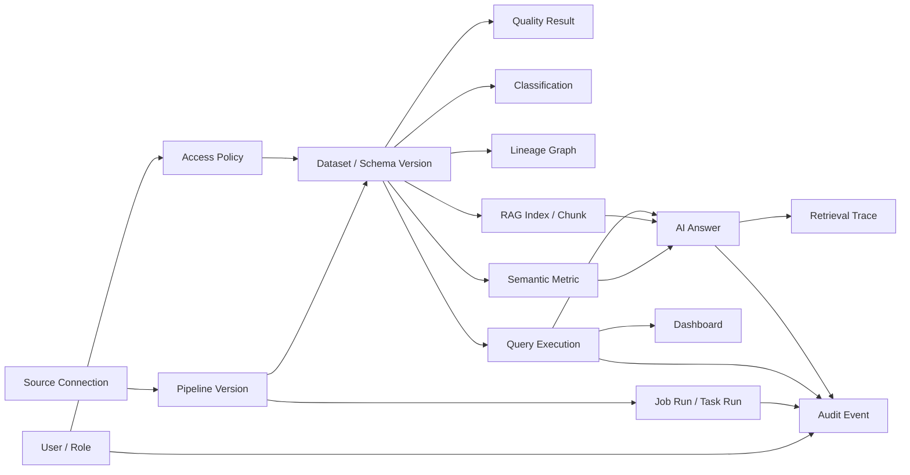

# 03. 인터페이스 기준

이 문서는 API, CLI 명령, UI 계약, event schema, background job, 내부 도구, 외부 연동 계약을 기록하는 기준 문서다.
Current implementation baseline contract와 Target MVP interface family를 분리해 관리한다.

## 1) 공통 규칙

- Base URL / command namespace / entrypoint: local backend `http://localhost:8000/api`
- Request/response format: API는 JSON, 사람 작업 흐름은 browser UI
- Naming conventions: code identifier는 원문을 유지하고, 협업 문서는 한국어로 작성한다.
- Idempotency: 실행, backfill, event 소비는 중복 요청과 중복 event를 고려한다.
- Secret: credential 값은 API payload나 metadata DB에 직접 저장하지 않고 secret reference로 저장한다.
- Policy: Query, Ask, RAG retrieval, prompt assembly는 동일한 권한 판단을 공유해야 한다.

## 2) 인증과 접근 제어

### Current Baseline

- Authentication: baseline demo에서는 보류한다.
- Authorization: baseline demo에서는 보류한다.
- Public/private boundaries: local demo만 대상으로 하며 실제 secret이나 production data를 사용하지 않는다.

### Target MVP

- Authentication: 사용자, 역할, 목적 정보를 policy decision과 audit event에 연결한다.
- Authorization: dataset/table/column 단위 policy와 action별 권한을 구분한다.
- Masking: 원본 접근이 불가능하면 마스킹 대안을 제공하거나 실행 전에 차단한다.
- Access Request: 차단된 자원, 필요한 권한, 목적, 기간을 포함해 요청할 수 있어야 한다.
- AI access: SQL, RAG retrieval, prompt, final answer 모든 단계에서 허용된 데이터만 사용한다.

## 3) 상태, 오류, 실패 형식

| 조건 | 기대 결과 |
| --- | --- |
| Invalid source config | API returns validation error and UI shows actionable message. |
| Pipeline run fails | Run status becomes `failed` and stores a short error/log. |
| Result dataset unavailable | Catalog detail shows not ready or failed state instead of pretending success. |
| Trust gate remains incomplete | Dataset is not exposed as `Trusted`; remaining gate is visible. |
| Policy denies query or ask | Request is blocked before execution/retrieval/prompt and access request path is offered when applicable. |
| Evidence is insufficient | Ask result is `Insufficient Evidence` or deferred instead of a confident answer. |
| Schema drift or quality failure occurs | Dataset becomes `Degraded` or `Blocked`; impacted assets are discoverable. |

## 4) Current Baseline Interface

### Health API

- Type: API
- Endpoint: `GET /health`, `GET /api/health`
- Output:

```json
{
  "service": "asklake-backend",
  "status": "ok",
  "app": "AskLake"
}
```

### Source / Catalog 계약

- Type: API/UI/Internal store
- Default source type: CSV/local file
- Metadata store: SQLite implementation behind `MetadataStore`
- ID rule: API에 노출되는 `source_id`, `dataset_id`는 string UUID로 둔다.
- Required endpoints:

```text
POST /api/sources
GET /api/sources
GET /api/sources/{source_id}
GET /api/catalog/datasets
GET /api/catalog/datasets/{dataset_id}
```

- `POST /api/sources` minimum request:

```json
{
  "name": "sample_orders",
  "type": "csv",
  "path": "samples/orders.csv"
}
```

- Catalog dataset minimum response:

```json
{
  "id": "dataset_001",
  "name": "sample_orders",
  "source_type": "csv",
  "schema": [
    { "name": "order_id", "type": "string" },
    { "name": "amount", "type": "number" }
  ],
  "row_count": 100,
  "sample": [
    { "order_id": "A001", "amount": 12000 }
  ],
  "status": "ready",
  "owner": "unassigned",
  "trust_status": "Draft",
  "trust_gate_result": {
    "id": "trust_gate_001",
    "dataset_id": "dataset_001",
    "status": "Draft",
    "required_gates": ["schema", "quality", "pii", "owner", "policy", "approval"],
    "passed_gates": ["schema"],
    "failed_gates": ["quality", "pii", "owner", "policy", "approval"],
    "reasons": ["quality gate is pending"],
    "evaluated_at": "2026-06-24T00:00:00Z"
  }
}
```

### Catalog / Trust Gate 계약

- Type: API/UI/Internal store
- Scope: Target R1 최소 구현. baseline `status: ready`는 유지하고 Target 신뢰 상태는 `trust_status`와 `trust_gate_result`로 분리한다.
- Mock/Fake boundary: quality, PII, owner, policy, approval gate는 deterministic placeholder로 계산한다. 실제 PII 탐지, 외부 policy service, secret-backed provider는 포함하지 않는다.
- Endpoint:

```text
POST /api/catalog/datasets/{dataset_id}/trust-gate
```

- Request:

```json
{
  "owner": "data-team",
  "passed_gates": ["schema", "quality", "pii", "owner", "policy", "approval"],
  "failed_gates": []
}
```

- Response: `TrustGateResult`

```json
{
  "id": "trust_gate_001",
  "dataset_id": "dataset_001",
  "status": "Trusted",
  "required_gates": ["schema", "quality", "pii", "owner", "policy", "approval"],
  "passed_gates": ["schema", "quality", "pii", "owner", "policy", "approval"],
  "failed_gates": [],
  "reasons": ["all required trust gates passed"],
  "evaluated_at": "2026-06-24T00:00:00Z"
}
```

Trust status rule:

- `Trusted`: all required gates are passed.
- `Verifying`: no gate has explicitly failed, but one or more required gates are still pending.
- `Blocked`: one or more gates are explicitly listed in `failed_gates`.
- Query / Ask follow-up phases must treat only `Trusted` as the default consumable candidate. `Draft`, `Verifying`, and `Blocked` are default block/defer candidates until a later policy contract states otherwise.

### Baseline Pipeline 계약

- Type: API/UI/Job
- Input: registered source dataset, `select_fields` transform config, target dataset name
- Output: `PipelineRun` with `queued`, `running`, `success`, or `failed` status
- Current endpoints:

```text
POST /api/pipelines
GET /api/pipelines
GET /api/pipelines/{pipeline_id}
POST /api/pipelines/{pipeline_id}/runs
GET /api/pipeline-runs/{run_id}
```

- `POST /api/pipelines` minimum request:

```json
{
  "name": "orders_amounts",
  "source_dataset_id": "dataset_uuid",
  "select_fields": ["order_id", "amount"],
  "target_name": "orders_amounts_result"
}
```

## 5) Target MVP Interface Family

Target MVP는 아래 family를 순차적으로 확정한다.
이번 rebaseline에서는 상세 endpoint를 과도하게 확정하지 않고 family, 상태, 핵심 contract만 둔다.

| Family | 목적 | 핵심 contract | 상태 |
| --- | --- | --- | --- |
| Source API | 연결 등록, 연결 테스트, schema discovery | `SourceConnection`, secret reference, schema/sample preview | baseline + 확장 |
| Source Dataset API | 등록된 source connection에서 raw/source dataset metadata 생성/조회 | `SourceDataset`, `SourceConfig.connection_ref`, schema preview | C-2 구현 |
| Pipeline / Job API | version, validation, deploy, run, retry, rerun, backfill | `PipelineVersion`, `JobRun`, `TaskRun`, idempotency key | target R2 |
| Catalog / Trust API | draft, dataset detail, trust status, lineage, usage | `Dataset`, `DatasetStatus`, `TrustGateResult` | target R1 |
| Quality / PII API | quality rule, result, PII candidate, classification | `QualityRule`, `QualityResult`, `Classification` | target R1/R2 |
| Policy / Access API | RBAC, masking, access request, approval | `AccessPolicy`, `PolicyDecision`, `AccessRequest` | target R4 |
| Query API | preflight, SQL execution, result, saved query | `QueryExecution`, scan/cost/policy result | target R4 |
| Ask / Evidence API | route, answer, evidence, retrieval trace | `AskAnswer`, `EvidenceItem`, `RetrievalTrace` | target R5 |
| Operation / Incident API | status center, alert, incident, impacted asset | `Incident`, `AssetImpact`, `RecoveryAction` | target R6 |
| Admin / Audit API | user, role, config, audit search | `AuditEvent`, `InvestigationCase` | target R4+ |
| Deployment / Health API | module health, readiness, config validation | `ModuleHealth`, `DeploymentProfile` | target R7 |

## 6) Modular Contract Baseline

R0.5 `Modular Contract Baseline`은 Target MVP를 병렬 workstream으로 구현하기 위한 최소 공유 계약이다.
이 계약은 상세 endpoint나 저장소 schema를 고정하지 않고, module 간 mock/fake adapter와 integration spine이 같은 언어를 쓰게 하는 기준이다.

### External Connection Metadata API

Taxi PostgreSQL Source Dataset 등록 slice는 External Connection을 metadata로 저장하고, 저장 전 PostgreSQL 접속/schema preview를 테스트한 뒤 Source Dataset 생성 전에 table schema preview를 조회한다.
MongoDB Source Dataset seed slice는 같은 External Connection API에서 `connection_type=mongodb`를 사용해 local Docker MongoDB collection schema/sample preview를 읽고 Source Dataset metadata로 저장한다.
비밀번호 원문 저장, 연결 테스트 상태 persistence, production credential vault 연동은 제외한다.
`password_secret_ref`는 backend process env 또는 후속 secret store의 참조 이름이며 API 응답에 실제 password 값을 포함하지 않는다.

| Method | Path | Request / Response | Notes |
| --- | --- | --- | --- |
| `POST` | `/api/external-connections/test` | `ExternalConnectionCreate -> ExternalTableSchema` | 저장 없이 env password ref로 PostgreSQL table 또는 MongoDB collection schema preview를 읽는다 |
| `POST` | `/api/external-connections` | `ExternalConnectionCreate -> ExternalConnection` | 현재 실제 저장 대상은 `connection_type=postgres` 또는 `connection_type=mongodb` |
| `GET` | `/api/external-connections` | `ExternalConnection[]` | Source Dataset wizard의 connection 후보로 사용 |
| `GET` | `/api/external-connections/{connection_id}` | `ExternalConnection` | 저장된 connection profile 조회 |
| `GET` | `/api/external-connections/{connection_id}/schemas/{schema_name}/tables/{table_name}` | `ExternalTableSchema` | PostgreSQL은 `schema.table`, MongoDB는 `database.collection`으로 해석한다. row count는 estimate로만 반환 가능 |

`ExternalConnectionCreate` 최소 필드는 `name`, `connection_type`, `host`, `port`, `database`, `username`, `password_secret_ref`, `default_schema`, `default_table`이다.
`ExternalConnectionCreate.connection_type`은 현재 `postgres`와 `mongodb`를 지원한다.
MongoDB에서는 `default_schema`를 database name, `default_table`을 collection name으로 사용하며 응답 `resource_label`은 `collection`이다.
`ExternalTableSchema.schema_preview[]`는 `ColumnSchema`와 같은 `{name, type}` shape를 사용한다.

### Source Dataset Metadata API

C-2 `Source Dataset persistence`는 등록된 External Connection을 `SourceConnection` 표시명으로 보고, 그 connection에서 raw/source layer dataset metadata만 저장한다.
실제 ingest, raw table creation, connector test, credential 저장은 실행하지 않는다.

| Method | Path | Request / Response | Notes |
| --- | --- | --- | --- |
| `POST` | `/api/source-datasets` | `SourceDatasetCreate -> SourceDataset` | `connection_id`, `connection_name`, `connection_type`, `name`, `raw_scope`, `resource_label`, `schema_preview[]` 필요 |
| `GET` | `/api/source-datasets` | `SourceDataset[]` | Target Dataset wizard의 source 후보로 사용 |
| `GET` | `/api/source-datasets/{dataset_id}` | `SourceDataset` | metadata detail 조회 |

`SourceDataset.schema_preview[]`는 `ColumnSchema`와 같은 `{name, type}` shape를 사용한다.
샘플 fixture는 `contracts/source_dataset.sample.json`에 둔다.

### Processing Template API

Product Health Processing Template slice는 M3 Product Health `TransformSpec` / Gold Contract를 Target Dataset wizard의 처리 계획 단계가 검토하고 저장할 수 있는 UI-oriented template으로 노출한다.
이 API는 template 조회만 담당하며 M2 runner 실행, multi-source Source Dataset role mapping, Silver/Gold preview, Catalog 등록, AI Query 연결은 수행하지 않는다.

| Method | Path | Request / Response | Notes |
| --- | --- | --- | --- |
| `GET` | `/api/processing-templates/product-health` | `ProcessingTemplate` | `contracts/product_health_transform_spec.sample.json`, Gold Contract, Schema Definition, Risk Score Policy를 읽어 `flow[]`, `steps[]`, `quality_rules[]`, `output_schema[]`, `metric_definitions[]`를 반환한다 |

`ProcessingTemplate.steps[]`는 M3 operation을 UI 검토용으로 변환한 `{id, phase, operation_type, title, description, input_artifacts, output_artifact, details}` shape다.
`phase`는 `bronze`, `silver`, `aggregate`, `join`, `derive`, `load` 중 하나이며, `details`에는 cast/null policy, aggregate metrics, join keys, derive expressions, load target 같은 원본 contract 정보를 포함한다.
Target Dataset 처리 계획 UI는 이 template을 기본값으로 사용하되 `process_rule.builder_config`에 Source role column mapping과 사용자 확인 상태를 함께 저장할 수 있다. PR 3 MVP에서 추천 template의 normalize, aggregate, join, `risk_score` policy, Gold schema는 review-only 또는 locked로 저장한다.

### Target Dataset Job Draft API

C-3 `Target Dataset job draft`는 Target Dataset wizard Review 결과를 저장한다.
이 단계는 Gold Target Dataset metadata와 처리 계획 draft만 만들며, pipeline run, M5 orchestration, CatalogMetadata 등록은 실행하지 않는다.

| Method | Path | Request / Response | Notes |
| --- | --- | --- | --- |
| `POST` | `/api/target-datasets` | `TargetDatasetCreate -> TargetDataset` | `source_dataset_id`, `source_mappings[]`, `selected_fields`, `process_rule`, `schedule`, `output_schema[]` 필요. `source_dataset_id`는 legacy/primary source reference이고 Product Health 추천 draft는 role별 `source_mappings[]`를 함께 저장한다 |
| `GET` | `/api/target-datasets` | `TargetDataset[]` | 후속 Run handoff와 데모 summary 후보로 사용 |
| `GET` | `/api/target-datasets/{dataset_id}` | `TargetDataset` | 저장된 Target Dataset / 처리 계획 draft 조회 |
| `POST` | `/api/target-datasets/{dataset_id}/runs` | `TargetDatasetRunCreate -> TargetDatasetRun` | 저장된 `job_definition` context를 실행한다. 일반 Target Dataset은 Week 2 fixture handoff를 유지하고, Product Health draft는 `source_snapshots[]`가 있으면 snapshot artifact 기반으로 `gold_product_health.parquet`를 생성한다 |
| `GET` | `/api/target-datasets/{dataset_id}/runs` | `TargetDatasetRun[]` | Target Dataset에 연결된 수동 실행 기록 조회 |
| `GET` | `/api/target-dataset-runs/{run_record_id}` | `TargetDatasetRun` | Target Dataset run link와 `ExecutionResult` 조회 |

`TargetDataset.status`는 C-3에서 항상 `draft`다.
`TargetDataset.source_mappings[]`는 Product Health multi-source draft에서 M3 `source_id`와 실제 Source Dataset을 연결하는 role mapping이다. 현재 허용 role은 `reviews`, `behavior`, `delivery`, `product_master`이며 각 항목은 `{role, source_id, source_dataset_id, source_dataset_name, source_type, required_fields[], optional_fields[], produces_metrics[]}` shape다.
`TargetDataset.job_definition`은 `job_type=target_dataset_etl_draft`, `source_dataset_id`, `source_mappings[]`, `process_rule`, `selected_fields`, `schedule`, `output_schema`, `status=draft`를 포함한다.
`TargetDataset.process_rule`는 현재 두 mode를 허용한다.

- Manual draft: `{type: "select_fields", mode: "manual", selected_fields: string[]}`.
- Product Health Gold pipeline draft: `{type: "product_health_gold_pipeline", mode: "recommended_template", input_kind: "raw_sources", template_id, template_version, final_output: {dataset_id, query_table, layer: "gold", user_facing: true}, internal_stages[], internal_artifacts_visible: false, target_dataset, query_table, source_mappings[], flow[], steps[], quality_rules[], output_schema[], metric_definitions[], locked_fields[], contract_claims}`.

Product Health Gold pipeline draft는 raw source role mapping과 M3 계약 기반 내부 처리 단계를 저장하되, 사용자-facing output은 `dataset_product_health_gold` / `gold_product_health` 하나로 둔다. PR 5B부터 Product Health는 `source_snapshots[]` parquet artifact 기반 multi-source 실행을 지원한다. PostgreSQL/MongoDB/Kafka 같은 원천 connector에서 snapshot을 직접 생성하거나 latest snapshot을 저장소에서 자동 조회하는 기능은 PR 4와 후속 통합 범위다.
`TargetDatasetRun.execution_result.target_dataset_handoff`는 `target_dataset_id`, `target_dataset_name`, `job_definition_status`, `source_dataset_id`, `source_mappings[]`, `selected_fields`, `process_rule`, `schedule`, `output_schema`를 포함한다.
일반 C-4 runtime output은 아직 동적 Target Dataset 산출물이 아니라 Week2 fixture-backed output이다. 따라서 일반 run은 `target_dataset_handoff.runtime_output_scope=week2_fixture_output`, `runtime_output_dataset_id`, `runtime_pipeline_id`를 함께 내려 API evidence가 현재 실행 범위를 보존한다. Product Health run은 PR 5B부터 `product_health_gold_output` 또는 `product_health_gold_output_failed` scope를 사용한다.
Product Health `process_rule.type=product_health_gold_pipeline`인 run은 Week2 reviews fixture를 실행하지 않고 Product Health 전용 Manual Run 경로를 탄다. `TargetDatasetRunCreate.source_snapshots[]`가 들어오면 각 snapshot artifact를 읽어 `gold_product_health.parquet`를 만들고, `execution_result.product_health_manual_run_contract`에 실제 source snapshot, Gold output, quality result, lineage, Catalog payload 값을 채운다. snapshot이 없거나 읽을 수 없으면 성공처럼 처리하지 않고 `status=failed`, `product_health_manual_run_contract.status=failed_product_health_execution`, `error.code=MISSING_SOURCE_SNAPSHOT|SOURCE_SNAPSHOT_ARTIFACT_NOT_FOUND|UNSUPPORTED_SOURCE_SNAPSHOT_FORMAT`로 저장한다. `schema_version`, Gold contract version, `allowed_columns`는 현재 `contracts/product_health_*.sample.json` 내용을 따르며, #310으로 머지된 Gold v2 계약 기준이면 `schema_product_health_gold_v2`와 identity evidence columns를 포함한다.

Product Health `TargetDatasetRunCreate.source_snapshots[]`는 PR 4 Source Snapshot 결과를 수동 실행 요청에 전달하는 임시 연결 계약이다. PR 4의 persistent latest lookup이 붙으면 같은 shape를 저장소에서 조회할 수 있어야 한다.

```json
{
  "executor": "local_runner",
  "triggered_by": "demo_user",
  "source_snapshots": [
    {
      "snapshot_id": "snapshot_reviews_20260630_001",
      "source_dataset_id": "source_reviews_seed",
      "source_type": "postgres",
      "artifact_uri": "file:///data/asklake/snapshots/source_reviews_seed/snapshot_reviews_20260630_001/reviews.parquet",
      "format": "parquet",
      "row_count": 10000,
      "bytes": 12345678,
      "schema": [{"name": "product_id", "type": "string"}],
      "created_at": "2026-06-30T12:00:00Z"
    }
  ]
}
```

`product_health_manual_run_contract` shape:

```json
{
  "contract_version": "product_health_manual_run_result_v1",
  "status": "pending_product_health_execution|succeeded_product_health_execution|failed_product_health_execution",
  "source_snapshot_contract_version": "source_snapshot_artifact_v1",
  "target_dataset": {
    "target_dataset_id": "<target_dataset_record_id>",
    "dataset_id": "dataset_product_health_gold",
    "query_table": "gold_product_health",
    "layer": "gold",
    "process_rule_type": "product_health_gold_pipeline"
  },
  "source_snapshot_inputs": [
    {
      "source_dataset_id": "<source_dataset_id>",
      "source_dataset_name": "<source_dataset_name>",
      "source_type": "postgres|mongodb|kafka|csv",
      "role": "reviews|behavior|delivery|product_master",
      "source_id": "<M3 source_id>",
      "required_snapshot_contract": "source_snapshot_artifact_v1",
      "snapshot_lookup": "latest_successful_by_source_dataset_id",
      "snapshot_status": "pending_source_snapshot|ready|missing_source_snapshot|invalid_source_snapshot",
      "artifact_uri": null,
      "format": "parquet",
      "row_count": null,
      "bytes": null,
      "schema": []
    }
  ],
  "gold_output": {
    "dataset_id": "dataset_product_health_gold",
    "query_table": "gold_product_health",
    "layer": "gold",
    "format": "parquet",
    "storage_uri": null,
    "local_fallback_path": null,
    "row_count": null,
    "bytes": null,
    "schema_version": "schema_product_health_gold_v2",
    "contract_version": "product_health_gold_contract_v2",
    "schema": [],
    "status": "pending_product_health_execution|succeeded_product_health_execution|failed_product_health_execution"
  },
  "quality_results": [
    {
      "rule_id": "row_count_nonzero",
      "type": "row_count_min",
      "severity": "blocking",
      "status": "pending",
      "message": "PR 5B records the actual quality check result after Product Health execution."
    }
  ],
  "lineage": {
    "pipeline_id": "pipeline_product_health_e2e",
    "input_source_dataset_ids": [],
    "input_snapshot_ids": [],
    "source_ids": [],
    "transform_steps": [],
    "output_dataset_id": "dataset_product_health_gold",
    "query_table": "gold_product_health",
    "runtime_output_scope": "product_health_gold_output_pending"
  },
  "catalog_payload": {
    "contract": "CatalogMetadata",
    "status": "pending_product_health_execution|ready_for_catalog_registration|blocked_by_product_health_execution|blocked_by_quality",
    "dataset_id": "dataset_product_health_gold",
    "table_name": "gold_product_health",
    "storage_uri": null,
    "format": "parquet",
    "schema": {"schema_version": "schema_product_health_gold_v2", "fields": []},
    "metrics": {"row_count": null, "bytes": null, "quality_summary": "pending"},
    "lineage": {},
    "query": {"table_name": "gold_product_health", "allowed_columns": []},
    "m3_contract_refs": {}
  },
  "error": null
}
```

PR 4 Source Snapshot은 `source_dataset_id` 기준으로 latest successful snapshot을 찾을 수 있어야 하며 snapshot artifact는 `format=parquet` 경로를 제공한다. PR 5B는 저장소 lookup이 붙기 전까지 `source_snapshots[]` 요청 필드로 같은 artifact metadata를 받아 실행한다. PR 6 Catalog 등록은 `catalog_payload.status=ready_for_catalog_registration`, `catalog_payload.storage_uri`, `schema`, `metrics`, `lineage`, `query.allowed_columns`, `m3_contract_refs`를 실제 값으로 채운 성공 run만 등록 대상으로 삼는다. `password`, connection string, raw secret은 이 계약 어디에도 포함하지 않는다.
샘플 fixture는 `contracts/target_dataset_job_draft.sample.json`에 둔다.

| Contract | Owner Workstream | 최소 필드/상태 | Mock/Fake Boundary |
| --- | --- | --- | --- |
| `Dataset` | Catalog / Trust | `id`, `name`, `source_ref`, `schema_version`, `status`, `owner`, `freshness`, `trust_gate_result_id` | Source/Job workstream은 fixture dataset으로 대체 가능 |
| `DatasetStatus` | Catalog / Trust | `Draft`, `Verifying`, `Trusted`, `Degraded`, `Blocked`, `Archived` | Query/Ask는 status fixture로 policy path를 검증 가능 |
| `TrustGateResult` | Catalog / Trust | `dataset_id`, `status`, `required_gates`, `passed_gates`, `failed_gates`, `reasons`, `evaluated_at` | quality/PII/policy engine은 placeholder result 허용 |
| `SourceConnection` | Source Connector | `id`, `type`, `display_name`, `secret_ref`, `connection_status`, `last_checked_at` | 실제 RDB/API 대신 local fixture connector 허용 |
| `SourceDataset` | Source Connector / Dataset UX | `id`, `connection_id`, `name`, `raw_scope`, `schema_preview`, `layer=source`, `status`, `created_at`, `updated_at` | C-2는 metadata draft만 저장하고 ingest/run은 실행하지 않음 |
| `TargetDataset` | Dataset UX / Job | `id`, `name`, `source_dataset_id`, `selected_fields`, `process_rule`, `schedule`, `job_definition`, `status=draft` | C-3는 job definition draft만 저장하고 실행/run/Catalog 등록은 하지 않음 |
| `TargetDatasetRun` | Dataset UX / Job | `id`, `target_dataset_id`, `week2_run_id`, `pipeline_id`, `executor`, `status`, `execution_result` | C-4는 M5 handoff smoke와 status 표시만 담당한다. `ExecutionResult.outputs`가 Week2 fixture이면 `runtime_output_scope=week2_fixture_output`로 표시하고 runtime evidence 정렬은 C-5로 넘김 |
| `SchemaSnapshot` | Source Connector | `source_id`, `dataset_id`, `columns`, `sample_ref`, `row_count`, `captured_at` | sample rows는 bounded preview fixture 허용 |
| `JobRun` | Job / Orchestrator | `id`, `job_type`, `status`, `dataset_id`, `idempotency_key`, `started_at`, `finished_at` | synchronous in-memory runner 허용 |
| `TaskRun` | Job / Orchestrator | `id`, `job_run_id`, `task_type`, `status`, `attempt`, `error_summary` | single-task fixture 허용 |
| `AuditEvent` | Job / Orchestrator | `id`, `actor`, `action`, `resource_ref`, `policy_decision_id`, `created_at` | append-only local event log 허용 |
| `PolicyDecision` | Query / Policy | `id`, `actor`, `action`, `resource_ref`, `decision`, `masking`, `reason`, `decided_at` | allow/deny/mask rule fixture 허용 |
| `QueryExecution` | Query / Policy | `id`, `dataset_id`, `status`, `sql_or_plan`, `policy_decision_id`, `evidence_refs` | local query fake 또는 dry-run plan 허용 |
| `EvidenceItem` | Ask / Evidence | `id`, `type`, `resource_ref`, `summary`, `freshness`, `policy_decision_id`, `trace_ref` | static evidence fixture 허용 |
| `RetrievalTrace` | Ask / Evidence | `id`, `question`, `route`, `retrieved_refs`, `blocked_refs`, `policy_decision_id` | external LLM 없이 deterministic route fixture 허용 |
| `AssetImpact` | Recovery / Operate | `id`, `source_event_ref`, `affected_assets`, `severity`, `reason` | schema drift/quality failure fixture 허용 |
| `RecoveryAction` | Recovery / Operate | `id`, `type`, `target_ref`, `range`, `idempotency_key`, `status` | retry/rerun/backfill simulation 허용 |
| `ModuleHealth` | Packaging | `module`, `status`, `checks`, `config_warnings`, `checked_at` | local/container health fixture 허용 |

R0.6 Thin Runtime Core code mapping:

| Area | Code location | Purpose |
| --- | --- | --- |
| Shared target contracts | `backend/app/domain/target_contracts.py` | R0.5 contract names and minimal fields as importable Pydantic models |
| Policy / Query ports | `backend/app/ports/policy_engine.py`, `backend/app/ports/query_engine.py` | Query / Policy workstream boundary without real Trino or external policy engine |
| Job runner port | `backend/app/ports/job_runner.py` | Job / Orchestrator workstream boundary without external scheduler |
| Fake providers | `backend/app/fakes/` | local fixture policy, query, source, and in-memory job runner for contract tests |
| Thin services | `backend/app/services/catalog_trust.py`, `backend/app/services/query_policy.py`, `backend/app/services/job_orchestrator.py` | minimal use-case skeleton for first workstream wave |
| Frontend feature entries | `frontend/src/features/catalog/`, `frontend/src/features/sources/`, `frontend/src/features/jobs/`, `frontend/src/features/query/` | feature folder anchors for later parallel UI work |

### AskLake Week 2 Contract Package

Week 2 module work must start from fixture contracts before M1~M6 feature implementation.
The fixture package lives in `contracts/` and is a thin consumer/producer contract, not a final storage schema.

| Fixture | Producer | Consumers | Purpose |
| --- | --- | --- | --- |
| `contracts/source_config.sample.json` | M1 | M2, M3, M4, M5 | Demo tenant source identity, source type, connection reference, and source options |
| `contracts/schema_definition.sample.json` | M3 | M1, M5, M6 | Source inferred/overridden schema shape used by workflow, catalog, and SQL planning |
| `contracts/transform_spec.sample.json` | M3 | M5 | Select/flatten/normalize/aggregate/load intent and catalog facts without owning runner or catalog persistence |
| `contracts/runtime_config.sample.json` | M2 | M3, M4, M5, M6 | MinIO/S3-compatible storage, Spark/local runner, Parquet, and SQL runtime settings |
| `contracts/kafka_topic_contract.sample.json` | M4 | M3, M5 | Kafka raw event shape, replay evidence, and non-blocking streaming handoff |
| `contracts/workflow_definition.sample.json` | M1/M5 | M5 | Source -> Select/Filter -> Cast/Normalize -> Aggregate -> Load workflow shape |
| `contracts/execution_result.sample.json` | M2, M3, M4, M5 | M1, M5, M6 | Airflow, local runner, and spark runner compatible execution result shape |
| `contracts/catalog_metadata.sample.json` | M2, M3, M4, M5 | M1, M6 | Dataset metadata, location, schema, metrics, lineage, and SQL allowlist context |
| `contracts/ai_query_result.sample.json` | M6 | M1 | Dataset selection, evidence, SELECT-only SQL, rows, summary, and chart result shape |

Locked Week 2 contract decisions:

- `SourceConfig` is not owned by M1 alone. M1 owns demo tenant, source id, and UI input shell; M3 owns CSV/JSON/JSONL source-specific options; M4 owns Kafka source-specific options.
- `TransformSpec` is the M3-owned intent contract. It does not create Spark sessions, choose runner implementation, or write Catalog state directly.
- `RuntimeConfig` is the M2-owned runtime contract. M5 consumes it for runner selection and M6 consumes its SQL runtime profile, but M2 does not define transform semantics. `RuntimeConfig.storage` is the S3-compatible storage mapping used to calculate both `s3_uri` and the local fallback path during MVP smoke runs.
- `RuntimeConfig` supports either a single `input_format`/`input_path` pair or a `source_inputs[]` list. `source_inputs[]` is for M2 multi-source pass-through runtime evidence such as reviews/behavior/delivery/product Product Health inputs; it does not define Bronze/Silver/Gold transform semantics.
- `RuntimeConfig.transform_spec` 또는 `RuntimeConfig.transform_spec_path`가 있으면 M2 `spark_runner`는 M3 L6 preview-only spec을 실행한다. 이번 경계는 M3 L6 allowlist의 `select`, `rename`, `cast`, `parse_timestamp`, `normalize_null`, `flatten_struct`, `explode_array`, `json_string`, `mask`, `hash`, `drop`, `quarantine_if_invalid`, `aggregate`를 preview 범위에서 지원한다. 단, `hash`는 `hash_policy.algorithm=hmac_sha256`과 secret reference가 필요하고, `quarantine_if_invalid`는 validation rule이 필요하며, `explode_array`는 cardinality guard 또는 default output row guard 안에서만 실행한다. 지원하지 않는 operation이나 필수 안전 parameter가 빠진 operation은 성공처럼 처리하지 않고 failed `Week2RunnerResult`로 돌려준다.
- `RuntimeConfig.source_inputs[]` keeps legacy `input_format` / `input_path` for compatibility and also accepts `source_type` / `format` / `path`. `source_type` means where the input lives or how it is reached, such as `local_file`, `s3`, `postgres`, `mongodb`, or `kafka`. `format` means the payload shape, such as `json`, `jsonl`, or `parquet`. Current M2 runner execution supports `source_type=local_file` only; other source types are accepted as contract shape but must fail clearly until their connector is implemented.
- `product_health_l6_gold_preview_smoke`는 작은 reviews fact input에 M3 L6 `aggregate` preview spec을 적용해 `gold_product_health.parquet`와 DuckDB SQL read evidence를 만드는 M2 smoke다. 이 smoke는 `negative_review_rate`, `conversion_rate`, `late_delivery_rate`, `risk_score`의 최종 의미를 확정하지 않는다. 해당 의미와 최종 `gold_product_health` schema는 M3가 소유한다.
- `GET /api/processing-templates/product-health`는 M1 Target Dataset 처리 계획 UI가 M3 Product Health `TransformSpec`을 추천 draft rule로 검토/저장하기 위한 조회 경계다. 이 endpoint는 Source Dataset을 내부 처리 단계로 묶어 `dataset_product_health_gold` / `gold_product_health`를 만드는 step list와 quality rules를 반환하지만, M2 execution, M5 catalog persistence, M6 SQL query 가능 상태를 주장하지 않는다.
- Week 2 workflow run request `executor` accepts `local_runner`, `airflow`, or `spark_runner`. `spark_runner` means M5 calls the M2 `Week2SparkRunner` boundary directly; it does not mean Airflow DAG-internal Spark execution is already implemented.
- `KafkaTopicContract` is evidence and raw-event handoff for Week 2. Kafka is not a blocker for the 1st-stage `gold_product_health` main E2E path unless a later Phase explicitly changes the main path.
- `ExecutionResult.duration_ms` is part of the locked execution evidence and comes from `Week2RunnerResult.duration_ms`.
- Week 2 product risk MVP uses `pipeline_product_health_e2e`, `dataset_product_health_gold`, and `gold_product_health` as the representative E2E identifiers. Amazon Reviews remains the reviews fact input, not the whole final analysis path.
- 5GB processing evidence is measured on main pipeline input, not Gold output size. `ExecutionResult.bytes` records primary or total input bytes for the run; multi-source product health runs should also expose source-level rows/bytes/duration in `task_results[]` or metrics. `CatalogMetadata.metrics.bytes` remains Gold output bytes.
- M5 Airflow local smoke uses a shared result artifact. `Week2AirflowAdapter` triggers DAG `asklake_week2_reviews` with `conf.airflow_result_file=<run_id>.json`; the DAG writes `data/week2/_airflow_results/<run_id>.json`; the artifact contains `week2_result` with the `Week2RunnerResult`-compatible fields `status`, `task_results`, `logs`, `row_count`, `bytes`, `duration_ms`, `output_path`, `output_row_count`, and `output_bytes`.
- M2 Airflow SparkRunner handoff CLI is `scripts/week2_m2_airflow_sparkrunner_handoff.py`. An Airflow DAG task can call it with `--run-id`, optional `--runtime-config-path` / `--runtime-profile`, optional `--output-root`, and `--result-path`; it writes the same `week2_result` artifact shape that `Week2AirflowAdapter` already consumes. This is an execution handoff only: M5 still owns the Airflow service, DAG scheduling, polling, and Catalog persistence.
- M2 Taxi local batch evidence uses `pipeline_taxi_daily_metrics`, `dataset_taxi_daily_metrics_gold`, and `gold_taxi_daily_metrics`. It is supporting Parquet execution evidence only, not the product risk representative path. PySpark local mode and Docker Spark standalone mode can read a single Parquet file or a Parquet directory and record input rows, input bytes, duration, output path, output rows, and output bytes. Docker Spark standalone evidence uses a public Spark image, one master, two workers, and a driver container. Docker Spark can run two MinIO-related smoke paths: `minio-small` writes a local fallback result and uploads it through `Week2StorageAdapter`, while `direct-s3a-small` configures Hadoop S3A and writes the Spark Parquet directory directly to `s3a://asklake-demo/...`. Direct S3A smoke still requires Hadoop AWS packages at submit time. 5GB direct S3A, real AWS S3/IAM, PostgreSQL loader, and Airflow DAG-internal invocation remain later phases.
- The hardcoded Taxi daily Gold schema, aggregation, and valid-row mask are provisional evidence scaffolding, not durable M2-owned transform semantics. Final Gold metric definitions, quality rules, quarantine behavior, and period rules remain M3-owned `TransformSpec` / `QualityRule` responsibilities. M2's durable responsibility is runner/runtime/storage execution plus row_count, bytes, duration, output path, and related evidence. When the M3 spec execution path is available, this hardcoded Taxi Gold builder must be removed or demoted to a demo/test fixture.

Provisional M2 Taxi daily metric evidence fields:

| Field | Type | Meaning |
| --- | --- | --- |
| `pickup_date` | date | pickup timestamp truncated to date |
| `trip_count` | integer | input Taxi rows for the date |
| `total_passenger_count` | integer | sum of passenger count over valid rows |
| `total_trip_distance` | number | sum of trip distance over valid rows |
| `avg_trip_distance` | number | average trip distance over valid rows |
| `total_fare_amount` | number | sum of fare amount over valid rows |
| `total_tip_amount` | number | sum of tip amount over valid rows |
| `total_tolls_amount` | number | sum of tolls amount over valid rows |
| `total_amount` | number | sum of total amount over valid rows |
| `avg_total_amount` | number | average total amount over valid rows |
| `avg_duration_minutes` | number | average dropoff-pickup duration over valid rows |
| `valid_trip_count` | integer | rows passing basic time, distance, and amount checks |
| `invalid_trip_count` | integer | `trip_count - valid_trip_count` |

Week 2 shared IDs:

| ID | Owner | Required format |
| --- | --- | --- |
| `tenant_id` | M1 | `tenant_demo` for MVP demo; every major fixture carries it |
| `source_id` | M1/M3/M4 | `source_<domain>_<profile>` |
| `pipeline_id` | M1/M5 | `pipeline_<domain>_<flow>` |
| `run_id` | M5 | `run_<domain>_<profile>_<sequence>` |
| `dataset_id` | M3/M5 | `dataset_<domain>_<layer>` |

Week 2 product risk representative IDs:

| ID | Meaning |
| --- | --- |
| `pipeline_product_health_e2e` | 5GB input -> `gold_product_health` representative workflow |
| `dataset_product_health_gold` | M5 Catalog dataset id for product risk Gold |
| `gold_product_health` | SQL table/output name for product risk Gold |
| `source_reviews_seed` | Reviews fact input source |
| `source_behavior_events_seed` | Behavior fact input source |
| `source_delivery_trips_seed` | Delivery fact input source |
| `source_product_master_seed` | Product dimension source |

Product Health handoff import boundary:

- CLI: `PYTHONPATH=backend .venv/bin/python scripts/import_product_health_handoff.py <handoff_root>`
- Input bundle: `product-health-demo-dataset-handoff` style folder with `gold/gold_product_health.parquet`, `silver/seed_product_mapping.parquet`, source handoff catalog, and 5GB/smoke run evidence JSON.
- The handoff `catalog/dataset_product_health_gold.json` is not registered directly as AskLake `CatalogMetadata`. It is a source handoff descriptor whose `schema` may be a list and whose Gold columns may use handoff-native names such as `internal_product_id`, `product_title`, and `avg_rating`.
- The importer writes a canonical Gold parquet under `data/results/week2/product_health/gold/run_id=<run_id>/gold_product_health.parquet` using the frozen `schema_product_health_gold_v2` query-facing columns. Required mapping examples: `product_id <- internal_product_id`, `product_name <- product_title`, `average_rating <- avg_rating`, `normalized_brand <- brand`, and `ecommerce_product_id` / `amazon_parent_asin` / `match_confidence` / `match_method` from `silver/seed_product_mapping.parquet`.
- The importer writes Week 2 metadata under `data/results/week2/_metadata/catalog/dataset_product_health_gold.json` and `data/results/week2/_metadata/runs/<run_id>.json`. `CatalogMetadata.metrics.bytes` remains Gold output bytes, while `CatalogMetadata.metrics.input_total_bytes` records measured processed input bytes from 5GB evidence.
- `silver/*.parquet` artifacts are internal lineage/evidence for this boundary. They must not become the default M6 user-facing query dataset unless a later Source of Truth change explicitly promotes them.
- M6 may tolerate a list-shaped raw handoff `schema` for defensive retrieval, but Product Health SQL/ranking questions are expected to succeed only after the canonical import provides `query.allowed_columns` including `product_id` and `risk_score`.

Week 2 draft API/UI route contract:

| Flow | Method / Route or UI route | Owner | Response fixture |
| --- | --- | --- | --- |
| Source register | `POST /api/week2/sources` / `/sources` | M1 + M3 | `SourceConfig`, `SchemaDefinition` preview |
| Schema preview/override | `POST /api/week2/schemas/{source_id}/preview` / `/schema-preview` | M3 + M1 | `SchemaDefinition` |
| Workflow run | `POST /api/week2/workflows/{pipeline_id}/runs` / `/runs` | M5 + M1 | `ExecutionResult` |
| Run status | `GET /api/week2/runs/{run_id}` / `/runs/{run_id}` | M5 + M1 | `ExecutionResult` |
| Catalog detail | `GET /api/week2/catalog/{dataset_id}` / `/catalog/{dataset_id}` | M5 + M1 | `CatalogMetadata` |
| Kafka replay health | `GET /api/week2/kafka-replay/health` | M4 + M5 | `KafkaReplayEvidence` summary |
| Kafka replay runs | `GET /api/week2/kafka-replay/runs`, `GET /api/week2/kafka-replay/runs/{run_id}` | M4 + M5 | `KafkaReplayEvidence` |
| AI query | `POST /api/week2/ai/query` / `/ask` | M6 + M1 | `AIQueryResult` |
| Dashboard cards | `POST /api/week2/dashboard/cards`, `GET /api/week2/dashboard/cards`, `GET /api/week2/dashboard/cards/{dashboard_card_id}` | M1 + M6 | `DashboardCard` |

These are Week 2 draft routes, not final product API routes. If an implementation uses existing baseline `/api/sources`, `/api/pipelines`, or `/api/catalog/datasets` routes, it must either adapt to these fixture names at the boundary or update this section before module work continues.
Locked for this contract pass: Source register and schema preview routes remain fixture-first until a later implementation PR adds them. The currently executable Week 2 routes are workflow run, run status, catalog detail, Kafka replay evidence, and AI query. M1 may replace placeholders with fixture/API state, but placeholder identifiers must converge on the shared Week 2 IDs in this section.

Minimum DashboardCard storage boundary:

Dashboard card storage is a serving metadata boundary for saved AI Query chart results. It stores the rendered query intent and chart configuration; it does not re-run SQL, refresh source data, edit cards, delete cards, or own dashboard layout composition.

| Field | Required | Notes |
| --- | --- | --- |
| `dashboard_card_id` | yes | backend-generated card id |
| `title` | yes | display title |
| `question` | yes | original AI Query question |
| `sql` | yes | SQL returned by `AIQueryResult.sql` / `query_result.sql` |
| `chart_spec` | yes | JSON object with at least `type`, `x`, `y`, and `title` |
| `dataset_id` | yes | selected dataset id used by the card |
| `created_at` | yes | server timestamp |

`POST /api/week2/dashboard/cards` accepts `title`, `question`, `sql`, `chart_spec`, and `dataset_id`, then returns the persisted `DashboardCard`. `GET /api/week2/dashboard/cards` returns cards ordered by `created_at DESC`. `GET /api/week2/dashboard/cards/{dashboard_card_id}` returns `404` when the card does not exist.

M4 Kafka replay writes harness-readable evidence under `data/results/week2/_metadata/kafka_replay/`.
Each replay run produces `<run_id>.json` plus `latest.json`. The minimum `KafkaReplayEvidence` shape is:

| Field | Required | Notes |
| --- | --- | --- |
| `contract` | yes | `KafkaReplayEvidence` |
| `run_id` | yes | `run_kafka_replay_<timestamp>_<suffix>` |
| `status` | yes | `queued`, `starting`, `running`, `paused`, `stopped`, `succeeded`, or `failed` |
| `source_file` | yes | CSV path replayed by M4 |
| `topic` | yes | Kafka topic written by M4 |
| `partitions` | yes | Topic partition count requested for replay |
| `records_per_second` | yes | Producer throttle setting |
| `batch_size` | yes | Producer batch size setting |
| `key_column` | no | Kafka key source column, or `null` when Kafka chooses partitions |
| `metrics.sent_rows` | yes | Rows successfully produced to Kafka |
| `metrics.failed_rows` | yes | Kafka 재생 오류가 날 때 현재 producer batch에서 실패로 잡힌 row 수 |
| `metrics.skipped_rows` | yes | 시작 row 또는 replay limit 때문에 건너뛴 row 수 |
| `metrics.error_count` | yes | Replay job error count |
| `metrics.throughput_per_second` | yes | Job-level rows/sec based on sent rows and elapsed runtime |
| `dead_letter_path` | no | 실패 batch row JSONL 경로. 보통 `data/results/week2/_metadata/kafka_replay/dead-letter/<run_id>.jsonl` |
| `retention.evidence_retention_days` | yes | `KAFKA_REPLAY_EVIDENCE_RETENTION_DAYS`에서 읽은 로컬 evidence 보관 일수. `0`이면 자동 삭제 없음 |
| `lineage.source_file` | yes | Source file node |
| `lineage.kafka_topic` | yes | Kafka target node |
| `health.status` | yes | `running`, `ok`, or `error` for status center display |

Kafka UI는 broker 쪽 message count, consumer lag, live throughput을 보는 화면이다. `KafkaReplayEvidence`는 replay job 뒤에 AskLake backend/report 흐름이 읽을 수 있는 지속 증거다. Kafka가 batch를 받기 전에 replay 오류가 나면, 실패한 producer batch row는 설정된 dead-letter JSONL 경로에 저장된다.

M4 Kafka replay 환경변수:

| 환경변수 | 의미 |
| --- | --- |
| `KAFKA_REPLAY_EVIDENCE_DIR` | `<run_id>.json`과 `latest.json`을 저장하는 경로 |
| `KAFKA_REPLAY_DEAD_LETTER_DIR` | 실패 row JSONL을 저장하는 경로 |
| `KAFKA_REPLAY_EVIDENCE_RETENTION_DAYS` | 로컬 evidence 자동 삭제 기준 일수. `0`이면 자동 삭제 없음 |
| `KAFKA_LOG_RETENTION_HOURS` | local `docker-compose.yml`에서 쓰는 Kafka broker log 보관 시간 |

Week 2 storage path pattern:

```text
s3://<bucket>/<domain>/<layer>/[dataset_path/]run_id=<run_id>/
```

`dataset_path` is optional and may hold a domain-specific Gold output such as `daily_metrics` or `product_health`.
MVP default bucket is `asklake-demo`. The local fallback file path is calculated from the same prefix under `RuntimeConfig.storage.local_fallback_root`, so `s3://asklake-demo/reviews/gold/run_id=run_reviews_demo_001/` maps to `data/week2/reviews/gold/run_id=run_reviews_demo_001/<output_file>`. Local MinIO smoke uses `RuntimeConfig.storage.endpoint=http://localhost:9000` and credential environment names only; secret values must stay outside Git. Object upload is opt-in through runner options and does not replace local fallback evidence.
For the product risk representative path, `s3://asklake-demo/product_health/gold/run_id=<run_id>/` maps to `data/week2/product_health/gold/run_id=<run_id>/<output_file>`.

Week 2 SQL execution uses an adapter boundary:

```text
M6 AI Query
-> SqlEngineAdapter
-> DuckDBSqlEngine for MVP
-> CatalogMetadata.s3_uri or local path
```

M6는 `CatalogMetadata`에 저장된 SQL context만 소비한다. 기본 shape는 `query.table_name`, `query.allowed_columns`, `query.default_limit`, `query.timeout_seconds`, `query.canonical_demo_query`, `storage.local_fallback_path`이며, Product Health Catalog 등록 PR과 병렬 통합할 때는 top-level alias인 `query_table`, `allowed_columns`, `canonical_demo_query`, `storage_uri`도 같은 의미로 읽을 수 있다. `storage_uri`가 local file path 또는 `file://` URI이면 `SqlEngineContext.local_fallback_path`로 전달하고, M6가 `gold_product_health` output file path를 직접 추측하지 않는다.

Minimum `SqlEngineAdapter` methods:

| Method | Purpose |
| --- | --- |
| `validate(sql, context)` | enforce SELECT-only, table allowlist, timeout, and limit rules before execution |
| `execute(sql, context)` | run SQL through the selected engine and return `QueryResult` |
| `explain_schema(context)` | expose dataset columns/types from `SqlEngineContext` to SQL generation and validation |
| `health_check()` | report whether the selected engine is ready for the current profile |

Minimum `QueryResult` shape:

| Field | Required | Notes |
| --- | --- | --- |
| `engine` | yes | `duckdb` for MVP |
| `sql` | yes | executed or validated SELECT-only SQL |
| `columns` | yes | list of `{name, type}` |
| `rows` | yes | list of row objects |
| `row_count` | yes | count of returned rows, not necessarily full scan count |
| `duration_ms` | yes | execution duration in milliseconds |
| `executed_at` | yes | ISO timestamp |

`AIQueryResult.query_result` is the canonical SQL execution result for Week 2.
Top-level `AIQueryResult.sql` and `AIQueryResult.rows` may remain as backward-compatible M1 display convenience fields, but they must mirror `query_result.sql` and `query_result.rows`.

Minimum `AIQueryResult` route and retrieval trace shape:

| Field | Required | Notes |
| --- | --- | --- |
| `route` | yes | `sql`, `rag`, `hybrid`, or `unsupported`. M6 Hybrid Route returns `sql` for metric/ranking questions, `hybrid` when a SQL question also asks for evidence/schema/lineage explanation, `rag` for CatalogMetadata-only explanation, and `unsupported` when no safe route exists. |
| `retrieval_trace[]` | yes | Ordered explanation of the retrieval/route evidence used by M6. It may be empty only when no catalog/evidence source was available and the response is blocked. |
| `retrieval_trace[].source_type` | yes | `catalog`, `schema`, `metric`, `lineage`, or `chunk` |
| `retrieval_trace[].source_id` | yes | dataset id, field name, metric key, lineage id, or chunk id |
| `retrieval_trace[].score` | yes | numeric score assigned by M6 retrieval/scoring |
| `retrieval_trace[].matched_terms` | yes | question terms, aliases, or metadata terms that contributed to the score |
| `retrieval_trace[].evidence_index` | no | index into `AIQueryResult.evidence[]` when the trace item directly supports an evidence item |

`route` and `retrieval_trace` are additive fields. Existing M1 consumers may continue reading `status`, `sql`, `query_result`, `rows`, `summary`, and `evidence`, while richer Week 2 displays can show why M6 selected a SQL/RAG/Hybrid/Unsupported path.

Minimum `AIQueryResult.answer_metadata` UX handoff shape:

| Field | Required | Notes |
| --- | --- | --- |
| `answer_metadata.source` | yes | `template`, `external`, or `internal`. `internal` is reserved for M6 blocked/guardrail summaries that did not call `LLMAdapter`. |
| `answer_metadata.provider` | yes | Display provider such as `template`, `openai`, or `m6`. |
| `answer_metadata.fallback_used` | yes | true only when a provider adapter fell back to deterministic template answer generation. |
| `answer_metadata.fallback_reason` | no | machine-readable reason such as `provider_error`, `empty_output`, or `no_api_key`. |
| `answer_metadata.used_evidence_indexes[]` | yes | indexes into `AIQueryResult.evidence[]` that grounded the generated answer. It may be empty for blocked or insufficient-evidence states. |
| `answer_metadata.grounding_state` | yes | `grounded`, `insufficient_evidence`, or `blocked`. M1 must not display `blocked` or `insufficient_evidence` as a successful grounded answer. |

`answer_metadata` is additive and exists so M1 does not infer answer source, fallback, or grounding state from free-form summary text. M1 may show compact badges for provider/source/fallback/grounding, but M1 must not recompute M6 route or evidence scoring.

Minimum M6 Catalog RAG-lite index boundary:

| Field / Source | Included in M6 index | Notes |
| --- | --- | --- |
| dataset identity | yes | `dataset_id`, `name`, `layer` |
| schema fields | yes | field name, type, nullable, and local semantic aliases |
| metrics | yes | metric keys and safe scalar metric values such as row count, bytes, quality, semantics |
| lineage | yes | `pipeline_id`, `run_id`, `source_ids`, `upstream_datasets` |
| query allowlist | yes | `query.table_name`, `query.allowed_columns`, `default_limit`, timeout metadata |
| freshness | yes | `updated_at` and freshness interval values |
| storage/local path | no | `storage.local_fallback_path`, raw file paths, whole source files, secrets, credentials, and API keys must not be indexed |

The M6 Catalog RAG-lite index is a derived cache, not the Catalog source of truth. Its cache signature is based on `dataset_id + lineage.run_id + updated_at`; when any of those values change, the index is stale and must be rebuilt before retrieval. `retrieval_trace[]` may include additional `schema`, `metric`, or `lineage` items from the index.

Minimum M6 Hybrid Route policy:

| Question shape | Route | Execution behavior |
| --- | --- | --- |
| metric/ranking/count question | `sql` | Plan, validate, and execute SELECT-only SQL through `SqlEngineAdapter`. |
| metric/ranking/count question plus evidence/schema/lineage explanation request | `hybrid` | Execute SQL first, then ground the answer with Catalog RAG-lite evidence and retrieval trace. |
| schema, metric, lineage, catalog, or dataset explanation without a SQL metric request | `rag` | Do not call SQL validate/execute; answer from CatalogMetadata evidence only. |
| forecast, future revenue, sentiment, or unsupported free-form request | `unsupported` | Do not call SQL/RAG answer path; return blocked guardrail result. |

Minimum M6 LLM answer adapter boundary:

```text
M6 AI Query
-> LLMAdapter
-> TemplateLLMAdapter for MVP
-> OpenAILLMAdapter when env-gated provider config is complete
```

| Field / Source | Included in `LLMAnswerContext` | Notes |
| --- | --- | --- |
| question | yes | Original user question. |
| route and intent | yes | M6-owned route decision and SQL planner intent. |
| SQL result | yes | Validated SQL, `QueryResult`, and returned rows after `SqlEngineAdapter` guardrails pass. |
| Catalog evidence | yes | `AIQueryResult.evidence[]` only: dataset id, run id, safe URI, freshness, table name, schema fields, metrics, lineage, retrieval terms. |
| retrieval trace | yes | `AIQueryResult.retrieval_trace[]` with score and matched terms. |
| guardrail result | yes | Passed/blocked state and failure reason. |
| SQL engine context | no | `SqlEngineContext.local_fallback_path`, timeout internals, and execution-only path data must not be sent to the LLM adapter. |
| raw files and secrets | no | Whole source files, local fallback paths, API keys, credentials, and unauthorized columns must not enter prompt/context material. |

The Week 2 default adapter is deterministic `TemplateLLMAdapter`; it performs no external network call and keeps current `AIQueryResult.summary` behavior stable for M1. `OpenAILLMAdapter` is opt-in and may be selected only when `WEEK2_LLM_PROVIDER=openai` and `OPENAI_API_KEY` are configured. If either provider selection or key is missing, M6 must keep using `TemplateLLMAdapter`. Blocked/unsupported answers must not call the LLM adapter.

Minimum M6 external LLM env contract:

| Env / Setting | Default | Notes |
| --- | --- | --- |
| `WEEK2_LLM_PROVIDER` / `Settings.week2_llm_provider` | `template` | Allowed values: `template`, `openai`. |
| `OPENAI_API_KEY` / `Settings.openai_api_key` | none | Secret must come from local environment only; it must not be committed, logged, or included in prompt/context material. |
| `OPENAI_MODEL` / `Settings.openai_model` | `gpt-4.1-mini` | Overrideable provider model name for local/manual smoke. |
| `OPENAI_BASE_URL` / `Settings.openai_base_url` | `https://api.openai.com/v1` | Adapter appends `/responses`. |
| `OPENAI_TIMEOUT_SECONDS` / `Settings.openai_timeout_seconds` | `30` | Provider timeout for a single answer generation call. |

`OpenAILLMAdapter` uses the Responses API request boundary and must fall back to `TemplateLLMAdapter` if the provider response is unavailable, malformed, times out, or returns no usable output text.

Local Docker Compose may load the external LLM env contract from repo-root `.env.local`.
`.env.local` is a developer-edited local convenience file and must remain ignored by Git.
`.env.example` may document the same variable names, but it must not contain real secret values.

Minimum `AIQueryResult.evidence[]` grounding shape:

| Field | Required | Notes |
| --- | --- | --- |
| `dataset_id` | yes | selected CatalogMetadata dataset id |
| `run_id` | no | source M5 run id when available |
| `s3_uri` | no | CatalogMetadata output URI |
| `freshness` | no | CatalogMetadata update timestamp |
| `table_name` | no | SQL table allowlist context from CatalogMetadata query section |
| `schema_fields` | no | CatalogMetadata schema fields, preserving nullable/type facts for M1 evidence display |
| `metrics` | no | CatalogMetadata metric facts such as output `row_count`, `bytes`, quality, and semantics |
| `lineage` | no | CatalogMetadata source, pipeline, run, and upstream dataset lineage |
| `retrieval_terms` | no | M6 retrieval/scoring terms that explain why the dataset was selected |

The grounding fields are additive. Existing M1 consumers may continue reading `dataset_id`, `run_id`, `s3_uri`, and `freshness`, while richer Week 2 displays can show schema, metric, lineage, and retrieval evidence without recomputing M6 scoring.

Minimum SQL guardrail failure shape:

| Field | Values |
| --- | --- |
| `status` | `succeeded`, `blocked`, `failed` |
| `guardrail.validation_status` | `passed`, `blocked`, `failed` |
| `guardrail.failure_code` | `non_select_sql`, `table_not_allowed`, `column_not_allowed`, `timeout`, `limit_required`, `local_path_missing`, `engine_unavailable`, `unsupported_question`, or `null` |
| `guardrail.failure_message` | human-readable reason or `null` |

Week 2 workflow/run status values:

```text
queued, running, succeeded, failed, fallback_succeeded, fallback_failed
```

Week 2 execution metric semantics:

| Field | Canonical meaning |
| --- | --- |
| `ExecutionResult.row_count` | Primary input rows processed by the workflow run |
| `ExecutionResult.bytes` | Primary or total input bytes read by the workflow run; product health 5GB evidence uses total fact input bytes |
| `ExecutionResult.duration_ms` | Runner execution duration in milliseconds |
| `ExecutionResult.task_results[].row_count` | Node/source-level row count, using the node's most useful available boundary; `Source` nodes record source rows and `Load` nodes record output dataset rows |
| `ExecutionResult.task_results[].bytes` | Node/source-level bytes, using the node's most useful available boundary; `Source` nodes record input bytes and `Load` nodes record output bytes |
| `CatalogMetadata.metrics.row_count` | Output dataset row count |
| `CatalogMetadata.metrics.bytes` | Output dataset bytes |

`ExecutionResult.task_results[]` records node-level status, attempt, row count, bytes, and error. M5 owns the canonical run state; M1 displays it; M6 may use successful `CatalogMetadata` only.
For big/complex dataset manipulation, these fields are processing evidence: they prove that transform/normalize/load produced a bounded output dataset instead of only displaying a successful UI state.

Week 2 daily smoke evidence must include:

```text
Date, Module, Owner, Run ID, Command or screen, Input source/file,
Output S3/local path, row_count, bytes, duration, Produced JSON,
Consumer module, Blocked issue, Next first action
```

M6 must not import DuckDB, Trino, or Athena directly. The MVP implementation may use `DuckDBSqlEngine` behind the adapter.
After the M6 DuckDB runtime integration step, the Week 2 runtime defaults to `Settings.week2_sql_engine="duckdb"` and may explicitly select `fake` only for legacy fixture smoke or focused tests.
Unconfirmed values such as real sample file path, row count, remote bucket contents, and production S3 path remain TODO in fixture files until the responsible module verifies them.
M1 static shell placeholders are not source of truth. When real API state is connected for the current Week 2 representative path, M1 must display `tenant_demo`, `pipeline_product_health_e2e`, `dataset_product_health_gold`, `gold_product_health`, and source-level 5GB input evidence unless this section is updated first.

### Workstream Ownership

| Workstream | Owns | Must Not Own |
| --- | --- | --- |
| Catalog / Trust | dataset identity, trust status, publish gate result | source connector implementation, query execution engine |
| Source Connector | connection config, schema discovery, source preview | trust decision, policy decision |
| Job / Orchestrator | job/task status, idempotency, audit event write path | UI-only evidence rendering, external scheduler lock-in |
| Query / Policy | policy preflight, query execution contract, masking/deny result | LLM answer generation, trust gate calculation |
| Ask / Evidence | route decision, evidence assembly, retrieval trace | raw unauthorized data access, source ingestion |
| Recovery / Operate | asset impact, incident/recovery action, retry/backfill record | source connector credentials, final policy override |
| Packaging | health/config/secret validation profile | product trust semantics |

### Integration Spine Contracts

| Checkpoint | Required Contracts |
| --- | --- |
| Spine 0. Contract Baseline | all contracts in this section are named with owner and mock boundary |
| Spine 1. Trusted Dataset Draft | `SourceConnection`, `SchemaSnapshot`, `Dataset`, `DatasetStatus`, `TrustGateResult` |
| Spine 2. Governed Query | `Dataset`, `DatasetStatus`, `PolicyDecision`, `QueryExecution`, `AuditEvent` |
| Spine 3. Evidence & Recovery | `EvidenceItem`, `RetrievalTrace`, `AssetImpact`, `RecoveryAction`, `AuditEvent` |
| Release Checkpoint | `ModuleHealth`, deployment profile, secret/config validation |

## 7) Target 상태 모델

### Pipeline Version

```text
Draft -> Validating -> Approval Pending -> Approved -> Deploying -> Active
Active -> Suspended
* -> Archived
```

### Run / Task

```text
Queued -> Running -> Succeeded
Queued -> Running -> Failed
Queued -> Running -> Partially Succeeded
Queued/Running -> Cancelled
```

### Dataset

```text
Draft -> Verifying -> Trusted
Trusted -> Degraded
Trusted/Degraded -> Blocked
* -> Archived
```

`Trusted`만 일반 Catalog 검색, Query, Ask 기본 후보가 된다.
`Degraded`는 마지막 정상 데이터를 사용할 수 있지만 freshness/quality 경고를 표시한다.
`Blocked`는 신규 소비를 막는다.

### Approval

```text
Pending -> Approved
Pending -> Rejected
Pending -> Changes Requested
Pending -> Cancelled
Pending -> Expired
```

### RAG Index

```text
Not Configured -> Draft -> Building -> Ready
Ready -> Stale
Ready/Stale -> Failed
Ready/Stale/Failed -> Disabled
```

Dataset이 `Blocked`되거나 policy가 강화되면 연결된 index는 즉시 `Stale` 또는 `Disabled`가 되어야 한다.

## 8) Target 핵심 데이터 관계



## 9) 주요 이벤트

| Event | 목적 |
| --- | --- |
| `SourceConnected` | 연결 검증과 schema discovery 시작 |
| `PipelineValidated` | pipeline version 검증 완료 |
| `PipelineApproved` | 승인된 pipeline version 기록 |
| `RunStarted` | run/task 상태 시작 |
| `TaskFailed` | 실패 원인, 재시도, 영향 분석 시작 |
| `RunSucceeded` | output과 quality 검증 시작 |
| `QualityFailed` | dataset trust 상태 변경 |
| `DatasetPublished` | `Trusted` 게시 |
| `DatasetDegraded` | freshness/schema/상류 실패 전파 |
| `AccessDenied` | 권한 부족 안내와 access request 연결 |
| `AccessRequested` | 접근 요청 workflow 시작 |
| `RAGIndexUpdated` | index version 갱신 |
| `RAGIndexStale` | 원본/정책 변경으로 index stale 처리 |
| `DashboardRefreshFailed` | serving/dashboard 영향 표시 |
| `SecurityAlertRaised` | 이상 접근 조사 시작 |

이벤트는 중복 전달될 수 있다고 가정한다.
소비자는 event id와 asset version을 이용해 멱등하게 처리하고, 중요 상태 변경은 Metadata DB 현재 상태로 재검증한다.

## 10) 내부 도구와 외부 연동

### GitHub PR Body Closing Keyword

- Type: PR metadata
- Input: linked GitHub issue number
- Output: PR body contains a closing keyword such as `Closes #123`
- Success behavior: merge 후 GitHub issue가 자동 close되고 downstream Project/Notion sync가 정리된다.
- Failure behavior: issue가 열린 상태로 남을 수 있으므로 PR 전에 수정한다.

### Notion Issue Sync

- Purpose: GitHub Issue / Project 상태와 Notion board 동기화
- Input: GitHub issue/project events, Notion secrets
- Output: Notion database and GitHub Project state updates
- Timeout/retry/fallback: GitHub Actions 로그와 `Sync Error` 필드를 확인한다.

## 11) 열린 이슈

- Target R1에서 `TrustGateResult`를 실제 품질/PII 엔진으로 계산할지, 먼저 manual/placeholder gate로 둘지 결정해야 한다.
- Target R3 첫 확장 source는 PostgreSQL 또는 REST API 중 하나만 선택한다.
- Target R4 query engine은 local-first 경로와 Trino 도입 시점을 결정해야 한다.
- Target R5 Ask/Evidence는 외부 LLM 없이도 core policy/evidence 흐름을 검증할 수 있어야 한다.
- R0.5 이후 R1~R7은 순서형 queue가 아니라 workstream alias로 유지한다.
