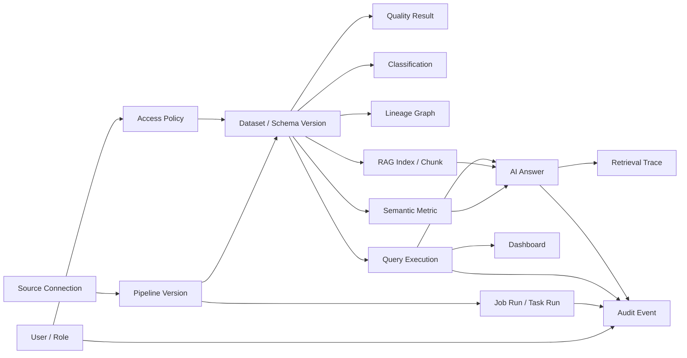

# 03. 인터페이스 기준

이 문서는 API, CLI 명령, UI 계약, event schema, background job, 내부 도구, 외부 연동 계약을 기록하는 기준 문서다.
Current implementation baseline contract와 Target MVP interface family를 분리해 관리한다.

## 1) 공통 규칙

- Base URL / command namespace / entrypoint: local backend `http://localhost:8000/api`
- Request/response format: API는 JSON, 사람 작업 흐름은 browser UI
- Naming conventions: code identifier는 원문을 유지하고, 협업 문서는 한국어로 작성한다.
- Idempotency: 실행, backfill, event 소비는 중복 요청과 중복 event를 고려한다.
- Secret: credential 값은 API payload나 metadata DB에 직접 저장하지 않고 secret reference로 저장한다.
- Policy: Query, Ask, RAG retrieval, prompt assembly는 동일한 권한 판단을 공유해야 한다.

## 2) 인증과 접근 제어

### Current Baseline

- Authentication: baseline demo에서는 보류한다.
- Authorization: baseline demo에서는 보류한다.
- Public/private boundaries: local demo만 대상으로 하며 실제 secret이나 production data를 사용하지 않는다.

### Target MVP

- Authentication: 사용자, 역할, 목적 정보를 policy decision과 audit event에 연결한다.
- Authorization: dataset/table/column 단위 policy와 action별 권한을 구분한다.
- Masking: 원본 접근이 불가능하면 마스킹 대안을 제공하거나 실행 전에 차단한다.
- Access Request: 차단된 자원, 필요한 권한, 목적, 기간을 포함해 요청할 수 있어야 한다.
- AI access: SQL, RAG retrieval, prompt, final answer 모든 단계에서 허용된 데이터만 사용한다.

## 3) 상태, 오류, 실패 형식

| 조건 | 기대 결과 |
| --- | --- |
| Invalid source config | API returns validation error and UI shows actionable message. |
| Pipeline run fails | Run status becomes `failed` and stores a short error/log. |
| Result dataset unavailable | Catalog detail shows not ready or failed state instead of pretending success. |
| Trust gate remains incomplete | Dataset is not exposed as `Trusted`; remaining gate is visible. |
| Policy denies query or ask | Request is blocked before execution/retrieval/prompt and access request path is offered when applicable. |
| Evidence is insufficient | Ask result is `Insufficient Evidence` or deferred instead of a confident answer. |
| Schema drift or quality failure occurs | Dataset becomes `Degraded` or `Blocked`; impacted assets are discoverable. |

## 4) Current Baseline Interface

### Health API

- Type: API
- Endpoint: `GET /health`, `GET /api/health`
- Output:

```json
{
  "service": "asklake-backend",
  "status": "ok",
  "app": "AskLake"
}
```

### Source / Catalog 계약

- Type: API/UI/Internal store
- Default source type: CSV/local file
- Metadata store: SQLite implementation behind `MetadataStore`
- ID rule: API에 노출되는 `source_id`, `dataset_id`는 string UUID로 둔다.
- Required endpoints:

```text
POST /api/sources
GET /api/sources
GET /api/sources/{source_id}
POST /api/external-connections
GET /api/external-connections
GET /api/external-connections/{connection_id}
PATCH /api/external-connections/{connection_id}
DELETE /api/external-connections/{connection_id}
POST /api/source-datasets
GET /api/source-datasets
GET /api/source-datasets/{dataset_id}
PATCH /api/source-datasets/{dataset_id}
DELETE /api/source-datasets/{dataset_id}
POST /api/source-datasets/{dataset_id}/snapshots
GET /api/source-datasets/{dataset_id}/snapshots
POST /api/silver-datasets
GET /api/silver-datasets
GET /api/silver-datasets/{dataset_id}
PATCH /api/silver-datasets/{dataset_id}
PATCH /api/silver-datasets/{dataset_id}/schedule
DELETE /api/silver-datasets/{dataset_id}
POST /api/silver-datasets/{dataset_id}/materializations
GET /api/silver-datasets/{dataset_id}/materializations
POST /api/target-dataset-drafts
GET /api/target-dataset-drafts
GET /api/target-dataset-drafts/{draft_id}
PATCH /api/target-dataset-drafts/{draft_id}
PATCH /api/target-dataset-drafts/{draft_id}/schedule
DELETE /api/target-dataset-drafts/{draft_id}
POST /api/target-dataset-job-runs
GET /api/target-dataset-job-runs
GET /api/target-dataset-job-runs/{run_id}
POST /api/target-dataset-job-runs/{run_id}/execute
POST /api/target-dataset-job-runs/{run_id}/publish-catalog
GET /api/catalog/datasets
GET /api/catalog/datasets/{dataset_id}
```

- Dataset module UI routes:

```text
/connections
/datasets/source
/datasets/silver
/datasets/gold
/jobs/silver-transform
/jobs/gold-build
/runs
```

`/dataset`, `/sources`, and `/datasets` remain compatibility routes for the Source Datasets view. The route split is UI-only in C-3.6 and uses the existing external connection, source dataset, and target dataset draft APIs.

- `POST /api/sources` minimum request:

```json
{
  "name": "sample_orders",
  "type": "csv",
  "path": "samples/orders.csv"
}
```

- `POST /api/external-connections` minimum request:

```json
{
  "name": "conn_product_health_reviews_file",
  "connector_type": "local_file",
  "resource": "backend/samples/product_health_reviews_seed.jsonl",
  "resource_label": "file_path",
  "auth_mode": "No credential",
  "mode_label": "직접 연결 가능",
  "contract_hint": "SourceConfig.connection_ref.path",
  "detected_format": "JSONL",
  "detected_dataset": "Product reviews / VOC",
  "confidence": "High",
  "recommended_role": "Source Dataset",
  "sync_mode": "manual",
  "sync_schedule": "manual on demand",
  "schema_preview": [
    { "name": "review_id", "type": "string" },
    { "name": "rating", "type": "number" }
  ]
}
```

External connection persistence stores metadata, inspect preview, and ingestion/sync schedule hints only. `sync_mode` is one of `manual`, `scheduled`, or `streaming`; `sync_schedule` is a human-readable hint such as `manual on demand`, `daily scan`, or `continuous topic consumption`. It does not store raw credential values, test database passwords, ingest files, register a scheduler, create Source Sync Jobs, or consume Kafka.

`GET /api/external-connections/credential-policy` returns the DB/S3/Kafka credential boundary. The accepted contract is `secret_ref_only`: local development may pass env var names as references, but request/response/log/metadata must not contain raw credential values. C-25 sets `connection_test_enabled=true` for lightweight runtime tests only. PostgreSQL, MongoDB, S3/MinIO, and Kafka tests may verify driver connectivity, lightweight query/ping, bucket listing, or broker metadata, but they do not persist credentials, ingest data, create Source Datasets, or complete schema discovery.

`POST /api/external-connections/test` minimum request:

```json
{
  "connector_type": "postgres",
  "resource": "127.0.0.1:15432/asklake",
  "secret_refs": {
    "username": "ASKLAKE_DEMO_POSTGRES_USER",
    "password": "ASKLAKE_DEMO_POSTGRES_PASSWORD"
  }
}
```

Minimum response:

```json
{
  "status": "passed",
  "connector_type": "postgres",
  "checked_capabilities": ["driver_connect", "lightweight_query"],
  "safe_summary": {
    "host": "127.0.0.1",
    "port": 15432,
    "database": "asklake",
    "credential_refs_configured": ["username", "password"]
  },
  "secret_values_exposed": false,
  "schema_discovery_completed": false,
  "message": "PostgreSQL connection test passed. Schema discovery is still separate."
}
```

`secret_refs` values must be environment variable names, not the secret values themselves. Raw fields such as `password`, `access_key`, `secret_key`, `token`, and `raw_credential` are rejected in request options. A passed connection test means the runtime is reachable; it is not schema discovery, ingestion, sync job registration, or dataset creation.

`PATCH /api/external-connections/{connection_id}` supports metadata management for an existing External Connection. C-13 permits updating `name`, `resource`, `resource_label`, `auth_mode`, `mode_label`, `contract_hint`, `detected_format`, `detected_dataset`, `confidence`, `recommended_role`, `sync_mode`, `sync_schedule`, and `schema_preview`. `DELETE /api/external-connections/{connection_id}` removes the External Connection metadata row only and is rejected while any Source Dataset references the connection.

- `POST /api/source-datasets` minimum request:

```json
{
  "connection_id": "conn_product_health_reviews_file",
  "connection_name": "Product Health Reviews File",
  "connection_type": "local_file",
  "name": "source_product_health_reviews",
  "raw_scope": "backend/samples/product_health_reviews_seed.jsonl",
  "resource_label": "file_path",
  "schema_preview": [
    { "name": "review_id", "type": "string" },
    { "name": "rating", "type": "number" }
  ]
}
```

`PATCH /api/source-datasets/{dataset_id}` supports metadata management for an existing Source Dataset. C-9 permits updating `name`, `raw_scope`, `resource_label`, `schema_preview`, and `status`. `DELETE /api/source-datasets/{dataset_id}` removes the Source Dataset metadata row only and is rejected while any Silver Dataset references the Source Dataset.

C-16 adds optional read-side `file_evidence` to Source/Silver/Target Dataset responses. `file_evidence.status` is one of `file_backed`, `missing`, or `metadata_only`; it may include `path`, `bytes`, `row_count`, `row_count_status`, `schema_fields`, and `message`. It is evidence derived at read time from local files, not a persisted credential, ingestion result, or file delete contract.

C-26C adds Source Dataset raw snapshot execution. `POST /api/source-datasets/{dataset_id}/snapshots` is a manual bounded ingest action that is separate from Source Dataset metadata creation. Local file/folder datasets write JSONL snapshot output under `data/lake/bronze/source_snapshots/`; PostgreSQL/MongoDB/S3/Kafka snapshot requests may pass `secret_refs` and `options` again at execution time because raw credential values are not persisted.

C-36 makes this boundary explicit for large-data demos. A Source snapshot is `snapshot_mode=bounded_sample` unless a later Phase adds a full ingest runner. `input_bytes` means available input bytes for the inspected scope, while `row_count` is the number of rows/messages written to the bounded snapshot. It must not be presented as full 5GB processing evidence.

Minimum request:

```json
{
  "sample_size": 100,
  "secret_refs": {},
  "options": {}
}
```

Minimum response:

```json
{
  "id": "snapshot-id",
  "source_dataset_id": "source-dataset-id",
  "source_dataset_name": "source_product_health_reviews",
  "connection_id": "conn_product_health_reviews_file",
  "connection_type": "local_file",
  "input_scope": "backend/samples/product_health_reviews_seed.jsonl",
  "output_path": "data/lake/bronze/source_snapshots/source_product_health_reviews/20260630T133508Z-9def9ede.jsonl",
  "row_count": 100,
  "output_bytes": 40124,
  "input_bytes": 540000,
  "snapshot_mode": "bounded_sample",
  "requested_sample_size": 100,
  "row_limit": 100,
  "coverage_status": "bounded_sample_limit_reached",
  "input_bytes_semantics": "available_input_bytes",
  "large_data_status": "not_full_large_data_ingest",
  "status": "succeeded",
  "duration_ms": 4,
  "message": "100개 row/message를 bounded raw snapshot으로 저장했습니다.",
  "created_at": "2026-06-30T13:35:08Z"
}
```

`GET /api/source-datasets/{dataset_id}/snapshots` returns latest snapshots first. Snapshot success updates the Source Dataset status to `snapshot_ready`; failure returns an error and must not make metadata appear successfully ingested.

C-37 adds a read-only Product Health source inventory endpoint for the clean-room demo source binding step. C-42 reframes that inventory around runtime source systems while preserving demo fallback evidence. It does not download data, run full ingest, create Source Dataset rows, or materialize Silver/Gold outputs. It exposes Kafka/PostgreSQL/MongoDB/S3 source intent plus local/prepared fallback evidence used for schema and row proof.

`GET /api/product-health/source-inventory` minimum response:

```json
{
  "scenario_id": "product_health",
  "status": "ready",
  "message": "4/4 Product Health source candidates are ready.",
  "sources": [
    {
      "role": "behavior_events",
      "label": "Commerce behavior events",
      "source_dataset_name": "source_user_events",
      "connection_name": "conn_product_health_behavior_kafka",
      "connection_type": "kafka",
      "resource_label": "kafka_topic",
      "path": "product-health.behavior-events",
      "binding_type": "runtime_source",
      "status": "ready",
      "can_create_source_dataset": true,
      "runtime_source_type": "kafka",
      "runtime_resource": "product-health.behavior-events",
      "fallback_binding_type": "raw_file",
      "fallback_path": "data/local_sources/product_health/raw/kaggle_ecommerce_behavior/2019-Oct.csv",
      "fallback_status": "ready",
      "bytes": 5668612855,
      "row_count": null,
      "row_count_status": "not_measured",
      "schema_preview": [{"name": "event_time", "type": "string"}],
      "message": "kafka runtime source is the Product Health primary source. Schema and row evidence are provided by demo fallback raw_file."
    }
  ]
}
```

`binding_type` is one of `runtime_source`, `raw_file`, `prepared_dataset`, `missing`, or `mismatch`. For Product Health after C-42, the normal ready value is `runtime_source`; local raw files and prepared parquet/json outputs should appear in `fallback_*` fields, not as the primary external source. `missing` and `mismatch` candidates are display-only and must not be saved as ready Source Datasets.

Product Health runtime source mapping:

| Role | Runtime source | Fallback evidence |
| --- | --- | --- |
| `behavior_events` | Kafka topic `product-health.behavior-events` | local behavior raw/prepared file |
| `product_catalog` | PostgreSQL table `public.product_catalog` | local product catalog raw/prepared file |
| `reviews` | MongoDB collection `asklake.product_reviews` | local review prepared file |
| `delivery_trip_logs` | S3/MinIO prefix `s3://asklake-demo/product_health/delivery_trip_logs/` | local delivery prepared file |

C-43 adds a Product Health runtime connection seed endpoint. It creates or updates four External Connection metadata records without storing raw credentials. Kafka is locally testable without secrets; PostgreSQL, MongoDB, and S3/MinIO remain `secret_ref_required` until env-name references and secret backend behavior are provided.

`POST /api/product-health/runtime-connections/seed` minimum response:

```json
{
  "scenario_id": "product_health",
  "status": "seeded",
  "connections": [
    {
      "name": "conn_product_health_behavior_kafka",
      "connector_type": "kafka",
      "resource": "127.0.0.1:29092",
      "resource_label": "bootstrap_servers",
      "auth_mode": "No credential in local demo",
      "mode_label": "Product Health runtime connection seed",
      "contract_hint": "Runtime source: Kafka broker 127.0.0.1:29092; Source Dataset scope: topic product-health.behavior-events",
      "detected_dataset": "Product Health behavior events topic",
      "recommended_role": "Product Health Source Connection"
    }
  ],
  "readiness": [
    {
      "role": "behavior_events",
      "connection_name": "conn_product_health_behavior_kafka",
      "connector_type": "kafka",
      "runtime_resource": "127.0.0.1:29092",
      "source_scope": "product-health.behavior-events",
      "readiness_status": "testable",
      "fallback_available": true,
      "message": "Local runtime can be tested without storing credentials; consume/replay remains a later phase."
    }
  ],
  "message": "Product Health runtime connection metadata was seeded. Secret values were not stored."
}
```

C-44 aligns Product Health Source Dataset save semantics with the runtime source contract. When a Product Health source is saved from inventory, `raw_scope` is the runtime scope (`topic`, `table`, `collection`, or `s3 prefix`) and `connection_type` remains the external system type. Local/prepared artifacts are returned as evidence only.

`POST /api/source-datasets` and `GET /api/source-datasets*` may include these Product Health runtime fields:

```json
{
  "connection_id": "external_connection_...",
  "connection_name": "conn_product_health_behavior_kafka",
  "connection_type": "kafka",
  "name": "source_user_events",
  "raw_scope": "product-health.behavior-events",
  "resource_label": "kafka_topic",
  "runtime_source": {
    "connection_id": "external_connection_...",
    "connection_name": "conn_product_health_behavior_kafka",
    "connection_type": "kafka",
    "resource_label": "kafka_topic",
    "resource": "product-health.behavior-events",
    "fallback_evidence_status": "file_backed"
  },
  "fallback_evidence": {
    "status": "file_backed",
    "path": "data/local_sources/product_health/raw/kaggle_ecommerce_behavior/2019-Oct.csv"
  }
}
```

`fallback_evidence.path` must not replace `raw_scope`. The UI may use `file_evidence` for backward-compatible evidence badges, but detail views should label Product Health runtime source and demo fallback evidence separately.

The endpoint must be idempotent by connection name. It must not accept or return raw `password`, `access_key`, `secret_key`, `token`, or `raw_credential` values. Connection test execution remains separate through `/api/external-connections/test`.

C-47 adds an operator-run Product Health runtime seed loader for the large synthetic dataset split. It is not called by the web UI and does not store raw credential values. `scripts/product_health_runtime_seed_loaders.py` accepts `contracts/product_health_runtime_seed_manifest.sample.json` style manifests and writes `ProductHealthRuntimeSeedLoadEvidence` under `data/results/product_health_runtime_seed_load/`.

| Role | Loader target | Load method |
| --- | --- | --- |
| `behavior_events` | Kafka topic `product-health.behavior-events` | stream CSV/JSONL/Parquet rows as JSON messages to `kafka-console-producer` |
| `product_catalog` | PostgreSQL table `public.product_catalog` | create table and stream CSV/JSONL/Parquet rows via `psql COPY` |
| `reviews` | MongoDB collection `asklake.product_reviews` | stream CSV/JSONL/Parquet rows as JSON documents to `mongoimport` |
| `delivery_trip_logs` | MinIO/S3 prefix `s3://asklake-demo/product_health/delivery_trip_logs/` | upload local Parquet/object files to S3-compatible storage with env-referenced credentials |

C-41 adds a Product Health-only preset synthesis endpoint. It wraps the existing local synthesis script so the site can regenerate demo-ready `seed_product_mapping`, Silver parquet, Gold parquet, Catalog handoff, and run summary artifacts. It is not a generic transform builder, Airflow/Spark production execution, new raw download, or 5GB evidence remeasurement.

`POST /api/product-health/preset-synthesis` minimum response:

```json
{
  "scenario_id": "product_health",
  "status": "succeeded",
  "mode": "source_inventory_and_row_limited_smoke_transform",
  "run_id": "run_product_health_smoke_001",
  "generated_at": "2026-07-01T00:00:00Z",
  "gold_output": {
    "role": "gold_product_health",
    "path": "data/local_sources/product_health/gold/gold_product_health.parquet",
    "row_count": 1000,
    "bytes": 12345,
    "format": "parquet",
    "status": "ready"
  },
  "artifacts": [
    {
      "role": "seed_product_mapping",
      "path": "data/local_sources/product_health/silver/seed_product_mapping.parquet",
      "row_count": 1000,
      "bytes": 12345,
      "format": "parquet",
      "status": "ready"
    }
  ],
  "sql_smoke": {
    "row_count": 10
  },
  "message": "Product Health preset synthesis completed. Prepared Silver/Gold/Catalog evidence was regenerated."
}
```

The response must expose artifact paths and measured parquet row counts when available. Missing artifacts must be reported as `status=missing` rather than hidden as success. Follow-up Run/Catalog/AI Query phases may consume these artifacts, but this endpoint itself does not create user-defined jobs or schedule recurring execution.

- `POST /api/silver-datasets` minimum request:

```json
{
  "source_dataset_id": "source_product_health_reviews",
  "source_dataset_name": "source_product_health_reviews",
  "name": "silver_product_health_reviews",
  "purpose": "리뷰 평점과 텍스트를 제품 품질 분석용 silver schema로 표준화",
  "standardize_rules": ["normalize_ids", "cast_types"],
  "validation_rules": ["required_keys", "schema_drift"],
  "schedule": {
    "mode": "manual",
    "note": ""
  },
  "schema_preview": [
    { "name": "review_id", "type": "string" },
    { "name": "product_id", "type": "string" },
    { "name": "rating", "type": "number" }
  ]
}
```

Silver Dataset persistence stores metadata only at creation time. C-10 requires `source_dataset_id` to reference an existing Source Dataset and stores `standardize_rules`, `validation_rules`, and `schema_preview` as the planned transform contract. It does not automatically materialize rows, run Spark/Airflow, publish CatalogMetadata, or switch Gold output state.

C-27 adds manual local Silver materialization. `POST /api/silver-datasets/{dataset_id}/materializations` reads the latest Source Dataset snapshot when available, otherwise bounded local source input, and writes a parquet output under `data/lake/silver/`. Unsupported runtime connector inputs must create a Source snapshot first. Spark distributed execution remains a separate capability and is not reported as success by this endpoint.

Minimum request:

```json
{
  "sample_size": 10000,
  "prefer_latest_source_snapshot": true
}
```

Minimum response:

```json
{
  "id": "materialization-id",
  "silver_dataset_id": "silver-dataset-id",
  "silver_dataset_name": "silver_product_health_reviews",
  "source_dataset_id": "source-dataset-id",
  "source_dataset_name": "source_product_health_reviews",
  "input_path": "data/lake/bronze/source_snapshots/source_product_health_reviews/20260630T133508Z-9def9ede.jsonl",
  "output_path": "data/lake/silver/silver_product_health_reviews.parquet",
  "row_count": 100,
  "output_bytes": 13000,
  "failed_row_count": 0,
  "status": "succeeded",
  "duration_ms": 177,
  "message": "100개 row를 Silver parquet로 materialize했습니다.",
  "created_at": "2026-06-30T14:00:00Z"
}
```

`GET /api/silver-datasets/{dataset_id}/materializations` returns latest materializations first. Materialization success updates the Silver Dataset status to `materialized`; failure returns an error and must not make metadata-only Silver appear file-backed.

`PATCH /api/silver-datasets/{dataset_id}` supports metadata management for an existing Silver Dataset. C-13 permits updating `name`, `purpose`, `standardize_rules`, `validation_rules`, `schema_preview`, and `status`; schedule remains managed by the Job schedule endpoint. If a Target Dataset draft references the Silver Dataset, changing `name` is rejected to avoid stale lineage labels, while non-name metadata such as `purpose` and rules remains editable. `DELETE /api/silver-datasets/{dataset_id}` removes the Silver Dataset metadata row only and is rejected while any Target Dataset draft references the Silver Dataset.

`PATCH /api/silver-datasets/{dataset_id}/schedule` updates only the Silver Transform Job schedule metadata derived from the Silver Dataset. Request body is `{"mode":"manual"|"placeholder","note":"..."}`. It does not modify `source_dataset_id`, transform rules, validation rules, schema, source rows, or register a real scheduler.

- `POST /api/target-dataset-drafts` minimum request:

```json
{
  "target_dataset_name": "dataset_product_health_gold",
  "description": "제품 상태 분석용 gold dataset draft",
  "base_source_ref": {
    "source_id": "silver_product_catalog",
    "name": "silver_product_catalog",
    "role": "base",
    "type_label": "Silver Dataset",
    "resource": "from source_partner_catalog_api"
  },
  "target_grain": "product_id",
  "source_refs": [
    {
      "source_id": "silver_product_catalog",
      "name": "silver_product_catalog",
      "role": "base",
      "type_label": "Silver Dataset",
      "resource": "from source_partner_catalog_api"
    },
    {
      "source_id": "silver_product_reviews",
      "name": "silver_product_reviews",
      "role": "enrichment",
      "type_label": "Silver Dataset",
      "resource": "from source_product_health_reviews"
    }
  ],
  "silver_outputs": [
    {
      "name": "silver_product_catalog",
      "from_source_id": "source_partner_catalog_api",
      "from_source_name": "Partner Catalog API",
      "purpose": "상품 id/category 표준화"
    }
  ],
  "processing_recipes": ["standardize_sources", "join_product", "score_health"],
  "gold_output": "dataset_product_health_gold",
  "executor_handoff": "local_runner",
  "schedule": {
    "mode": "manual",
    "note": "데모에서는 수동 실행으로만 준비합니다."
  },
  "schema_preview": [
    { "name": "product_id", "type": "string" },
    { "name": "risk_score", "type": "number" }
  ]
}
```

Target dataset draft persistence stores job definition metadata only. From C-11, the Gold Dataset wizard input is persisted Silver Dataset metadata. The legacy field names `base_source_ref` and `source_refs` remain for runner/catalog compatibility, but UI payloads set their `type_label` to `Silver Dataset` and point `silver_outputs[]` back to the original Source Dataset lineage. The UI separates `Process -> Handoff/Run -> Scheduling -> Review`; `executor_handoff` is selected in Handoff/Run but still does not trigger Airflow, run Spark/local runner, materialize Silver/Gold files, or publish CatalogMetadata.

`PATCH /api/target-dataset-drafts/{draft_id}` supports metadata management for an existing planned Gold/Target Dataset draft. C-13 permits updating `target_dataset_name`, `description`, `base_source_ref`, `target_grain`, `source_refs`, `silver_outputs`, `processing_recipes`, `gold_output`, `executor_handoff`, `schema_preview`, and `status`; schedule remains managed by the Job schedule endpoint. UI edits keep `target_dataset_name` and `gold_output` aligned so the Gold list title changes immediately after a rename. `DELETE /api/target-dataset-drafts/{draft_id}` removes the planned draft metadata row only and is rejected while any Job Run references the draft. Published/registered CatalogDataset rows are not modified or deleted by this endpoint.

`PATCH /api/target-dataset-drafts/{draft_id}/schedule` updates only the Gold Build Job schedule metadata stored on the Target Dataset draft. Request body is `{"mode":"manual"|"placeholder","note":"..."}`. It does not modify Silver inputs, processing recipes, executor handoff, schema, or create a Job Run. Gold Build Jobs keep `Run 준비` as the action that creates a queued run from the current draft metadata.

- `POST /api/target-dataset-job-runs` minimum request:

```json
{
  "target_dataset_draft_id": "target_draft_product_health_gold",
  "job_type": "gold_build",
  "triggered_by": "demo_user"
}
```

Target dataset job run handoff creates a queued run record from a saved Target Dataset draft. C-4 does not trigger Airflow, run local/spark runner, materialize Silver/Gold files, or publish CatalogMetadata.

`POST /api/target-dataset-job-runs/{run_id}/execute` updates a common Target Dataset Job Run record by executor. `executor_handoff=local_runner` has three demo-safe modes. If a prepared Product Health Gold parquet matches `gold_output`, it references that parquet as `runtime_evidence.materialization_mode=prepared_gold_reference` without rerunning large ETL and records `runtime_evidence.large_etl_rerun=false`, `catalog_publish_ready=true`, and `product_health_result_role=gold_run_execution_evidence`. If no prepared Gold exists but all declared Silver outputs have local parquet files, it reads those Silver parquet files and writes Gold parquet under `data/lake/gold/run_id=<run_id>/` as `runtime_evidence.materialization_mode=silver_parquet_to_gold` with `catalog_publish_ready=true`. The run also includes `runtime_evidence.object_storage.status=not_uploaded` and an expected S3-compatible `object_uri` so local materialization success is not confused with MinIO upload success. Legacy fallback may still write planned JSONL evidence as `local_demo_jsonl` when Silver parquet inputs are unavailable. Local runner execution updates the run with `status=succeeded`, `output_path`, `row_count`, `output_bytes`, `silver_output_paths`, `logs`, `duration_ms`, `source_evidence[]`, and `runtime_evidence.executor_status=executed`.

C-29 keeps Airflow and Spark in the same Run record shape without falsely marking them succeeded. If `executor_handoff=airflow` or `spark_runner`, execute records `status=ready_to_run`, no `output_path`, no `row_count`, no `output_bytes`, and `runtime_evidence.executor_status=readiness_only`, `trigger_attempted=false`, `result_artifact_status=not_connected`, and `blocked_until[]`. It does not trigger Airflow/Spark, run distributed jobs, or publish CatalogMetadata.

`POST /api/target-dataset-job-runs/{run_id}/publish-catalog` publishes a succeeded run to `CatalogDataset`. It is idempotent by `run_id`: repeated publish requests return the existing catalog dataset instead of creating duplicates. It rejects queued/failed/unmaterialized runs. JSONL demo outputs keep the draft schema preview; prepared parquet outputs publish the actual parquet schema and `storage.format=parquet` so AI Query allowlist matches DuckDB-visible columns.

`GET /api/catalog/datasets/management-policy` returns the current registered `CatalogDataset` management boundary. C-21 keeps registered CatalogDataset rows read-only for product UI management: allowed actions are `detail` and `ai_query_context`; disabled actions are `metadata_update`, `metadata_delete`, `file_delete`, and `cascade_delete`. Metadata-only delete, actual output file delete, and cascade delete must remain separate future flows with 409 reference checks and explicit human confirmation before any file removal.

M6 AI Query consumes published `CatalogDataset` rows through the `CatalogSource` adapter. `source_type=target_dataset_job_run` and `status=ready` rows are converted to `CatalogMetadata` shape with `schema.fields`, `storage.local_fallback_path`, `metrics`, `lineage`, and `query.allowed_columns`; Week2 stored/fixture catalogs remain fallback candidates when no published target dataset matches. C-39 requires the selected dataset, evidence item, retrieval trace, SQL table name, and `evidence[].storage.local_fallback_path` to point to the same published CatalogDataset/run/path when a live Product Health Gold run was published.

```json
{
  "connection_id": "conn_product_health_reviews_file",
  "connection_name": "Product Health Reviews File",
  "connection_type": "local_file",
  "name": "source_product_health_reviews",
  "raw_scope": "backend/samples/product_health_reviews_seed.jsonl",
  "resource_label": "file_path",
  "schema_preview": [
    { "name": "review_id", "type": "string" },
    { "name": "rating", "type": "number" }
  ]
}
```

- Source dataset minimum response:

```json
{
  "id": "source_dataset_uuid",
  "connection_id": "conn_product_health_reviews_file",
  "connection_name": "Product Health Reviews File",
  "connection_type": "local_file",
  "name": "source_product_health_reviews",
  "raw_scope": "backend/samples/product_health_reviews_seed.jsonl",
  "resource_label": "file_path",
  "schema_preview": [
    { "name": "review_id", "type": "string" },
    { "name": "rating", "type": "number" }
  ],
  "layer": "source",
  "status": "metadata_ready",
  "created_at": "2026-06-30T00:00:00Z",
  "updated_at": "2026-06-30T00:00:00Z"
}
```

Source dataset persistence stores metadata only. It does not ingest files, consume Kafka, test database credentials, or register final `CatalogMetadata`.

- Catalog dataset minimum response:

```json
{
  "id": "dataset_001",
  "name": "sample_orders",
  "source_type": "csv",
  "schema": [
    { "name": "order_id", "type": "string" },
    { "name": "amount", "type": "number" }
  ],
  "row_count": 100,
  "sample": [
    { "order_id": "A001", "amount": 12000 }
  ],
  "status": "ready",
  "owner": "unassigned",
  "trust_status": "Draft",
  "trust_gate_result": {
    "id": "trust_gate_001",
    "dataset_id": "dataset_001",
    "status": "Draft",
    "required_gates": ["schema", "quality", "pii", "owner", "policy", "approval"],
    "passed_gates": ["schema"],
    "failed_gates": ["quality", "pii", "owner", "policy", "approval"],
    "reasons": ["quality gate is pending"],
    "evaluated_at": "2026-06-24T00:00:00Z"
  },
  "lineage": {
    "run_id": "run_product_health_001",
    "target_dataset_draft_id": "target_draft_product_health_gold",
    "target_dataset_name": "dataset_product_health_gold",
    "source_refs": [],
    "silver_output_paths": ["data/lake/silver/run_id=run_product_health_001/silver_product_reviews.jsonl"],
    "processing_recipes": ["standardize_sources", "join_product", "score_health"]
  },
  "metrics": {
    "row_count": 1,
    "bytes": 1024,
    "duration_ms": 12,
    "source_count": 2,
    "silver_output_count": 2
  },
  "storage": {
    "local_path": "data/lake/gold/run_id=run_product_health_001/dataset_product_health_gold.jsonl",
    "format": "jsonl"
  },
  "runtime_evidence": {
    "runner": "local_runner",
    "status": "succeeded"
  },
  "source_evidence": []
}
```

### Catalog / Trust Gate 계약

- Type: API/UI/Internal store
- Scope: Target R1 최소 구현. baseline `status: ready`는 유지하고 Target 신뢰 상태는 `trust_status`와 `trust_gate_result`로 분리한다.
- Mock/Fake boundary: quality, PII, owner, policy, approval gate는 deterministic placeholder로 계산한다. 실제 PII 탐지, 외부 policy service, secret-backed provider는 포함하지 않는다.
- Endpoint:

```text
POST /api/catalog/datasets/{dataset_id}/trust-gate
```

- Request:

```json
{
  "owner": "data-team",
  "passed_gates": ["schema", "quality", "pii", "owner", "policy", "approval"],
  "failed_gates": []
}
```

- Response: `TrustGateResult`

```json
{
  "id": "trust_gate_001",
  "dataset_id": "dataset_001",
  "status": "Trusted",
  "required_gates": ["schema", "quality", "pii", "owner", "policy", "approval"],
  "passed_gates": ["schema", "quality", "pii", "owner", "policy", "approval"],
  "failed_gates": [],
  "reasons": ["all required trust gates passed"],
  "evaluated_at": "2026-06-24T00:00:00Z"
}
```

Trust status rule:

- `Trusted`: all required gates are passed.
- `Verifying`: no gate has explicitly failed, but one or more required gates are still pending.
- `Blocked`: one or more gates are explicitly listed in `failed_gates`.
- Query / Ask follow-up phases must treat only `Trusted` as the default consumable candidate. `Draft`, `Verifying`, and `Blocked` are default block/defer candidates until a later policy contract states otherwise.

### Baseline Pipeline 계약

- Type: API/UI/Job
- Input: registered source dataset, `select_fields` transform config, target dataset name
- Output: `PipelineRun` with `queued`, `running`, `success`, or `failed` status
- Current endpoints:

```text
POST /api/pipelines
GET /api/pipelines
GET /api/pipelines/{pipeline_id}
POST /api/pipelines/{pipeline_id}/runs
GET /api/pipeline-runs/{run_id}
```

- `POST /api/pipelines` minimum request:

```json
{
  "name": "orders_amounts",
  "source_dataset_id": "dataset_uuid",
  "select_fields": ["order_id", "amount"],
  "target_name": "orders_amounts_result"
}
```

## 5) Target MVP Interface Family

Target MVP는 아래 family를 순차적으로 확정한다.
이번 rebaseline에서는 상세 endpoint를 과도하게 확정하지 않고 family, 상태, 핵심 contract만 둔다.

| Family | 목적 | 핵심 contract | 상태 |
| --- | --- | --- | --- |
| Source API | 연결 등록, 연결 테스트, schema discovery | `SourceConnection`, secret reference, schema/sample preview | baseline + 확장 |
| Pipeline / Job API | version, validation, deploy, run, retry, rerun, backfill | `PipelineVersion`, `JobRun`, `TaskRun`, idempotency key | target R2 |
| Catalog / Trust API | draft, dataset detail, trust status, lineage, usage | `Dataset`, `DatasetStatus`, `TrustGateResult` | target R1 |
| Quality / PII API | quality rule, result, PII candidate, classification | `QualityRule`, `QualityResult`, `Classification` | target R1/R2 |
| Policy / Access API | RBAC, masking, access request, approval | `AccessPolicy`, `PolicyDecision`, `AccessRequest` | target R4 |
| Query API | preflight, SQL execution, result, saved query | `QueryExecution`, scan/cost/policy result | target R4 |
| Ask / Evidence API | route, answer, evidence, retrieval trace | `AskAnswer`, `EvidenceItem`, `RetrievalTrace` | target R5 |
| Operation / Incident API | status center, alert, incident, impacted asset | `Incident`, `AssetImpact`, `RecoveryAction` | target R6 |
| Admin / Audit API | user, role, config, audit search | `AuditEvent`, `InvestigationCase` | target R4+ |
| Deployment / Health API | module health, readiness, config validation | `ModuleHealth`, `DeploymentProfile` | target R7 |

## 6) Modular Contract Baseline

R0.5 `Modular Contract Baseline`은 Target MVP를 병렬 workstream으로 구현하기 위한 최소 공유 계약이다.
이 계약은 상세 endpoint나 저장소 schema를 고정하지 않고, module 간 mock/fake adapter와 integration spine이 같은 언어를 쓰게 하는 기준이다.

| Contract | Owner Workstream | 최소 필드/상태 | Mock/Fake Boundary |
| --- | --- | --- | --- |
| `Dataset` | Catalog / Trust | `id`, `name`, `source_ref`, `schema_version`, `status`, `owner`, `freshness`, `trust_gate_result_id` | Source/Job workstream은 fixture dataset으로 대체 가능 |
| `DatasetStatus` | Catalog / Trust | `Draft`, `Verifying`, `Trusted`, `Degraded`, `Blocked`, `Archived` | Query/Ask는 status fixture로 policy path를 검증 가능 |
| `TrustGateResult` | Catalog / Trust | `dataset_id`, `status`, `required_gates`, `passed_gates`, `failed_gates`, `reasons`, `evaluated_at` | quality/PII/policy engine은 placeholder result 허용 |
| `SourceConnection` | Source Connector | `id`, `type`, `display_name`, `secret_ref`, `connection_status`, `last_checked_at` | 실제 RDB/API 대신 local fixture connector 허용 |
| `SchemaSnapshot` | Source Connector | `source_id`, `dataset_id`, `columns`, `sample_ref`, `row_count`, `captured_at` | sample rows는 bounded preview fixture 허용 |
| `JobRun` | Job / Orchestrator | `id`, `job_type`, `status`, `dataset_id`, `idempotency_key`, `started_at`, `finished_at` | synchronous in-memory runner 허용 |
| `TaskRun` | Job / Orchestrator | `id`, `job_run_id`, `task_type`, `status`, `attempt`, `error_summary` | single-task fixture 허용 |
| `AuditEvent` | Job / Orchestrator | `id`, `actor`, `action`, `resource_ref`, `policy_decision_id`, `created_at` | append-only local event log 허용 |
| `PolicyDecision` | Query / Policy | `id`, `actor`, `action`, `resource_ref`, `decision`, `masking`, `reason`, `decided_at` | allow/deny/mask rule fixture 허용 |
| `QueryExecution` | Query / Policy | `id`, `dataset_id`, `status`, `sql_or_plan`, `policy_decision_id`, `evidence_refs` | local query fake 또는 dry-run plan 허용 |
| `EvidenceItem` | Ask / Evidence | `id`, `type`, `resource_ref`, `summary`, `freshness`, `policy_decision_id`, `trace_ref` | static evidence fixture 허용 |
| `RetrievalTrace` | Ask / Evidence | `id`, `question`, `route`, `retrieved_refs`, `blocked_refs`, `policy_decision_id` | external LLM 없이 deterministic route fixture 허용 |
| `AssetImpact` | Recovery / Operate | `id`, `source_event_ref`, `affected_assets`, `severity`, `reason` | schema drift/quality failure fixture 허용 |
| `RecoveryAction` | Recovery / Operate | `id`, `type`, `target_ref`, `range`, `idempotency_key`, `status` | retry/rerun/backfill simulation 허용 |
| `ModuleHealth` | Packaging | `module`, `status`, `checks`, `config_warnings`, `checked_at` | local/container health fixture 허용 |

R0.6 Thin Runtime Core code mapping:

| Area | Code location | Purpose |
| --- | --- | --- |
| Shared target contracts | `backend/app/domain/target_contracts.py` | R0.5 contract names and minimal fields as importable Pydantic models |
| Policy / Query ports | `backend/app/ports/policy_engine.py`, `backend/app/ports/query_engine.py` | Query / Policy workstream boundary without real Trino or external policy engine |
| Job runner port | `backend/app/ports/job_runner.py` | Job / Orchestrator workstream boundary without external scheduler |
| Fake providers | `backend/app/fakes/` | local fixture policy, query, source, and in-memory job runner for contract tests |
| Thin services | `backend/app/services/catalog_trust.py`, `backend/app/services/query_policy.py`, `backend/app/services/job_orchestrator.py` | minimal use-case skeleton for first workstream wave |
| Frontend feature entries | `frontend/src/features/catalog/`, `frontend/src/features/sources/`, `frontend/src/features/jobs/`, `frontend/src/features/query/` | feature folder anchors for later parallel UI work |

### AskLake Week 2 Contract Package

Week 2 module work must start from fixture contracts before M1~M6 feature implementation.
The fixture package lives in `contracts/` and is a thin consumer/producer contract, not a final storage schema.

| Fixture | Producer | Consumers | Purpose |
| --- | --- | --- | --- |
| `contracts/source_config.sample.json` | M1 | M2, M3, M4, M5 | Demo tenant source identity, source type, connection reference, and source options |
| `contracts/schema_definition.sample.json` | M3 | M1, M5, M6 | Source inferred/overridden schema shape used by workflow, catalog, and SQL planning |
| `contracts/transform_spec.sample.json` | M3 | M5 | Select/flatten/normalize/aggregate/load intent and catalog facts without owning runner or catalog persistence |
| `contracts/runtime_config.sample.json` | M2 | M3, M4, M5, M6 | MinIO/S3-compatible storage, Spark/local runner, Parquet, and SQL runtime settings |
| `contracts/kafka_topic_contract.sample.json` | M4 | M3, M5 | Kafka raw event shape, replay evidence, and non-blocking streaming handoff |
| `contracts/workflow_definition.sample.json` | M1/M5 | M5 | Source -> Select/Filter -> Cast/Normalize -> Aggregate -> Load workflow shape |
| `contracts/execution_result.sample.json` | M2, M3, M4, M5 | M1, M5, M6 | Airflow, local runner, and spark runner compatible execution result shape |
| `contracts/catalog_metadata.sample.json` | M2, M3, M4, M5 | M1, M6 | Dataset metadata, location, schema, metrics, lineage, and SQL allowlist context |
| `contracts/ai_query_result.sample.json` | M6 | M1 | Dataset selection, evidence, SELECT-only SQL, rows, summary, and chart result shape |

Locked Week 2 contract decisions:

- `SourceConfig` is not owned by M1 alone. M1 owns demo tenant, source id, and UI input shell; M3 owns CSV/JSON/JSONL source-specific options; M4 owns Kafka source-specific options.
- `TransformSpec` is the M3-owned intent contract. It does not create Spark sessions, choose runner implementation, or write Catalog state directly.
- `RuntimeConfig` is the M2-owned runtime contract. M5 consumes it for runner selection and M6 consumes its SQL runtime profile, but M2 does not define transform semantics. `RuntimeConfig.storage` is the S3-compatible storage mapping used to calculate both `s3_uri` and the local fallback path during MVP smoke runs.
- `RuntimeConfig` supports either a single `input_format`/`input_path` pair or a `source_inputs[]` list. `source_inputs[]` is for M2 multi-source pass-through runtime evidence such as reviews/behavior/delivery/product Product Health inputs; it does not define Bronze/Silver/Gold transform semantics.
- `RuntimeConfig.transform_spec` 또는 `RuntimeConfig.transform_spec_path`가 있으면 M2 `spark_runner`는 M3 L6 preview-only spec을 실행한다. 이번 경계는 M3 L6 allowlist의 `select`, `rename`, `cast`, `parse_timestamp`, `normalize_null`, `flatten_struct`, `explode_array`, `json_string`, `mask`, `hash`, `drop`, `quarantine_if_invalid`, `aggregate`를 preview 범위에서 지원한다. 단, `hash`는 `hash_policy.algorithm=hmac_sha256`과 secret reference가 필요하고, `quarantine_if_invalid`는 validation rule이 필요하며, `explode_array`는 cardinality guard 또는 default output row guard 안에서만 실행한다. 지원하지 않는 operation이나 필수 안전 parameter가 빠진 operation은 성공처럼 처리하지 않고 failed `Week2RunnerResult`로 돌려준다.
- `RuntimeConfig.source_inputs[]` keeps legacy `input_format` / `input_path` for compatibility and also accepts `source_type` / `format` / `path`. `source_type` means where the input lives or how it is reached, such as `local_file`, `s3`, `postgres`, `mongodb`, or `kafka`. `format` means the payload shape, such as `json`, `jsonl`, or `parquet`. Current M2 runner execution supports `source_type=local_file` only; other source types are accepted as contract shape but must fail clearly until their connector is implemented.
- `product_health_l6_gold_preview_smoke`는 작은 reviews fact input에 M3 L6 `aggregate` preview spec을 적용해 `gold_product_health.parquet`와 DuckDB SQL read evidence를 만드는 M2 smoke다. 이 smoke는 `negative_review_rate`, `conversion_rate`, `late_delivery_rate`, `risk_score`의 최종 의미를 확정하지 않는다. 해당 의미와 최종 `gold_product_health` schema는 M3가 소유한다.
- Week 2 workflow run request `executor` accepts `local_runner`, `airflow`, or `spark_runner`. `spark_runner` means M5 calls the M2 `Week2SparkRunner` boundary directly; it does not mean Airflow DAG-internal Spark execution is already implemented.
- `KafkaTopicContract` is evidence and raw-event handoff for Week 2. Kafka is not a blocker for the 1st-stage `gold_product_health` main E2E path unless a later Phase explicitly changes the main path.
- `ExecutionResult.duration_ms` is part of the locked execution evidence and comes from `Week2RunnerResult.duration_ms`.
- Week 2 product risk MVP uses `pipeline_product_health_e2e`, `dataset_product_health_gold`, and `gold_product_health` as the representative E2E identifiers. Amazon Reviews remains the reviews fact input, not the whole final analysis path.
- 5GB processing evidence is measured on main pipeline input, not Gold output size. `ExecutionResult.bytes` records primary or total input bytes for the run; multi-source product health runs should also expose source-level rows/bytes/duration in `task_results[]` or metrics. `CatalogMetadata.metrics.bytes` remains Gold output bytes.
- M5 Airflow local smoke uses a shared result artifact. `Week2AirflowAdapter` triggers DAG `asklake_week2_reviews` with `conf.airflow_result_file=<run_id>.json`; the DAG writes `data/week2/_airflow_results/<run_id>.json`; the artifact contains `week2_result` with the `Week2RunnerResult`-compatible fields `status`, `task_results`, `logs`, `row_count`, `bytes`, `duration_ms`, `output_path`, `output_row_count`, and `output_bytes`.
- M2 Taxi local batch evidence uses `pipeline_taxi_daily_metrics`, `dataset_taxi_daily_metrics_gold`, and `gold_taxi_daily_metrics`. It is supporting Parquet execution evidence only, not the product risk representative path. PySpark local mode and Docker Spark standalone mode can read a single Parquet file or a Parquet directory and record input rows, input bytes, duration, output path, output rows, and output bytes. Docker Spark standalone evidence uses a public Spark image, one master, two workers, and a driver container; durable MinIO/S3 write, PostgreSQL loader, and Airflow DAG-internal invocation are later phases.
- The hardcoded Taxi daily Gold schema, aggregation, and valid-row mask are provisional evidence scaffolding, not durable M2-owned transform semantics. Final Gold metric definitions, quality rules, quarantine behavior, and period rules remain M3-owned `TransformSpec` / `QualityRule` responsibilities. M2's durable responsibility is runner/runtime/storage execution plus row_count, bytes, duration, output path, and related evidence. When the M3 spec execution path is available, this hardcoded Taxi Gold builder must be removed or demoted to a demo/test fixture.

Provisional M2 Taxi daily metric evidence fields:

| Field | Type | Meaning |
| --- | --- | --- |
| `pickup_date` | date | pickup timestamp truncated to date |
| `trip_count` | integer | input Taxi rows for the date |
| `total_passenger_count` | integer | sum of passenger count over valid rows |
| `total_trip_distance` | number | sum of trip distance over valid rows |
| `avg_trip_distance` | number | average trip distance over valid rows |
| `total_fare_amount` | number | sum of fare amount over valid rows |
| `total_tip_amount` | number | sum of tip amount over valid rows |
| `total_tolls_amount` | number | sum of tolls amount over valid rows |
| `total_amount` | number | sum of total amount over valid rows |
| `avg_total_amount` | number | average total amount over valid rows |
| `avg_duration_minutes` | number | average dropoff-pickup duration over valid rows |
| `valid_trip_count` | integer | rows passing basic time, distance, and amount checks |
| `invalid_trip_count` | integer | `trip_count - valid_trip_count` |

Week 2 shared IDs:

| ID | Owner | Required format |
| --- | --- | --- |
| `tenant_id` | M1 | `tenant_demo` for MVP demo; every major fixture carries it |
| `source_id` | M1/M3/M4 | `source_<domain>_<profile>` |
| `pipeline_id` | M1/M5 | `pipeline_<domain>_<flow>` |
| `run_id` | M5 | `run_<domain>_<profile>_<sequence>` |
| `dataset_id` | M3/M5 | `dataset_<domain>_<layer>` |

Week 2 product risk representative IDs:

| ID | Meaning |
| --- | --- |
| `pipeline_product_health_e2e` | 5GB input -> `gold_product_health` representative workflow |
| `dataset_product_health_gold` | M5 Catalog dataset id for product risk Gold |
| `gold_product_health` | SQL table/output name for product risk Gold |
| `source_reviews_seed` | Reviews fact input source |
| `source_behavior_events_seed` | Behavior fact input source |
| `source_delivery_trips_seed` | Delivery fact input source |
| `source_product_master_seed` | Product dimension source |

Week 2 draft API/UI route contract:

| Flow | Method / Route or UI route | Owner | Response fixture |
| --- | --- | --- | --- |
| Source register | `POST /api/week2/sources` / `/sources` | M1 + M3 | `SourceConfig`, `SchemaDefinition` preview |
| Schema preview/override | `POST /api/week2/schemas/{source_id}/preview` / `/schema-preview` | M3 + M1 | `SchemaDefinition` |
| Workflow run | `POST /api/week2/workflows/{pipeline_id}/runs` / `/runs` | M5 + M1 | `ExecutionResult` |
| Run status | `GET /api/week2/runs/{run_id}` / `/runs/{run_id}` | M5 + M1 | `ExecutionResult` |
| Catalog detail | `GET /api/week2/catalog/{dataset_id}` / `/catalog/{dataset_id}` | M5 + M1 | `CatalogMetadata` |
| Kafka replay health | `GET /api/week2/kafka-replay/health` | M4 + M5 | `KafkaReplayEvidence` summary |
| Kafka replay runs | `GET /api/week2/kafka-replay/runs`, `GET /api/week2/kafka-replay/runs/{run_id}` | M4 + M5 | `KafkaReplayEvidence` |
| Airflow readiness | `GET /api/week2/airflow/readiness` | M5 + M1 | Airflow env readiness summary |
| Spark readiness | `GET /api/week2/spark/readiness` | M2 + M5 + M1 | Spark runner readiness summary |
| AI query | `POST /api/week2/ai/query` / `/ask` | M6 + M1 | `AIQueryResult` |

These are Week 2 draft routes, not final product API routes. If an implementation uses existing baseline `/api/sources`, `/api/pipelines`, or `/api/catalog/datasets` routes, it must either adapt to these fixture names at the boundary or update this section before module work continues.
Locked for this contract pass: Source register and schema preview routes remain fixture-first until a later implementation PR adds them. The currently executable Week 2 routes are workflow run, run status, catalog detail, Kafka replay evidence, Airflow readiness, Spark readiness, and AI query. M1 may replace placeholders with fixture/API state, but placeholder identifiers must converge on the shared Week 2 IDs in this section.

M4 Kafka replay writes harness-readable evidence under `data/results/week2/_metadata/kafka_replay/`.
Each replay run produces `<run_id>.json` plus `latest.json`. The minimum `KafkaReplayEvidence` shape is:

| Field | Required | Notes |
| --- | --- | --- |
| `contract` | yes | `KafkaReplayEvidence` |
| `run_id` | yes | `run_kafka_replay_<timestamp>_<suffix>` |
| `status` | yes | `queued`, `starting`, `running`, `paused`, `stopped`, `succeeded`, or `failed` |
| `source_file` | yes | CSV path replayed by M4 |
| `topic` | yes | Kafka topic written by M4 |
| `partitions` | yes | Topic partition count requested for replay |
| `records_per_second` | yes | Producer throttle setting |
| `batch_size` | yes | Producer batch size setting |
| `key_column` | no | Kafka key source column, or `null` when Kafka chooses partitions |
| `metrics.sent_rows` | yes | Rows successfully produced to Kafka |
| `metrics.error_count` | yes | Replay job error count |
| `metrics.throughput_per_second` | yes | Job-level rows/sec based on sent rows and elapsed runtime |
| `lineage.source_file` | yes | Source file node |
| `lineage.kafka_topic` | yes | Kafka target node |
| `health.status` | yes | `running`, `ok`, or `error` for status center display |

Kafka UI remains the live view for broker-side message count, consumer lag, and live throughput. `KafkaReplayEvidence` is the durable harness receipt that AskLake backend/report flows can read after the replay job.

C-18 exposes this evidence in the AskLake execution history UI as read-only state. The UI may show health, latest run, persisted replay metrics, lineage source/target, and missing evidence status, but it must not provide a Kafka consume/produce trigger.

C-19 exposes Airflow DAG trigger readiness in the AskLake execution history UI as read-only state. `GET /api/week2/airflow/readiness` returns `status`, `trigger_available`, `fallback_available`, `base_url`, `dag_id`, `result_root`, `result_root_exists`, `username_configured`, `password_configured`, `credential_values_exposed=false`, and `required_env`. It must not return credential values and must not trigger the DAG. If Airflow env is missing, the response is `status=not_configured`, `trigger_available=false`, and `fallback_available=true`.

C-20 exposes Spark runner readiness in the AskLake execution history UI as read-only state. `GET /api/week2/spark/readiness` returns `status`, `runner=spark_runner`, `runner_implementation=local_pyarrow_smoke`, `local_smoke_available`, `distributed_cluster_available=false`, `cluster_configured`, `spark_master`, dependency booleans, `supported_source_types=["local_file"]`, deferred source types, supported input formats, and L6 preview operation names. It must not start Spark, trigger a distributed cluster job, read Kafka/S3/DB sources, or rerun Product Health large ETL. A configured Spark master is environment metadata only until a later cluster execution Phase provides evidence.

Week 2 storage path pattern:

```text
s3://<bucket>/<domain>/<layer>/[dataset_path/]run_id=<run_id>/
```

`dataset_path` is optional and may hold a domain-specific Gold output such as `daily_metrics` or `product_health`.
MVP default bucket is `asklake-demo`. The local fallback file path is calculated from the same prefix under `RuntimeConfig.storage.local_fallback_root`, so `s3://asklake-demo/reviews/gold/run_id=run_reviews_demo_001/` maps to `data/week2/reviews/gold/run_id=run_reviews_demo_001/<output_file>`. Local MinIO smoke uses `RuntimeConfig.storage.endpoint=http://localhost:9000` and credential environment names only; secret values must stay outside Git. Object upload is opt-in through runner options and does not replace local fallback evidence.
For the product risk representative path, `s3://asklake-demo/product_health/gold/run_id=<run_id>/` maps to `data/week2/product_health/gold/run_id=<run_id>/<output_file>`.

Week 2 SQL execution uses an adapter boundary:

```text
M6 AI Query
-> CatalogSource: published CatalogDataset, Week2 catalog store, or fixture fallback
-> CatalogMetadata query/storage/schema context
-> SqlEngineAdapter
-> DuckDBSqlEngine for MVP
-> CatalogMetadata.s3_uri or local path
```

Minimum `SqlEngineAdapter` methods:

| Method | Purpose |
| --- | --- |
| `validate(sql, context)` | enforce SELECT-only, table allowlist, timeout, and limit rules before execution |
| `execute(sql, context)` | run SQL through the selected engine and return `QueryResult` |
| `explain_schema(context)` | expose dataset columns/types from `SqlEngineContext` to SQL generation and validation |
| `health_check()` | report whether the selected engine is ready for the current profile |

Minimum `QueryResult` shape:

| Field | Required | Notes |
| --- | --- | --- |
| `engine` | yes | `duckdb` for MVP |
| `sql` | yes | executed or validated SELECT-only SQL |
| `columns` | yes | list of `{name, type}` |
| `rows` | yes | list of row objects |
| `row_count` | yes | count of returned rows, not necessarily full scan count |
| `duration_ms` | yes | execution duration in milliseconds |
| `executed_at` | yes | ISO timestamp |

`AIQueryResult.query_result` is the canonical SQL execution result for Week 2.
Top-level `AIQueryResult.sql` and `AIQueryResult.rows` may remain as backward-compatible M1 display convenience fields, but they must mirror `query_result.sql` and `query_result.rows`.

Minimum `AIQueryResult` route and retrieval trace shape:

| Field | Required | Notes |
| --- | --- | --- |
| `route` | yes | `sql`, `rag`, `hybrid`, or `unsupported`. `sql` executes a safe SELECT, `hybrid` combines SQL rows with CatalogMetadata evidence, `rag` answers metadata/schema/lineage questions without SQL execution, and `unsupported` blocks unsafe or unsupported requests. |
| `retrieval_trace[]` | yes | Ordered explanation of the retrieval/route evidence used by M6. It may be empty only when no catalog/evidence source was available and the response is blocked. |
| `retrieval_trace[].source_type` | yes | `catalog`, `schema`, `metric`, `lineage`, or `chunk` |
| `retrieval_trace[].source_id` | yes | dataset id, field name, metric key, lineage id, or chunk id |
| `retrieval_trace[].score` | yes | numeric score assigned by M6 retrieval/scoring |
| `retrieval_trace[].matched_terms` | yes | question terms, aliases, or metadata terms that contributed to the score |
| `retrieval_trace[].evidence_index` | no | index into `AIQueryResult.evidence[]` when the trace item directly supports an evidence item |

`route` and `retrieval_trace` are additive fields. Existing M1 consumers may continue reading `status`, `sql`, `query_result`, `rows`, `summary`, and `evidence`, while richer Week 2 displays can show why M6 selected a SQL/RAG/Hybrid/Unsupported path. When a live Product Health `CatalogDataset` exists, retrieval prefers that live catalog over fixture fallback for generic metadata questions such as "이 데이터셋의 스키마와 lineage 근거".

Minimum `AIQueryResult.evidence[]` grounding shape:

| Field | Required | Notes |
| --- | --- | --- |
| `dataset_id` | yes | selected CatalogMetadata dataset id |
| `run_id` | no | source M5 run id when available |
| `s3_uri` | no | CatalogMetadata output URI |
| `freshness` | no | CatalogMetadata update timestamp |
| `table_name` | no | SQL table allowlist context from CatalogMetadata query section |
| `storage` | no | CatalogMetadata storage facts used by SQL context, including `local_fallback_path` for local/DuckDB handoff |
| `schema_fields` | no | CatalogMetadata schema fields, preserving nullable/type facts for M1 evidence display |
| `metrics` | no | CatalogMetadata metric facts such as output `row_count`, `bytes`, quality, and semantics |
| `lineage` | no | CatalogMetadata source, pipeline, run, and upstream dataset lineage |
| `retrieval_terms` | no | M6 retrieval/scoring terms that explain why the dataset was selected |

The grounding fields are additive. Existing M1 consumers may continue reading `dataset_id`, `run_id`, `s3_uri`, and `freshness`, while richer Week 2 displays can show storage, schema, metric, lineage, and retrieval evidence without recomputing M6 scoring.

Minimum `AIQueryResult.answer_metadata` shape:

| Field | Required | Notes |
| --- | --- | --- |
| `source` | yes | `internal`, `template`, or `external` |
| `provider` | yes | `m6`, `template`, `openai`, or provider identifier |
| `fallback_used` | yes | true when external provider falls back to deterministic template answer |
| `fallback_reason` | no | `no_api_key`, `provider_error`, `empty_output`, or provider-specific reason |
| `used_evidence_indexes` | yes | evidence indexes used by answer generation |
| `grounding_state` | yes | `grounded`, `insufficient_evidence`, or `blocked` |

LLM answer generation must receive only safe evidence. `AIQueryResult.evidence[].storage.local_fallback_path` remains available for UI/SQL handoff verification, but external LLM context must exclude local paths, parquet/jsonl paths, credentials, tokens, and secret references.

Minimum SQL guardrail failure shape:

| Field | Values |
| --- | --- |
| `status` | `succeeded`, `blocked`, `failed` |
| `guardrail.validation_status` | `passed`, `blocked`, `failed` |
| `guardrail.failure_code` | `non_select_sql`, `table_not_allowed`, `column_not_allowed`, `timeout`, `limit_required`, `local_path_missing`, `engine_unavailable`, `unsupported_question`, or `null` |
| `guardrail.failure_message` | human-readable reason or `null` |

Week 2 workflow/run status values:

```text
queued, running, succeeded, failed, fallback_succeeded, fallback_failed
```

Week 2 execution metric semantics:

| Field | Canonical meaning |
| --- | --- |
| `ExecutionResult.row_count` | Primary input rows processed by the workflow run |
| `ExecutionResult.bytes` | Primary or total input bytes read by the workflow run; product health 5GB evidence uses total fact input bytes |
| `ExecutionResult.duration_ms` | Runner execution duration in milliseconds |
| `ExecutionResult.task_results[].row_count` | Node/source-level row count, using the node's most useful available boundary; `Source` nodes record source rows and `Load` nodes record output dataset rows |
| `ExecutionResult.task_results[].bytes` | Node/source-level bytes, using the node's most useful available boundary; `Source` nodes record input bytes and `Load` nodes record output bytes |
| `CatalogMetadata.metrics.row_count` | Output dataset row count |
| `CatalogMetadata.metrics.bytes` | Output dataset bytes |

`ExecutionResult.task_results[]` records node-level status, attempt, row count, bytes, and error. M5 owns the canonical run state; M1 displays it; M6 may use successful `CatalogMetadata` only.
For big/complex dataset manipulation, these fields are processing evidence: they prove that transform/normalize/load produced a bounded output dataset instead of only displaying a successful UI state.

Week 2 daily smoke evidence must include:

```text
Date, Module, Owner, Run ID, Command or screen, Input source/file,
Output S3/local path, row_count, bytes, duration, Produced JSON,
Consumer module, Blocked issue, Next first action
```

M6 must not import DuckDB, Trino, or Athena directly. The MVP implementation may use `DuckDBSqlEngine` behind the adapter.
After the M6 DuckDB runtime integration step, the Week 2 runtime defaults to `Settings.week2_sql_engine="duckdb"` and may explicitly select `fake` only for legacy fixture smoke or focused tests.
Unconfirmed values such as real sample file path, row count, remote bucket contents, and production S3 path remain TODO in fixture files until the responsible module verifies them.
M1 static shell placeholders are not source of truth. When real API state is connected for the current Week 2 representative path, M1 must display `tenant_demo`, `pipeline_product_health_e2e`, `dataset_product_health_gold`, `gold_product_health`, and source-level 5GB input evidence unless this section is updated first.

### Workstream Ownership

| Workstream | Owns | Must Not Own |
| --- | --- | --- |
| Catalog / Trust | dataset identity, trust status, publish gate result | source connector implementation, query execution engine |
| Source Connector | connection config, schema discovery, source preview | trust decision, policy decision |
| Job / Orchestrator | job/task status, idempotency, audit event write path | UI-only evidence rendering, external scheduler lock-in |
| Query / Policy | policy preflight, query execution contract, masking/deny result | LLM answer generation, trust gate calculation |
| Ask / Evidence | route decision, evidence assembly, retrieval trace | raw unauthorized data access, source ingestion |
| Recovery / Operate | asset impact, incident/recovery action, retry/backfill record | source connector credentials, final policy override |
| Packaging | health/config/secret validation profile | product trust semantics |

### Integration Spine Contracts

| Checkpoint | Required Contracts |
| --- | --- |
| Spine 0. Contract Baseline | all contracts in this section are named with owner and mock boundary |
| Spine 1. Trusted Dataset Draft | `SourceConnection`, `SchemaSnapshot`, `Dataset`, `DatasetStatus`, `TrustGateResult` |
| Spine 2. Governed Query | `Dataset`, `DatasetStatus`, `PolicyDecision`, `QueryExecution`, `AuditEvent` |
| Spine 3. Evidence & Recovery | `EvidenceItem`, `RetrievalTrace`, `AssetImpact`, `RecoveryAction`, `AuditEvent` |
| Release Checkpoint | `ModuleHealth`, deployment profile, secret/config validation |

## 7) Target 상태 모델

### Pipeline Version

```text
Draft -> Validating -> Approval Pending -> Approved -> Deploying -> Active
Active -> Suspended
* -> Archived
```

### Run / Task

```text
Queued -> Running -> Succeeded
Queued -> Running -> Failed
Queued -> Running -> Partially Succeeded
Queued/Running -> Cancelled
```

### Dataset

```text
Draft -> Verifying -> Trusted
Trusted -> Degraded
Trusted/Degraded -> Blocked
* -> Archived
```

`Trusted`만 일반 Catalog 검색, Query, Ask 기본 후보가 된다.
`Degraded`는 마지막 정상 데이터를 사용할 수 있지만 freshness/quality 경고를 표시한다.
`Blocked`는 신규 소비를 막는다.

### Approval

```text
Pending -> Approved
Pending -> Rejected
Pending -> Changes Requested
Pending -> Cancelled
Pending -> Expired
```

### RAG Index

```text
Not Configured -> Draft -> Building -> Ready
Ready -> Stale
Ready/Stale -> Failed
Ready/Stale/Failed -> Disabled
```

Dataset이 `Blocked`되거나 policy가 강화되면 연결된 index는 즉시 `Stale` 또는 `Disabled`가 되어야 한다.

## 8) Target 핵심 데이터 관계



## 9) 주요 이벤트

| Event | 목적 |
| --- | --- |
| `SourceConnected` | 연결 검증과 schema discovery 시작 |
| `PipelineValidated` | pipeline version 검증 완료 |
| `PipelineApproved` | 승인된 pipeline version 기록 |
| `RunStarted` | run/task 상태 시작 |
| `TaskFailed` | 실패 원인, 재시도, 영향 분석 시작 |
| `RunSucceeded` | output과 quality 검증 시작 |
| `QualityFailed` | dataset trust 상태 변경 |
| `DatasetPublished` | `Trusted` 게시 |
| `DatasetDegraded` | freshness/schema/상류 실패 전파 |
| `AccessDenied` | 권한 부족 안내와 access request 연결 |
| `AccessRequested` | 접근 요청 workflow 시작 |
| `RAGIndexUpdated` | index version 갱신 |
| `RAGIndexStale` | 원본/정책 변경으로 index stale 처리 |
| `DashboardRefreshFailed` | serving/dashboard 영향 표시 |
| `SecurityAlertRaised` | 이상 접근 조사 시작 |

이벤트는 중복 전달될 수 있다고 가정한다.
소비자는 event id와 asset version을 이용해 멱등하게 처리하고, 중요 상태 변경은 Metadata DB 현재 상태로 재검증한다.

## 10) 내부 도구와 외부 연동

### GitHub PR Body Closing Keyword

- Type: PR metadata
- Input: linked GitHub issue number
- Output: PR body contains a closing keyword such as `Closes #123`
- Success behavior: merge 후 GitHub issue가 자동 close되고 downstream Project/Notion sync가 정리된다.
- Failure behavior: issue가 열린 상태로 남을 수 있으므로 PR 전에 수정한다.

### Notion Issue Sync

- Purpose: GitHub Issue / Project 상태와 Notion board 동기화
- Input: GitHub issue/project events, Notion secrets
- Output: Notion database and GitHub Project state updates
- Timeout/retry/fallback: GitHub Actions 로그와 `Sync Error` 필드를 확인한다.

## 11) 열린 이슈

- Target R1에서 `TrustGateResult`를 실제 품질/PII 엔진으로 계산할지, 먼저 manual/placeholder gate로 둘지 결정해야 한다.
- Target R3 첫 확장 source는 PostgreSQL 또는 REST API 중 하나만 선택한다.
- Target R4 query engine은 local-first 경로와 Trino 도입 시점을 결정해야 한다.
- Target R5 Ask/Evidence는 외부 LLM 없이도 core policy/evidence 흐름을 검증할 수 있어야 한다.
- R0.5 이후 R1~R7은 순서형 queue가 아니라 workstream alias로 유지한다.
