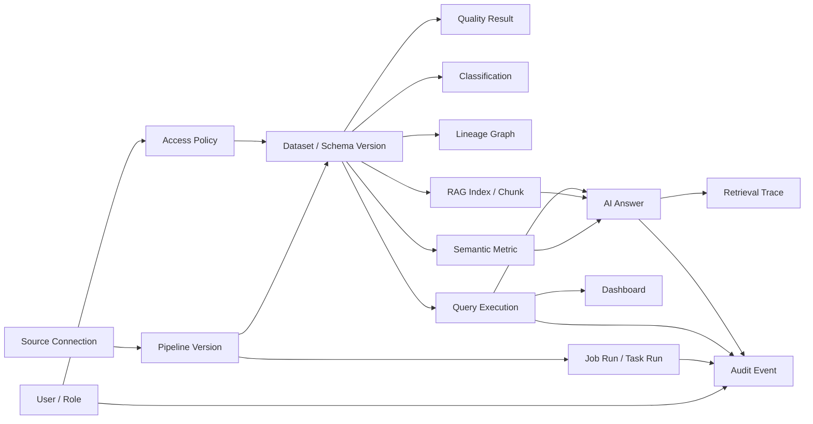

# 03. 인터페이스 기준

이 문서는 API, CLI 명령, UI 계약, event schema, background job, 내부 도구, 외부 연동 계약을 기록하는 기준 문서다.
Current implementation baseline contract와 Target MVP interface family를 분리해 관리한다.

## 1) 공통 규칙

- Base URL / command namespace / entrypoint: local backend `http://localhost:8000/api`
- Request/response format: API는 JSON, 사람 작업 흐름은 browser UI
- Naming conventions: code identifier는 원문을 유지하고, 협업 문서는 한국어로 작성한다.
- Idempotency: 실행, backfill, event 소비는 중복 요청과 중복 event를 고려한다.
- Secret: credential 값은 API payload나 metadata DB에 직접 저장하지 않고 secret reference로 저장한다.
- Policy: Query, Ask, RAG retrieval, prompt assembly는 동일한 권한 판단을 공유해야 한다.

## 2) 인증과 접근 제어

### Current Baseline

- Authentication: baseline demo에서는 보류한다.
- Authorization: baseline demo에서는 보류한다.
- Public/private boundaries: local demo만 대상으로 하며 실제 secret이나 production data를 사용하지 않는다.

### Target MVP

- Authentication: 사용자, 역할, 목적 정보를 policy decision과 audit event에 연결한다.
- Authorization: dataset/table/column 단위 policy와 action별 권한을 구분한다.
- Masking: 원본 접근이 불가능하면 마스킹 대안을 제공하거나 실행 전에 차단한다.
- Access Request: 차단된 자원, 필요한 권한, 목적, 기간을 포함해 요청할 수 있어야 한다.
- AI access: SQL, RAG retrieval, prompt, final answer 모든 단계에서 허용된 데이터만 사용한다.

## 3) 상태, 오류, 실패 형식

| 조건 | 기대 결과 |
| --- | --- |
| Invalid source config | API returns validation error and UI shows actionable message. |
| Pipeline run fails | Run status becomes `failed` and stores a short error/log. |
| Result dataset unavailable | Catalog detail shows not ready or failed state instead of pretending success. |
| Trust gate remains incomplete | Dataset is not exposed as `Trusted`; remaining gate is visible. |
| Policy denies query or ask | Request is blocked before execution/retrieval/prompt and access request path is offered when applicable. |
| Evidence is insufficient | Ask result is `Insufficient Evidence` or deferred instead of a confident answer. |
| Schema drift or quality failure occurs | Dataset becomes `Degraded` or `Blocked`; impacted assets are discoverable. |

## 4) Current Baseline Interface

### Health API

- Type: API
- Endpoint: `GET /health`, `GET /api/health`
- Output:

```json
{
  "service": "asklake-backend",
  "status": "ok",
  "app": "AskLake"
}
```

### Source / Catalog 계약

- Type: API/UI/Internal store
- Default source type: CSV/local file
- Metadata store: SQLite implementation behind `MetadataStore`
- ID rule: API에 노출되는 `source_id`, `dataset_id`는 string UUID로 둔다.
- Required endpoints:

```text
POST /api/sources
GET /api/sources
GET /api/sources/{source_id}
GET /api/catalog/datasets
GET /api/catalog/datasets/{dataset_id}
```

- `POST /api/sources` minimum request:

```json
{
  "name": "sample_orders",
  "type": "csv",
  "path": "samples/orders.csv"
}
```

- Catalog dataset minimum response:

```json
{
  "id": "dataset_001",
  "name": "sample_orders",
  "source_type": "csv",
  "schema": [
    { "name": "order_id", "type": "string" },
    { "name": "amount", "type": "number" }
  ],
  "row_count": 100,
  "sample": [
    { "order_id": "A001", "amount": 12000 }
  ],
  "status": "ready",
  "owner": "unassigned",
  "trust_status": "Draft",
  "trust_gate_result": {
    "id": "trust_gate_001",
    "dataset_id": "dataset_001",
    "status": "Draft",
    "required_gates": ["schema", "quality", "pii", "owner", "policy", "approval"],
    "passed_gates": ["schema"],
    "failed_gates": ["quality", "pii", "owner", "policy", "approval"],
    "reasons": ["quality gate is pending"],
    "evaluated_at": "2026-06-24T00:00:00Z"
  }
}
```

### Catalog / Trust Gate 계약

- Type: API/UI/Internal store
- Scope: Target R1 최소 구현. baseline `status: ready`는 유지하고 Target 신뢰 상태는 `trust_status`와 `trust_gate_result`로 분리한다.
- Mock/Fake boundary: quality, PII, owner, policy, approval gate는 deterministic placeholder로 계산한다. 실제 PII 탐지, 외부 policy service, secret-backed provider는 포함하지 않는다.
- Endpoint:

```text
POST /api/catalog/datasets/{dataset_id}/trust-gate
```

- Request:

```json
{
  "owner": "data-team",
  "passed_gates": ["schema", "quality", "pii", "owner", "policy", "approval"],
  "failed_gates": []
}
```

- Response: `TrustGateResult`

```json
{
  "id": "trust_gate_001",
  "dataset_id": "dataset_001",
  "status": "Trusted",
  "required_gates": ["schema", "quality", "pii", "owner", "policy", "approval"],
  "passed_gates": ["schema", "quality", "pii", "owner", "policy", "approval"],
  "failed_gates": [],
  "reasons": ["all required trust gates passed"],
  "evaluated_at": "2026-06-24T00:00:00Z"
}
```

Trust status rule:

- `Trusted`: all required gates are passed.
- `Verifying`: no gate has explicitly failed, but one or more required gates are still pending.
- `Blocked`: one or more gates are explicitly listed in `failed_gates`.
- Query / Ask follow-up phases must treat only `Trusted` as the default consumable candidate. `Draft`, `Verifying`, and `Blocked` are default block/defer candidates until a later policy contract states otherwise.

### Baseline Pipeline 계약

- Type: API/UI/Job
- Input: registered source dataset, `select_fields` transform config, target dataset name
- Output: `PipelineRun` with `queued`, `running`, `success`, or `failed` status
- Current endpoints:

```text
POST /api/pipelines
GET /api/pipelines
GET /api/pipelines/{pipeline_id}
POST /api/pipelines/{pipeline_id}/runs
GET /api/pipeline-runs/{run_id}
```

- `POST /api/pipelines` minimum request:

```json
{
  "name": "orders_amounts",
  "source_dataset_id": "dataset_uuid",
  "select_fields": ["order_id", "amount"],
  "target_name": "orders_amounts_result"
}
```

## 5) Target MVP Interface Family

Target MVP는 아래 family를 순차적으로 확정한다.
이번 rebaseline에서는 상세 endpoint를 과도하게 확정하지 않고 family, 상태, 핵심 contract만 둔다.

| Family | 목적 | 핵심 contract | 상태 |
| --- | --- | --- | --- |
| Source API | 연결 등록, 연결 테스트, schema discovery | `SourceConnection`, secret reference, schema/sample preview | baseline + 확장 |
| Pipeline / Job API | version, validation, deploy, run, retry, rerun, backfill | `PipelineVersion`, `JobRun`, `TaskRun`, idempotency key | target R2 |
| Catalog / Trust API | draft, dataset detail, trust status, lineage, usage | `Dataset`, `DatasetStatus`, `TrustGateResult` | target R1 |
| Quality / PII API | quality rule, result, PII candidate, classification | `QualityRule`, `QualityResult`, `Classification` | target R1/R2 |
| Policy / Access API | RBAC, masking, access request, approval | `AccessPolicy`, `PolicyDecision`, `AccessRequest` | target R4 |
| Query API | preflight, SQL execution, result, saved query | `QueryExecution`, scan/cost/policy result | target R4 |
| Ask / Evidence API | route, answer, evidence, retrieval trace | `AskAnswer`, `EvidenceItem`, `RetrievalTrace` | target R5 |
| Operation / Incident API | status center, alert, incident, impacted asset | `Incident`, `AssetImpact`, `RecoveryAction` | target R6 |
| Admin / Audit API | user, role, config, audit search | `AuditEvent`, `InvestigationCase` | target R4+ |
| Deployment / Health API | module health, readiness, config validation | `ModuleHealth`, `DeploymentProfile` | target R7 |

## 6) Modular Contract Baseline

R0.5 `Modular Contract Baseline`은 Target MVP를 병렬 workstream으로 구현하기 위한 최소 공유 계약이다.
이 계약은 상세 endpoint나 저장소 schema를 고정하지 않고, module 간 mock/fake adapter와 integration spine이 같은 언어를 쓰게 하는 기준이다.

| Contract | Owner Workstream | 최소 필드/상태 | Mock/Fake Boundary |
| --- | --- | --- | --- |
| `Dataset` | Catalog / Trust | `id`, `name`, `source_ref`, `schema_version`, `status`, `owner`, `freshness`, `trust_gate_result_id` | Source/Job workstream은 fixture dataset으로 대체 가능 |
| `DatasetStatus` | Catalog / Trust | `Draft`, `Verifying`, `Trusted`, `Degraded`, `Blocked`, `Archived` | Query/Ask는 status fixture로 policy path를 검증 가능 |
| `TrustGateResult` | Catalog / Trust | `dataset_id`, `status`, `required_gates`, `passed_gates`, `failed_gates`, `reasons`, `evaluated_at` | quality/PII/policy engine은 placeholder result 허용 |
| `SourceConnection` | Source Connector | `id`, `type`, `display_name`, `secret_ref`, `connection_status`, `last_checked_at` | 실제 RDB/API 대신 local fixture connector 허용 |
| `SchemaSnapshot` | Source Connector | `source_id`, `dataset_id`, `columns`, `sample_ref`, `row_count`, `captured_at` | sample rows는 bounded preview fixture 허용 |
| `JobRun` | Job / Orchestrator | `id`, `job_type`, `status`, `dataset_id`, `idempotency_key`, `started_at`, `finished_at` | synchronous in-memory runner 허용 |
| `TaskRun` | Job / Orchestrator | `id`, `job_run_id`, `task_type`, `status`, `attempt`, `error_summary` | single-task fixture 허용 |
| `AuditEvent` | Job / Orchestrator | `id`, `actor`, `action`, `resource_ref`, `policy_decision_id`, `created_at` | append-only local event log 허용 |
| `PolicyDecision` | Query / Policy | `id`, `actor`, `action`, `resource_ref`, `decision`, `masking`, `reason`, `decided_at` | allow/deny/mask rule fixture 허용 |
| `QueryExecution` | Query / Policy | `id`, `dataset_id`, `status`, `sql_or_plan`, `policy_decision_id`, `evidence_refs` | local query fake 또는 dry-run plan 허용 |
| `EvidenceItem` | Ask / Evidence | `id`, `type`, `resource_ref`, `summary`, `freshness`, `policy_decision_id`, `trace_ref` | static evidence fixture 허용 |
| `RetrievalTrace` | Ask / Evidence | `id`, `question`, `route`, `retrieved_refs`, `blocked_refs`, `policy_decision_id` | external LLM 없이 deterministic route fixture 허용 |
| `AssetImpact` | Recovery / Operate | `id`, `source_event_ref`, `affected_assets`, `severity`, `reason` | schema drift/quality failure fixture 허용 |
| `RecoveryAction` | Recovery / Operate | `id`, `type`, `target_ref`, `range`, `idempotency_key`, `status` | retry/rerun/backfill simulation 허용 |
| `ModuleHealth` | Packaging | `module`, `status`, `checks`, `config_warnings`, `checked_at` | local/container health fixture 허용 |

R0.6 Thin Runtime Core code mapping:

| Area | Code location | Purpose |
| --- | --- | --- |
| Shared target contracts | `backend/app/domain/target_contracts.py` | R0.5 contract names and minimal fields as importable Pydantic models |
| Policy / Query ports | `backend/app/ports/policy_engine.py`, `backend/app/ports/query_engine.py` | Query / Policy workstream boundary without real Trino or external policy engine |
| Job runner port | `backend/app/ports/job_runner.py` | Job / Orchestrator workstream boundary without external scheduler |
| Fake providers | `backend/app/fakes/` | local fixture policy, query, source, and in-memory job runner for contract tests |
| Thin services | `backend/app/services/catalog_trust.py`, `backend/app/services/query_policy.py`, `backend/app/services/job_orchestrator.py` | minimal use-case skeleton for first workstream wave |
| Frontend feature entries | `frontend/src/features/catalog/`, `frontend/src/features/sources/`, `frontend/src/features/jobs/`, `frontend/src/features/query/` | feature folder anchors for later parallel UI work |

### AskLake Week 2 Contract Package

Week 2 module work must start from fixture contracts before M1~M6 feature implementation.
The fixture package lives in `contracts/` and is a thin consumer/producer contract, not a final storage schema.

| Fixture | Producer | Consumers | Purpose |
| --- | --- | --- | --- |
| `contracts/source_config.sample.json` | M1 | M2, M3, M4, M5 | Demo tenant source identity, source type, connection reference, and source options |
| `contracts/schema_definition.sample.json` | M3 | M1, M5, M6 | Amazon Reviews inferred/overridden schema shape used by workflow, catalog, and SQL planning |
| `contracts/transform_spec.sample.json` | M3 | M5 | Select/flatten/normalize/aggregate/load intent and catalog facts without owning runner or catalog persistence |
| `contracts/runtime_config.sample.json` | M2 | M3, M4, M5, M6 | MinIO/S3-compatible storage, Spark/local runner, Parquet, and SQL runtime settings |
| `contracts/kafka_topic_contract.sample.json` | M4 | M3, M5 | Kafka raw event shape, replay evidence, and non-blocking streaming handoff |
| `contracts/workflow_definition.sample.json` | M1/M5 | M5 | Source -> Select/Filter -> Cast/Normalize -> Aggregate -> Load workflow shape |
| `contracts/execution_result.sample.json` | M2, M3, M4, M5 | M1, M5, M6 | Airflow and local runner compatible execution result shape |
| `contracts/catalog_metadata.sample.json` | M2, M3, M4, M5 | M1, M6 | Dataset metadata, location, schema, metrics, lineage, and SQL allowlist context |
| `contracts/ai_query_result.sample.json` | M6 | M1 | Dataset selection, evidence, SELECT-only SQL, rows, summary, and chart result shape |

Locked Week 2 contract decisions:

- `SourceConfig` is not owned by M1 alone. M1 owns demo tenant, source id, and UI input shell; M3 owns CSV/JSON/JSONL source-specific options; M4 owns Kafka source-specific options.
- `TransformSpec` is the M3-owned intent contract. It does not create Spark sessions, choose runner implementation, or write Catalog state directly.
- `RuntimeConfig` is the M2-owned runtime contract. M5 consumes it for runner selection and M6 consumes its SQL runtime profile, but M2 does not define transform semantics.
- `KafkaTopicContract` is evidence and raw-event handoff for Week 2. Kafka is not a blocker for the Amazon Reviews main E2E path unless a later Phase explicitly changes the main path.
- `ExecutionResult.duration_ms` is part of the locked execution evidence and comes from `Week2RunnerResult.duration_ms`.

Week 2 shared IDs:

| ID | Owner | Required format |
| --- | --- | --- |
| `tenant_id` | M1 | `tenant_demo` for MVP demo; every major fixture carries it |
| `source_id` | M1/M3/M4 | `source_<domain>_<profile>` |
| `pipeline_id` | M1/M5 | `pipeline_<domain>_<flow>` |
| `run_id` | M5 | `run_<domain>_<profile>_<sequence>` |
| `dataset_id` | M3/M5 | `dataset_<domain>_<layer>` |

Week 2 draft API/UI route contract:

| Flow | Method / Route or UI route | Owner | Response fixture |
| --- | --- | --- | --- |
| Source register | `POST /api/week2/sources` / `/sources` | M1 + M3 | `SourceConfig`, `SchemaDefinition` preview |
| Schema preview/override | `POST /api/week2/schemas/{source_id}/preview` / `/schema-preview` | M3 + M1 | `SchemaDefinition` |
| Workflow run | `POST /api/week2/workflows/{pipeline_id}/runs` / `/runs` | M5 + M1 | `ExecutionResult` |
| Run status | `GET /api/week2/runs/{run_id}` / `/runs/{run_id}` | M5 + M1 | `ExecutionResult` |
| Catalog detail | `GET /api/week2/catalog/{dataset_id}` / `/catalog/{dataset_id}` | M5 + M1 | `CatalogMetadata` |
| AI query | `POST /api/week2/ai/query` / `/ask` | M6 + M1 | `AIQueryResult` |

These are Week 2 draft routes, not final product API routes. If an implementation uses existing baseline `/api/sources`, `/api/pipelines`, or `/api/catalog/datasets` routes, it must either adapt to these fixture names at the boundary or update this section before module work continues.
Locked for this contract pass: Source register and schema preview routes remain fixture-first until a later implementation PR adds them. The currently executable Week 2 routes are workflow run, run status, catalog detail, and AI query. M1 may replace placeholders with fixture/API state, but placeholder identifiers must converge on the shared Week 2 IDs in this section.

Week 2 storage path pattern:

```text
s3://<bucket>/<domain>/<layer>/[dataset_path/]run_id=<run_id>/
```

`dataset_path` is optional and may hold a domain-specific Gold output such as `daily_metrics`.
MVP default bucket is `asklake-demo`; final MinIO endpoint and local fallback path remain implementation decisions that must be recorded before M3/M5 handoff.

Week 2 SQL execution uses an adapter boundary:

```text
M6 AI Query
-> SqlEngineAdapter
-> DuckDBSqlEngine for MVP
-> CatalogMetadata.s3_uri or local path
```

Minimum `SqlEngineAdapter` methods:

| Method | Purpose |
| --- | --- |
| `validate(sql, context)` | enforce SELECT-only, table allowlist, timeout, and limit rules before execution |
| `execute(sql, context)` | run SQL through the selected engine and return `QueryResult` |
| `explain_schema(context)` | expose dataset columns/types from `SqlEngineContext` to SQL generation and validation |
| `health_check()` | report whether the selected engine is ready for the current profile |

Minimum `QueryResult` shape:

| Field | Required | Notes |
| --- | --- | --- |
| `engine` | yes | `duckdb` for MVP |
| `sql` | yes | executed or validated SELECT-only SQL |
| `columns` | yes | list of `{name, type}` |
| `rows` | yes | list of row objects |
| `row_count` | yes | count of returned rows, not necessarily full scan count |
| `duration_ms` | yes | execution duration in milliseconds |
| `executed_at` | yes | ISO timestamp |

`AIQueryResult.query_result` is the canonical SQL execution result for Week 2.
Top-level `AIQueryResult.sql` and `AIQueryResult.rows` may remain as backward-compatible M1 display convenience fields, but they must mirror `query_result.sql` and `query_result.rows`.

Minimum `AIQueryResult.evidence[]` grounding shape:

| Field | Required | Notes |
| --- | --- | --- |
| `dataset_id` | yes | selected CatalogMetadata dataset id |
| `run_id` | no | source M5 run id when available |
| `s3_uri` | no | CatalogMetadata output URI |
| `freshness` | no | CatalogMetadata update timestamp |
| `table_name` | no | SQL table allowlist context from CatalogMetadata query section |
| `schema_fields` | no | CatalogMetadata schema fields, preserving nullable/type facts for M1 evidence display |
| `metrics` | no | CatalogMetadata metric facts such as output `row_count`, `bytes`, quality, and semantics |
| `lineage` | no | CatalogMetadata source, pipeline, run, and upstream dataset lineage |
| `retrieval_terms` | no | M6 retrieval/scoring terms that explain why the dataset was selected |

The grounding fields are additive. Existing M1 consumers may continue reading `dataset_id`, `run_id`, `s3_uri`, and `freshness`, while richer Week 2 displays can show schema, metric, lineage, and retrieval evidence without recomputing M6 scoring.

Minimum SQL guardrail failure shape:

| Field | Values |
| --- | --- |
| `status` | `succeeded`, `blocked`, `failed` |
| `guardrail.validation_status` | `passed`, `blocked`, `failed` |
| `guardrail.failure_code` | `non_select_sql`, `table_not_allowed`, `column_not_allowed`, `timeout`, `limit_required`, `engine_unavailable`, or `null` |
| `guardrail.failure_message` | human-readable reason or `null` |

Week 2 workflow/run status values:

```text
queued, running, succeeded, failed, fallback_succeeded, fallback_failed
```

Week 2 execution metric semantics:

| Field | Canonical meaning |
| --- | --- |
| `ExecutionResult.row_count` | Primary input rows processed by the workflow run |
| `ExecutionResult.bytes` | Primary input bytes read by the workflow run |
| `ExecutionResult.duration_ms` | Runner execution duration in milliseconds |
| `ExecutionResult.task_results[].row_count` | Node-level row count, using the node's most useful available boundary; `Load` nodes record output dataset rows |
| `ExecutionResult.task_results[].bytes` | Node-level bytes, using the node's most useful available boundary; `Source` nodes record input bytes and `Load` nodes record output bytes |
| `CatalogMetadata.metrics.row_count` | Output dataset row count |
| `CatalogMetadata.metrics.bytes` | Output dataset bytes |

`ExecutionResult.task_results[]` records node-level status, attempt, row count, bytes, and error. M5 owns the canonical run state; M1 displays it; M6 may use successful `CatalogMetadata` only.
For big/complex dataset manipulation, these fields are processing evidence: they prove that transform/normalize/load produced a bounded output dataset instead of only displaying a successful UI state.

Week 2 daily smoke evidence must include:

```text
Date, Module, Owner, Run ID, Command or screen, Input source/file,
Output S3/local path, row_count, bytes, duration, Produced JSON,
Consumer module, Blocked issue, Next first action
```

M6 must not import DuckDB, Trino, or Athena directly. The MVP implementation may use `DuckDBSqlEngine` behind the adapter.
Unconfirmed values such as real sample file path, row count, and final MinIO path remain TODO in fixture files until the responsible module verifies them.
M1 static shell placeholders are not source of truth. When real API state is connected, M1 must display `tenant_demo`, `pipeline_reviews_json_e2e`, `dataset_reviews_gold`, and other shared fixture identifiers unless this section is updated first.

### Workstream Ownership

| Workstream | Owns | Must Not Own |
| --- | --- | --- |
| Catalog / Trust | dataset identity, trust status, publish gate result | source connector implementation, query execution engine |
| Source Connector | connection config, schema discovery, source preview | trust decision, policy decision |
| Job / Orchestrator | job/task status, idempotency, audit event write path | UI-only evidence rendering, external scheduler lock-in |
| Query / Policy | policy preflight, query execution contract, masking/deny result | LLM answer generation, trust gate calculation |
| Ask / Evidence | route decision, evidence assembly, retrieval trace | raw unauthorized data access, source ingestion |
| Recovery / Operate | asset impact, incident/recovery action, retry/backfill record | source connector credentials, final policy override |
| Packaging | health/config/secret validation profile | product trust semantics |

### Integration Spine Contracts

| Checkpoint | Required Contracts |
| --- | --- |
| Spine 0. Contract Baseline | all contracts in this section are named with owner and mock boundary |
| Spine 1. Trusted Dataset Draft | `SourceConnection`, `SchemaSnapshot`, `Dataset`, `DatasetStatus`, `TrustGateResult` |
| Spine 2. Governed Query | `Dataset`, `DatasetStatus`, `PolicyDecision`, `QueryExecution`, `AuditEvent` |
| Spine 3. Evidence & Recovery | `EvidenceItem`, `RetrievalTrace`, `AssetImpact`, `RecoveryAction`, `AuditEvent` |
| Release Checkpoint | `ModuleHealth`, deployment profile, secret/config validation |

## 7) Target 상태 모델

### Pipeline Version

```text
Draft -> Validating -> Approval Pending -> Approved -> Deploying -> Active
Active -> Suspended
* -> Archived
```

### Run / Task

```text
Queued -> Running -> Succeeded
Queued -> Running -> Failed
Queued -> Running -> Partially Succeeded
Queued/Running -> Cancelled
```

### Dataset

```text
Draft -> Verifying -> Trusted
Trusted -> Degraded
Trusted/Degraded -> Blocked
* -> Archived
```

`Trusted`만 일반 Catalog 검색, Query, Ask 기본 후보가 된다.
`Degraded`는 마지막 정상 데이터를 사용할 수 있지만 freshness/quality 경고를 표시한다.
`Blocked`는 신규 소비를 막는다.

### Approval

```text
Pending -> Approved
Pending -> Rejected
Pending -> Changes Requested
Pending -> Cancelled
Pending -> Expired
```

### RAG Index

```text
Not Configured -> Draft -> Building -> Ready
Ready -> Stale
Ready/Stale -> Failed
Ready/Stale/Failed -> Disabled
```

Dataset이 `Blocked`되거나 policy가 강화되면 연결된 index는 즉시 `Stale` 또는 `Disabled`가 되어야 한다.

## 8) Target 핵심 데이터 관계



## 9) 주요 이벤트

| Event | 목적 |
| --- | --- |
| `SourceConnected` | 연결 검증과 schema discovery 시작 |
| `PipelineValidated` | pipeline version 검증 완료 |
| `PipelineApproved` | 승인된 pipeline version 기록 |
| `RunStarted` | run/task 상태 시작 |
| `TaskFailed` | 실패 원인, 재시도, 영향 분석 시작 |
| `RunSucceeded` | output과 quality 검증 시작 |
| `QualityFailed` | dataset trust 상태 변경 |
| `DatasetPublished` | `Trusted` 게시 |
| `DatasetDegraded` | freshness/schema/상류 실패 전파 |
| `AccessDenied` | 권한 부족 안내와 access request 연결 |
| `AccessRequested` | 접근 요청 workflow 시작 |
| `RAGIndexUpdated` | index version 갱신 |
| `RAGIndexStale` | 원본/정책 변경으로 index stale 처리 |
| `DashboardRefreshFailed` | serving/dashboard 영향 표시 |
| `SecurityAlertRaised` | 이상 접근 조사 시작 |

이벤트는 중복 전달될 수 있다고 가정한다.
소비자는 event id와 asset version을 이용해 멱등하게 처리하고, 중요 상태 변경은 Metadata DB 현재 상태로 재검증한다.

## 10) 내부 도구와 외부 연동

### GitHub PR Body Closing Keyword

- Type: PR metadata
- Input: linked GitHub issue number
- Output: PR body contains a closing keyword such as `Closes #123`
- Success behavior: merge 후 GitHub issue가 자동 close되고 downstream Project/Notion sync가 정리된다.
- Failure behavior: issue가 열린 상태로 남을 수 있으므로 PR 전에 수정한다.

### Notion Issue Sync

- Purpose: GitHub Issue / Project 상태와 Notion board 동기화
- Input: GitHub issue/project events, Notion secrets
- Output: Notion database and GitHub Project state updates
- Timeout/retry/fallback: GitHub Actions 로그와 `Sync Error` 필드를 확인한다.

## 11) 열린 이슈

- Target R1에서 `TrustGateResult`를 실제 품질/PII 엔진으로 계산할지, 먼저 manual/placeholder gate로 둘지 결정해야 한다.
- Target R3 첫 확장 source는 PostgreSQL 또는 REST API 중 하나만 선택한다.
- Target R4 query engine은 local-first 경로와 Trino 도입 시점을 결정해야 한다.
- Target R5 Ask/Evidence는 외부 LLM 없이도 core policy/evidence 흐름을 검증할 수 있어야 한다.
- R0.5 이후 R1~R7은 순서형 queue가 아니라 workstream alias로 유지한다.
