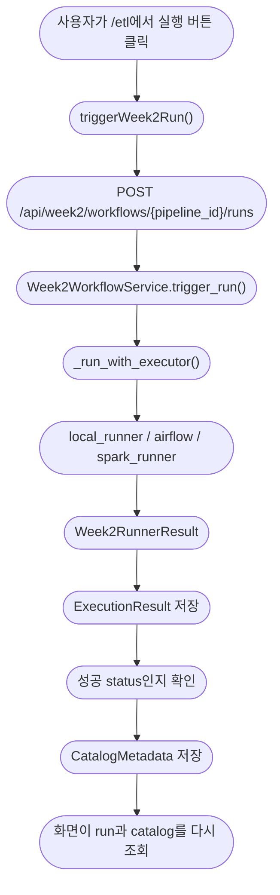

# M5 Overview Demo Guide

## 한 줄 요약

여기는 M5를 맡은 사람이 데모 화면을 보면서 "내가 무엇을 만들었고, 코드가 어떻게 움직이는지" 설명하기 위한 문서다.

M5는 계산 자체를 깊게 만드는 파트가 아니다.

```text
M5
= workflow 실행을 받고
= runner 결과를 ExecutionResult로 기록하고
= 성공한 output을 CatalogMetadata로 등록하고
= 나중에 M6가 믿고 읽을 lineage를 남기는 파트
```

딱 기억해.

```text
같은 run_id가 ExecutionResult -> output file -> CatalogMetadata.lineage까지 이어지면
M5의 핵심 설명은 끝난다.
```

## 데모 페이지와 같이 설명하는 순서

### 1. 기본 M5 데모: `/etl`

이 화면은 reviews 기본 경로를 설명할 때 쓴다.

```text
URL
= http://127.0.0.1:5173/etl

화면 파일
= frontend/src/app/App.jsx

API client
= frontend/src/api/week2Api.js
```

화면에서 먼저 볼 곳은 4개다.

| 화면 영역 | 설명할 말 |
| --- | --- |
| `M5는 4칸짜리 흐름입니다` | M5는 workflow, runner, output, catalog를 연결한다. |
| `executor를 고르고 run_id를 만듭니다` | 실행 엔진을 고르면 backend가 새 `run_id`를 만든다. |
| `실험 결과 판정` | `run_id`, `status`, `output`, `catalog lineage` 4개만 보면 된다. |
| `이 세 문장을 말할 수 있으면 데모를 이해한 것입니다` | 발표자가 그대로 말할 수 있는 요약 문장이다. |

데모에서 말할 문장은 아래처럼 잡으면 된다.

```text
1. M5는 pipeline_reviews_json_e2e workflow 실행을 받습니다.
2. runner가 만든 결과를 ExecutionResult로 저장하고 output 위치를 남깁니다.
3. 성공한 run이면 CatalogMetadata.lineage.run_id도 같은 run_id로 갱신합니다.
```

### 2. Product-health Airflow 데모: `product-health-airflow-demo.html`

이 화면은 product-health 발표 보강 경로를 보여줄 때 쓴다.

```text
URL
= http://127.0.0.1:5173/product-health-airflow-demo.html

파일
= frontend/product-health-airflow-demo.html

기본 API base
= http://127.0.0.1:8002
```

이 페이지는 main React route tree 안에 들어간 화면이 아니다.
독립 HTML 페이지가 backend API를 직접 호출한다.

| 화면 영역 | 설명할 말 |
| --- | --- |
| `Run Receipt` | `pipeline_product_health_e2e` run이 생성됐는지 본다. |
| `Task Evidence` | product-health source 4개가 같은 run에 묶였는지 본다. |
| `Catalog Metadata` | `dataset_product_health_gold`, `gold_product_health`, allowed columns를 본다. |
| `Logs` | Airflow 성공인지, fallback인지, 실패인지 로그로 구분한다. |

여기서 중요한 구분은 이거다.

```text
Product-health 계산 로직을 M5가 완성한 것이 아니다.
M5는 product-health runner가 준 Week2RunnerResult를
ExecutionResult와 CatalogMetadata로 연결하는 책임을 맡았다.
```

## 전체 흐름



여기서 M5의 중심은 `Week2WorkflowService.trigger_run()`이다.

## 파일/함수 단위 지도

### Frontend

```text
frontend/src/app/App.jsx
= /etl 화면을 만든다.
```

| 함수/컴포넌트 | 하는 일 |
| --- | --- |
| `M5DemoPage` | `/etl` 데모 전체 화면. 실행 버튼, evidence, Catalog 확인을 묶는다. |
| `executeWeek2Run()` | `triggerWeek2Run()`을 호출하고, 실행 후 Catalog를 다시 읽는다. |
| `refreshWeek2Evidence()` | 현재 run과 Catalog를 다시 불러온다. |
| `M5CoreFlowMap` | workflow -> runner -> output -> Catalog 4칸 흐름을 보여준다. |
| `M5VerdictPanel` | `run_id`, `status`, `output`, `catalog lineage` 판정 카드를 보여준다. |
| `M5EvidenceBoard` | `ExecutionResult`의 핵심 값을 표로 보여준다. |
| `CatalogEvidencePanel` | `CatalogMetadata.lineage.run_id`가 현재 run과 같은지 보여준다. |
| `runInterpretation()` | `succeeded`, `fallback_succeeded`, 실패 상태를 사람이 읽을 말로 바꾼다. |

```text
frontend/src/api/week2Api.js
= frontend가 backend에 전화 거는 작은 API client다.
```

| 함수 | 호출 API |
| --- | --- |
| `triggerWeek2Run()` | `POST /api/week2/workflows/{pipeline_id}/runs` |
| `getWeek2Run()` | `GET /api/week2/runs/{run_id}` |
| `getWeek2Catalog()` | `GET /api/week2/catalog/{dataset_id}` |

### Backend API

```text
backend/app/api/week2_workflow.py
= HTTP 요청이 처음 도착하는 입구다.
```

| 함수 | 하는 일 |
| --- | --- |
| `trigger_workflow_run()` | request body의 `executor`, `triggered_by`를 읽고 service에 넘긴다. |
| `get_workflow_run()` | 저장된 `ExecutionResult`를 `run_id`로 조회한다. |
| `get_catalog_metadata()` | 저장된 `CatalogMetadata`를 `dataset_id`로 조회한다. |

정확히는 이거다.

```text
week2_workflow.py가 실행을 처리하는 게 아님.
여기는 요청 받는 입구다.

진짜 실행 조율은 Week2WorkflowService가 한다.
```

### Backend Service

```text
backend/app/services/week2_workflow.py
= M5의 중심 파일이다.
```

| 함수/값 | 하는 일 |
| --- | --- |
| `SUPPORTED_EXECUTORS` | `airflow`, `local_runner`, `spark_runner`만 허용한다. |
| `SUCCESSFUL_RUN_STATUSES` | `succeeded`, `fallback_succeeded`만 Catalog 갱신 후보로 본다. |
| `Week2WorkflowService.__init__()` | contract fixture, runner, CatalogStore, 저장된 run/catalog를 준비한다. |
| `trigger_run()` | 새 `run_id` 생성, runner 실행, run 저장, 성공 시 Catalog 저장까지 한다. |
| `_run_with_executor()` | executor 이름에 따라 local/Airflow/Spark/product-health runner를 고른다. |
| `_fallback_runner()` | product-health는 `Week2ProductHealthHandoffRunner`, reviews는 `Week2LocalRunner`로 보낸다. |
| `_catalog_for_run()` | runner 결과를 `CatalogMetadata` 모양으로 바꾼다. |
| `_logs_for_executor()` | 화면에서 성공/fallback을 설명할 수 있게 로그를 덧붙인다. |
| `should_fallback_to_local_runner()` | Airflow 결과가 `succeeded`가 아니면 local fallback이 필요하다고 판단한다. |

`trigger_run()`의 핵심은 이 순서다.

```text
1. pipeline_id로 workflow bundle을 찾는다.
2. executor가 허용된 값인지 확인한다.
3. 새 run_id를 만든다.
4. _run_with_executor()로 runner를 실행한다.
5. runner_result를 ExecutionResult에 반영한다.
6. run metadata를 저장한다.
7. status가 성공 계열이면 CatalogMetadata를 저장한다.
```

### Runner

```text
backend/app/services/week2_local_runner.py
= local demo용 실제 처리 runner다.
```

| 함수/값 | 하는 일 |
| --- | --- |
| `Week2RunnerResult` | runner들이 M5에게 제출하는 공통 결과지다. |
| `Week2LocalRunner.run()` | workflow node를 순서대로 실행하고 결과를 만든다. |
| `_run_node()` | `Source`, `Select/Filter`, `Cast/Normalize`, `Aggregate`, `Load`를 처리한다. |
| `_write_output_rows()` | `data/week2/reviews/gold/run_id=<run_id>/dataset_reviews_gold.jsonl`을 쓴다. |
| `select_columns()` | 필요한 컬럼만 남긴다. |
| `normalize_rows()` | schema definition을 보고 값 타입을 맞춘다. |
| `aggregate_rows()` | product별 review count와 average rating을 만든다. |

```text
backend/app/services/week2_airflow_adapter.py
= Airflow DAG를 호출하고 결과 artifact를 Week2RunnerResult로 바꾼다.
```

| 함수/값 | 하는 일 |
| --- | --- |
| `Week2AirflowConfig.from_env()` | Airflow URL, DAG id, result root 환경값을 읽는다. |
| `Week2AirflowAdapter.run()` | DAG run 생성, polling, 성공/실패 판단을 한다. |
| `result_from_successful_dag_run()` | Airflow success payload를 `Week2RunnerResult`로 바꾼다. |
| `week2_result_artifact_payload()` | `data/week2/_airflow_results/<run_id>.json`을 읽는다. |
| `failed_airflow_result()` | Airflow가 성공 증거를 못 주면 `status=failed` 결과로 만든다. |

```text
backend/app/services/week2_product_health_runner.py
= product-health 계산 runner가 붙기 전 M5 계약을 보여주는 handoff runner다.
```

| 함수/값 | 하는 일 |
| --- | --- |
| `Week2ProductHealthHandoffRunner.run()` | product-health source evidence와 Gold Parquet output을 만든다. |
| `PRODUCT_HEALTH_SOURCE_EVIDENCE` | reviews, behavior, delivery, product master source 증거다. |
| `write_parquet()` | `dataset_product_health_gold.parquet`를 쓴다. |

### Persistence

```text
backend/app/services/week2_catalog_store.py
= run과 catalog를 local JSON metadata로 저장한다.
```

| 함수 | 하는 일 |
| --- | --- |
| `load_runs()` | `data/week2/_metadata/runs/*.json`을 읽는다. |
| `load_catalog()` | `data/week2/_metadata/catalog/*.json`을 읽는다. |
| `save_run()` | run metadata를 `run_id` 파일로 저장한다. |
| `save_catalog()` | catalog metadata를 `dataset_id` 파일로 저장한다. |
| `sequence_start()` | 재시작 뒤에도 다음 sequence 번호를 이어간다. |

## status 해석

| status + executor | 설명할 말 |
| --- | --- |
| `fallback_succeeded` + `local_runner` | local demo runner가 output을 만들었고 성공했다. `/etl` 기본 실험에서는 정상 성공으로 설명한다. |
| `succeeded` + `airflow` | Airflow DAG가 성공했고 fallback 없이 result artifact를 backend가 읽었다. |
| `fallback_succeeded` + `airflow` | Airflow가 실패/미설정이라 local runner가 대신 성공했다. Airflow 성공으로 말하면 안 된다. |
| `failed` | runner가 실패했다. Catalog latest가 바뀌면 안 된다. |
| `fallback_failed` | Airflow도 실패하고 local fallback도 실패했거나 local runner 자체가 실패했다. 성공으로 말하면 안 된다. |

## M5가 보장하려고 한 것

### 1. 실행 기록과 Catalog latest를 분리한다

```text
run history
= 성공/실패와 관계없이 실행 시도를 기록한다.

Catalog latest
= 사용자가 믿고 볼 최신 성공 dataset metadata다.
```

실패 run은 저장될 수 있다.
하지만 실패 run이 Catalog latest를 덮으면 안 된다.

### 2. runner가 달라도 같은 결과 모양을 받는다

```text
local_runner
airflow
spark_runner
product-health handoff runner

모두 Week2RunnerResult 모양으로 M5에 결과를 준다.
```

그래서 M5의 Catalog 저장 로직은 runner 내부 구현에 덜 묶인다.

### 3. output 위치와 Catalog 위치가 같은 run을 가리킨다

reviews 기본 경로는 이렇게 이어진다.

```text
run_id
= run_reviews_demo_001

ExecutionResult.outputs[0].uri
= s3://asklake-demo/reviews/gold/run_id=run_reviews_demo_001/

CatalogMetadata.storage.local_fallback_path
= data/week2/reviews/gold/run_id=run_reviews_demo_001/dataset_reviews_gold.jsonl

CatalogMetadata.lineage.run_id
= run_reviews_demo_001
```

product-health 경로는 이렇게 이어진다.

```text
run_id
= run_product_health_demo_001

ExecutionResult.outputs[0].uri
= s3://asklake-demo/product_health/gold/run_id=run_product_health_demo_001/

CatalogMetadata.query.table_name
= gold_product_health

CatalogMetadata.lineage.run_id
= run_product_health_demo_001
```

## M5가 아닌 것

| 영역 | 담당 기준 |
| --- | --- |
| raw data 등록 UI | M1/M3와 연결되는 영역 |
| Spark runtime 자체 | M2 |
| JSON 분석 transform spec/job logic | M3 |
| Kafka ingestion/replay | M4 |
| AI Query, RAG-lite, SQL answer | M6 |
| product-health risk score 계산 의미 | M2/M3 후속 runner |

M5가 말할 수 있는 선은 이거다.

```text
M5는 계산 결과의 의미를 만든 게 아니라,
계산 결과가 성공 run, output, Catalog, lineage로 믿을 수 있게 이어지는 길을 만들었다.
```

## 설명 연습 스크립트

### 30초 설명

```text
제가 맡은 M5는 Workflow Runtime과 Catalog 연결입니다.
사용자가 workflow를 실행하면 backend가 run_id를 만들고 runner를 호출합니다.
runner가 Week2RunnerResult를 돌려주면 M5가 ExecutionResult를 저장하고,
성공한 run에 대해서만 CatalogMetadata를 최신 값으로 갱신합니다.
그래서 화면에서는 같은 run_id가 실행 결과, output, catalog lineage까지 이어지는지 확인하면 됩니다.
```

### 2분 설명

```text
/etl 화면에서 local_runner를 실행하면 frontend의 triggerWeek2Run()이
POST /api/week2/workflows/pipeline_reviews_json_e2e/runs를 호출합니다.

backend route는 이 요청을 Week2WorkflowService.trigger_run()에 넘깁니다.
여기서 executor 검증, run_id 생성, runner 선택, run 저장, Catalog 저장이 일어납니다.

local_runner는 JSONL sample을 읽어서 Source, Select/Filter, Normalize, Aggregate, Load node를 순서대로 처리합니다.
마지막 Load node가 data/week2/reviews/gold/run_id=<run_id>/dataset_reviews_gold.jsonl을 씁니다.

그 결과가 Week2RunnerResult로 돌아오면 M5는 ExecutionResult를 만들고 저장합니다.
status가 succeeded 또는 fallback_succeeded면 CatalogMetadata도 저장합니다.

중요한 안전장치는 실패 run이 최신 Catalog를 덮지 않는다는 점입니다.
그래서 run history와 Catalog latest를 분리해서 설명해야 합니다.
```

### 코드 질문을 받았을 때

| 질문 | 답변 시작점 |
| --- | --- |
| "버튼 누르면 어디로 가요?" | `frontend/src/app/App.jsx`의 `executeWeek2Run()`에서 시작한다. |
| "API 주소가 뭐예요?" | `POST /api/week2/workflows/{pipeline_id}/runs`다. |
| "진짜 일하는 곳은 어디예요?" | `Week2WorkflowService.trigger_run()`이다. |
| "runner는 어디서 고르나요?" | `_run_with_executor()`에서 `executor` 값으로 고른다. |
| "Catalog는 언제 저장돼요?" | `trigger_run()`에서 `status in SUCCESSFUL_RUN_STATUSES`일 때만 저장된다. |
| "Airflow 성공은 어떻게 판단해요?" | `Week2AirflowAdapter.run()`이 DAG state와 result payload/artifact를 확인한다. |
| "product-health는 M5가 계산했나요?" | 아니고, handoff runner 결과를 M5가 run/catalog로 연결한 것이다. |

## 검증으로 설명할 수 있는 것

| 테스트 | 보장하는 말 |
| --- | --- |
| `backend/tests/test_week2_workflow_catalog.py` | run 생성, Catalog lineage, 실패 run이 latest Catalog를 덮지 않는 동작을 확인한다. |
| `backend/tests/test_week2_airflow_adapter.py` | Airflow DAG trigger, result artifact 읽기, product-health DAG routing을 확인한다. |
| `backend/tests/test_week2_local_runner.py` | local runner의 node 처리와 실패 처리를 확인한다. |
| `backend/tests/test_week2_spark_runner.py` | `spark_runner`가 같은 result boundary에 붙을 수 있는지 확인한다. |

## 데모 전 확인 체크리스트

- [ ] backend가 떠 있다.
- [ ] frontend dev server가 떠 있다.
- [ ] `/etl`에서 `local_runner 실행`이 눌린다.
- [ ] 새 `run_id`가 보인다.
- [ ] `status`를 executor와 함께 해석한다.
- [ ] output URI 또는 local path가 보인다.
- [ ] `CatalogMetadata.lineage.run_id`가 현재 `run_id`와 같다.
- [ ] product-health를 보여줄 때는 `dataset_product_health_gold`, `gold_product_health`, allowed columns를 같이 확인한다.

## 같이 읽을 문서

- [`docs/manual-verification/09-m5-demo-cockpit-learning-guide.md`](../../../manual-verification/09-m5-demo-cockpit-learning-guide.md)
- [`docs/project-context/asklake-week2-module-plan/ver2/m5-technical-depth-study-guide.md`](m5-technical-depth-study-guide.md)
- [`docs/project-context/asklake-week2-module-plan/ver2/runner-boundary-decision.md`](runner-boundary-decision.md)
- [`docs/reports/m5-airflow-smoke-integration.md`](../../../reports/m5-airflow-smoke-integration.md)
- [`docs/reports/m5-product-health-catalog-lineage.md`](../../../reports/m5-product-health-catalog-lineage.md)
