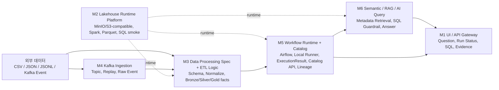

# AskLake Week2 M1~M6 책임 분리 ver2

## 배경

초기 회의안은 대용량 데이터셋을 명시했고, M2 정형 Batch, M3 JSON, M4 Kafka가 각각 데이터 생산자가 되는 구조였다. 이 구조는 빠르게 병렬화하기 좋지만, 발표 직전에는 M2/M3/M4가 Spark, Parquet, Catalog 책임을 각자 구현할 위험이 있다.

ver2는 중복 구현을 줄이고 발표 전 E2E를 안정화하기 위해 만든 현재 작업 기준이다. 기존 회의안은 historical context로 보존하고, 구현과 통합 판단은 이 문서를 우선한다.

## 핵심 원칙

- 산출물마다 최종 책임자를 하나만 둔다.
- 다른 모듈은 필요한 값을 제공하거나 결과를 소비한다.
- Spark는 공통 runtime으로 취급하고, 모듈별 Spark 구현을 만들지 않는다.
- Catalog는 M3의 data facts와 M5의 storage/API 책임을 분리한다.
- Week2 분석 대표 경로는 상품 리스크 Gold인 `gold_product_health`로 고정한다.
- Amazon Reviews JSON은 버리지 않고 `reviews_seed` fact input으로 유지한다.
- 5GB 처리는 Taxi 별도 evidence가 아니라 `gold_product_health`를 만드는 raw/bronze fact input 규모 기준으로 둔다.
- Kafka는 1차 blocker가 아니며, 2차 이후 behavior replay evidence 또는 3차 streaming evidence로 둔다.
- M6 최종 방향은 RAG/LLM 포함 완성형이지만, 현재 SQL도 fake/template 수준이므로 2주차 후속 M6 우선순위는 SQL MVP 완성이다.

## 최종 E2E 흐름



## M1 UI/API Gateway

### 하는 것

- demo tenant와 발표 클릭 흐름을 관리한다.
- Source, Run, Catalog, AI Query, Evidence 화면을 제공한다.
- backend API를 호출하고 pending/empty/error/fallback 상태를 표시한다.
- 화면에서 필요한 입력 형식과 표시 요구사항을 M3/M4/M5/M6에 전달한다.

### 하지 않는 것

- schema, ETL, Airflow, RAG 로직을 결정하지 않는다.
- data/schema/semantic 계약의 최종 결정자가 아니다.
- Catalog 저장소 내부 구현을 소유하지 않는다.

## M2 Lakehouse Runtime Platform

### 하는 것

- MinIO 또는 S3-compatible storage smoke를 제공한다.
- Spark execution runtime을 제공한다.
- Parquet path convention과 `RuntimeConfig`를 정리한다.
- `SparkRunner` 또는 동등한 runtime boundary를 제공한다.
- SQL runtime smoke를 제공한다.
- `SparkRunner`는 데이터셋별 runner가 아니라 입력 format/path/options를 `RuntimeConfig`로 받는 공통 실행기로 둔다.
- 5GB 이상 reviews/behavior/delivery fact input을 읽고 쓰는 runtime/storage/Spark execution evidence를 남긴다.
- Taxi 또는 정형 batch 입력은 delivery/fact input 준비 또는 50GB scale path에서 활용할 수 있지만, Taxi 별도 evidence만으로 상품 리스크 Gold 완료를 주장하지 않는다.
- source별 row_count, bytes, duration_ms, input_path, bronze/silver/gold output_path 같은 실행 evidence를 남긴다.

### 하지 않는 것

- 데이터 변환 정책을 결정하지 않는다.
- schema inference, quality 판단, `CatalogMetadata` facts를 만들지 않는다.
- Catalog 저장소/API를 소유하지 않는다.
- Iceberg는 이번 발표 범위에서 제외한다.

## M3 Data Processing Spec + ETL Logic

### 하는 것

- CSV/JSON/JSONL source profile을 만든다.
- schema inference, override, flatten, normalize, cast, quality rule을 정의한다.
- Bronze/Silver/Gold transformation spec을 만든다.
- Spark 또는 local runner에서 실행될 job logic/config를 제공한다.
- `CatalogMetadata`에 들어갈 schema, metrics, quality, source lineage facts를 만든다.

### 하지 않는 것

- Spark runtime 설치와 운영을 소유하지 않는다. Spark execution runtime은 M2 책임이다.
- Catalog DB/API 저장소를 소유하지 않는다. 저장/API는 M5 책임이다.
- Airflow DAG 실행 상태와 retry/log 표준화를 소유하지 않는다.

### 과부하 guardrail

M3가 runtime까지 맡으면 병목이 된다. 발표 전 AI Query/분석 대표 경로는 `gold_product_health`다. M3는 schema, silver/gold transform, metric semantics, `risk_score` 정의를 소유하되, Spark session/config/output convention은 M2/M5 boundary에 둔다.

## M4 Kafka Ingestion

### 하는 것

- Kafka topic, producer, replay command를 소유한다.
- raw event contract를 정의한다.
- consumer smoke, lag/throughput/restart evidence를 남긴다.
- raw Kafka event를 M3가 처리할 수 있는 형태로 제공한다.
- Kafka Event / streaming ingestion 경로의 output_path와 실행 evidence를 M5 run evidence 또는 Catalog에서 확인 가능하게 제공한다.

### 하지 않는 것

- flatten, Silver/Gold transformation을 소유하지 않는다.
- Catalog 저장을 소유하지 않는다.
- Spark Structured Streaming 운영 구현은 이번 slice의 필수 범위가 아니다.

## 데이터 경로별 완료 기준

| 데이터 경로 | 담당 | 필수 완료 기준 | 이번 기본 범위에서 제외 |
| --- | --- | --- | --- |
| `gold_product_health` 대표 path | M3, M2, M5, M6, M1 | reviews/behavior/delivery fact input과 product dimension을 처리해 `input_total_bytes >= 5GB` evidence, `gold_product_health`, M5 Catalog, M6 SQL/AI Query, M1 표시까지 연결 | real LLM, 외부 vector DB, full document RAG |
| Kafka Event / streaming ingestion | M4, M5, M1 | 2차 이후 behavior replay 또는 3차 streaming evidence로 replay/ingestion, throughput, lag, restart/replay, output_path, run evidence 확인 | 1차 Gold 생성 blocker화 |
| 50GB input scale path | M2, M3, M5 | Docker Spark cluster, partitioned Parquet/Bronze, storage, temp/shuffle/output disk 계획과 50GB run evidence | 100GB 필수화 |

발표 분석 질문과 M6 evidence의 대표 경로는 `gold_product_health`로 먼저 닫는다. 5GB input evidence는 이 Gold 생성 pipeline에 연결되어야 하며, Gold output 파일이 5GB일 필요는 없다.

## 상품 리스크 companion dataset 기준

정형/반정형/이벤트를 한 번에 분석하려면 공통 entity key가 필요하다. Week2 대표 path는 `product_id`를 기준으로 reviews, behavior, delivery fact와 product dimension을 결합한다.

- 공통 key가 없는 임의 데이터셋을 억지로 결합하지 않는다.
- M3는 `product_id` 결합 기준, silver metric, Gold schema, `risk_score` semantics를 소유한다.
- M2는 결합 의미를 정의하지 않고 대용량 read/write/runtime/storage evidence를 제공한다.

## M5 Workflow Runtime + Catalog Store/API + Lineage

### 하는 것

- `WorkflowDefinition`을 소유한다.
- Airflow Adapter와 local runner fallback을 소유한다.
- M2 runtime 또는 M3 ETL job logic을 실행하고 `ExecutionResult`를 만든다.
- Catalog 저장/API와 run/catalog 연결을 소유한다.
- input/output dataset과 workflow run lineage를 저장한다.

### 하지 않는 것

- ETL 내부 변환 로직을 소유하지 않는다. Transformation spec/job logic은 M3가 제공한다.
- Spark runtime 설치와 운영을 소유하지 않는다.
- raw Kafka ingestion을 소유하지 않는다.

## M6 Semantic/RAG/AI Query

### 하는 것

- `CatalogMetadata` retrieval과 semantic dataset selection evidence를 만든다.
- Catalog metadata, schema/profile facts, metrics, quality, lineage facts를 근거로 RAG-lite answer grounding을 만든다.
- 2주차 후속 실행 우선순위로 `dataset_product_health_gold` CatalogMetadata의 `storage.local_fallback_path`, `query.table_name`, `query.allowed_columns`, `query.default_limit`을 읽어 실제 SQL MVP를 완성한다.
- SQL planner와 SQL guardrail을 소유한다.
- `AIQueryResult`, answer, evidence, `chart_spec`을 만든다.

### 하지 않는 것

- 원본 ETL을 소유하지 않는다.
- Kafka ingestion을 소유하지 않는다.
- Catalog 저장소/API 구현을 소유하지 않는다.
- M5 CatalogMetadata를 저장하거나 수정하지 않는다.
- SQL engine runtime 설치는 M2 runtime 책임이다.
- SQL MVP 이전에 외부 vector DB, full document RAG, 대규모 indexing, real LLM provider 연결을 이번 기본 범위로 소유하지 않는다.
- 범용 NL2SQL을 이번 기본 범위로 소유하지 않는다.

### 빌드업 순서

```text
SQL MVP 완성
-> SQL Planner 강화
-> 응답 계약 보강
-> CatalogMetadata 기반 RAG
-> Hybrid query
-> 외부 LLM 답변 생성
-> M1 evidence 표시 연동
```

## 계약별 책임

| 계약 | 최종 소유자 | 제공자 | 소비자 | 설명 |
| --- | --- | --- | --- | --- |
| `SourceConfig` shell | M1 | M3, M4 | M2, M3, M4, M5 | demo tenant, source id, 화면 입력 흐름은 M1이 관리한다. |
| source-specific options | M3/M4 | M1 | M1, M5 | CSV/JSON/JSONL options는 M3, Kafka options는 M4가 제공한다. |
| `RuntimeConfig` | M2 | M5, M6 요구사항 | M3, M4, M5, M6 | MinIO/Spark/Parquet/SQL runtime 연결값. |
| `SchemaDefinition` | M3 | M2, M4 sample/raw 구조 | M1, M5, M6 | source field, type, nullable, array, override. |
| transformation spec/job logic | M3 | M2 runtime 제약, M5 workflow 요구사항 | M5 | Spark/local runner에서 실행될 데이터 처리 정의. |
| `WorkflowDefinition` | M5 | M1, M3 | M5, M1 | DAG/node/edge/retry/schedule/target dataset. |
| `ExecutionResult` | M5 | M2, M3, M4 실행 값 | M1, M5, M6 | run status, row_count, bytes, output path, error. |
| `CatalogMetadata` facts | M3 | M2/M4 raw facts | M5, M6, M1 | schema, metrics, quality, source lineage facts. |
| Catalog store/API/lineage | M5 | M3 facts | M1, M6 | Catalog record 저장, 조회 API, lineage 저장. |
| `KafkaTopicContract` | M4 | M3 요구사항 | M3, M5 | topic, event key, event timestamp, replay command. |
| `AIQueryResult` | M6 | M5 catalog, M3 facts | M1 | question, selected_datasets, semantic/RAG-lite evidence, SQL, rows, summary, chart_spec. |

## Spark/Runtime 책임 분리

```text
M3 transformation spec/job logic
    -> M5 WorkflowDefinition
    -> M2 SparkRunner 또는 local runner
    -> M5 ExecutionResult
    -> M5 Catalog store/API
```

- Spark는 M2가 제공하는 공통 runtime이다.
- M3는 Spark에서 실행될 transformation spec/job logic을 제공한다.
- M5는 `WorkflowDefinition`으로 `SparkRunner` 또는 local runner를 호출한다.
- M2/M3/M4가 각자 Spark session/config/output convention을 따로 만들지 않는다.

## Catalog 책임 분리

```text
M3 = Catalog에 넣을 데이터 사실을 만든다.
M5 = Catalog를 저장하고 조회 가능하게 만든다.
M6 = Catalog를 semantic retrieval/RAG-lite 근거로 검색해서 질문에 쓴다.
M1 = Catalog를 화면에 보여준다.
```

| 항목 | 소유자 |
| --- | --- |
| schema/metrics/quality/source lineage facts | M3 |
| Catalog 저장소/API/Lineage | M5 |
| Catalog 검색/RAG-lite grounding | M6 |
| Catalog 화면 표시 | M1 |

## Airflow/local runner 책임 분리

- Airflow는 M5의 workflow execution layer다.
- local runner는 Airflow 실패 대비 fallback이다.
- M3는 ETL task config/job logic을 제공한다.
- M5는 실행 상태, log, retry, `ExecutionResult`를 표준화한다.

## 현재 main 진척도와 충돌 여부

| 모듈 | 현재 진척 | ver2 충돌 여부 |
| --- | --- | --- |
| M1 | UI shell 기반 완료. 실제 backend 연결은 일부 placeholder 성격. | 충돌 낮음. UI/API Gateway 역할과 맞다. |
| M2 | Taxi dataset bootstrap은 설계/전략 중심이며 실제 batch 구현은 아직 약하다. | 역할 변경 가능성이 높다. Runtime Platform으로 재정렬 필요. |
| M3 | 기존 source/catalog 기반은 있으나 Week2 JSON 핵심 구현은 미병합/재조정 필요. | 범위 확대 위험이 있다. Amazon Reviews 분석 대표 path 우선으로 줄여야 한다. |
| M4 | Kafka replay to local Parquet demo는 있으나 Spark/S3 운영 구현은 아니다. | 충돌 낮음. Kafka Ingestion evidence로 흡수 가능하다. |
| M5 | workflow/catalog 기반이 가장 많이 구현되어 있다. | 충돌 낮음. M5는 실행/Catalog 저장/API 중심으로 유지한다. |
| M6 | AI query skeleton이며 CatalogMetadata 기반 retrieval/RAG-lite는 기본 연결 대상이다. 다만 현재 SQL도 fake/template 수준이므로 다음 우선순위는 실제 SQL MVP다. 외부 vector DB/full document RAG/real LLM은 SQL MVP 이후 후속 연결이다. | 충돌 낮음. M5 Catalog를 읽기 전용으로 소비하고 M2 SQL runtime adapter 뒤에서 실행하면 된다. |

## 발표까지 통합 순서

1. M2가 `RuntimeConfig`, MinIO/S3-compatible path, SparkRunner/local runner boundary를 고정한다.
2. M1이 `SourceConfig` shell, demo tenant, source id, 화면 입력 흐름을 고정한다.
3. M3/M4가 source type별 options와 validation 요구사항을 제공한다.
4. M3가 Amazon Reviews JSON 분석 대표 path profile/schema/ETL spec을 확정한다.
5. M4가 Kafka raw event contract와 replay evidence를 확정한다.
6. M5가 `WorkflowDefinition`으로 local runner 또는 SparkRunner 호출 경계를 연결한다.
7. M5가 `ExecutionResult`, Catalog store/API, lineage를 저장한다.
8. M6가 먼저 CatalogMetadata 기반 SQL MVP와 SQL planner/guardrail을 닫고, 이후 semantic retrieval, RAG-lite evidence grounding, `AIQueryResult`를 반환한다.
9. M1이 질문, SQL, 수치, evidence, fallback을 화면에 표시한다.

## 즉시 바꿀 문서와 보류할 문서

| 구분 | 문서 | 처리 |
| --- | --- | --- |
| 즉시 | `docs/project-context/asklake-week2-module-plan/README.md` | ver2 안내만 상단에 추가한다. |
| 즉시 | `docs/project-context/asklake-week2-module-plan/ver2/*` | 현재 기준 분업안을 새로 작성한다. |
| 보류 | `docs/project-context/asklake-week2-module-plan/plan.md` | 초기 회의안으로 보존한다. 대량 rewrite하지 않는다. |
| 보류 | `docs/project-context/asklake-week2-module-plan/decisions.md` | 후속 합의 후 짧은 결정 로그만 추가한다. |
| 보류 | `docs/project-context/asklake-week2-module-plan/meeting-summary.md` | 회의 기록으로 보존한다. |
| 후속 | `docs/03-interface-reference.md`, `contracts/*.sample.json` | 실제 구현 계약이 확정될 때 별도 PR에서 반영한다. |
