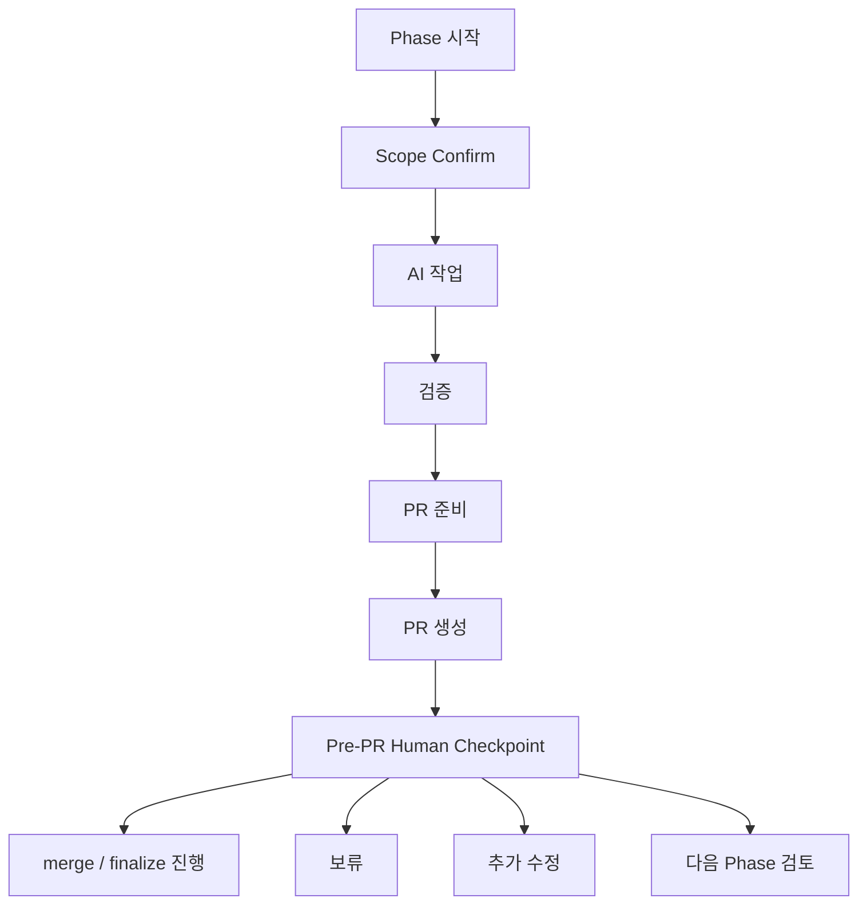

# AskLake 협업 하네스 사용 가이드

## 목차

1. [한 문장 요약](#1-한-문장-요약)
2. [이 하네스를 왜 쓰는가](#2-이-하네스를-왜-쓰는가)
3. [협업 하네스란 무엇인가](#3-협업-하네스란-무엇인가)
4. [전체 작업 흐름](#4-전체-작업-흐름)
5. [팀원이 기억할 최소 규칙](#5-팀원이-기억할-최소-규칙)
6. [AI에게 요청하는 방법](#6-ai에게-요청하는-방법)
7. [Phase 작업 흐름](#7-phase-작업-흐름)
8. [작업 중 방향을 바꾸고 싶을 때](#8-작업-중-방향을-바꾸고-싶을-때)
9. [확인 게이트란 무엇인가](#9-확인-게이트란-무엇인가)
10. [PR과 merge 흐름](#10-pr과-merge-흐름)
11. [AI가 자동으로 할 수 있는 일과 사람 확인이 필요한 일](#11-ai가-자동으로-할-수-있는-일과-사람-확인이-필요한-일)
12. [팀원이 하면 안 되는 것](#12-팀원이-하면-안-되는-것)
13. [좋은 요청 예시와 애매한 요청 예시](#13-좋은-요청-예시와-애매한-요청-예시)
14. [자주 묻는 질문](#14-자주-묻는-질문)
15. [팀원용 체크리스트](#15-팀원용-체크리스트)

---

## 1. 한 문장 요약

AskLake 협업 하네스는 팀원이 짧은 명령으로 작업을 시작하고, AI가 실행·검증·기록을 도우며, 사람은 중요한 결정 지점에서 안전하게 선택하도록 만드는 협업 장치입니다.

이 문서의 핵심은 하나입니다.

```text
하네스는 사람을 통제하는 규칙집이 아니라,
AI와 사람이 같은 흐름으로 일하게 만드는 작업 운영 방식이다.
```

팀원은 모든 문서를 외울 필요가 없습니다.

대신 다음만 기억하면 됩니다.

```text
작업은 Phase 단위로 시작한다.
AI에게 범위와 목표를 짧게 말한다.
중요한 결정 지점에서는 사람이 선택한다.
PR 생성과 merge는 다르다.
기록은 AI가 돕지만, 책임 있는 결정은 사람이 확인한다.
```

---

## 2. 이 하네스를 왜 쓰는가

AI와 함께 개발하면 속도는 빨라집니다. 하지만 그냥 빠르게만 진행하면 문제가 생길 수 있습니다.

예를 들어 이런 일이 생길 수 있습니다.

```text
범위가 슬쩍 커진다.
어떤 문서가 최신 기준인지 헷갈린다.
검증하지 않은 작업이 완료된 것처럼 보인다.
PR은 올라갔지만 merge해도 되는지 모른다.
한 사람이 계속 전체 흐름을 붙잡고 설명해야 한다.
```

AskLake 협업 하네스는 이런 문제를 줄이기 위한 작업 방식입니다.

하네스가 해주는 일은 다음과 같습니다.

- 작업을 `Phase` 단위로 나눈다.
- branch와 workspace를 연결한다.
- 작업 범위, 검증, 결정, PR 상태를 기록한다.
- AI가 어디까지 자동으로 해도 되는지 정한다.
- 사람이 확인해야 할 지점을 분명하게 만든다.

즉, 하네스는 AI에게 일을 맡기기 위한 장치이면서 동시에 사람이 놓치면 안 되는 결정을 드러내는 장치입니다.

---

## 3. 협업 하네스란 무엇인가

협업 하네스는 코드만 관리하는 도구가 아닙니다.

AskLake 프로젝트에서 하네스는 다음을 함께 관리합니다.

| 구성 요소 | 의미 |
|---|---|
| `Phase` | 하나의 작업 단위 |
| branch workspace | branch별 계획, 기록, 검증 결과를 담는 작업 공간 |
| Source of Truth | 현재 기준이 되는 요구사항, 설계, 인터페이스, 검증 문서 |
| confirmation gate | 사람이 확인해야 하는 결정 지점 |
| PR handoff | 작업 결과를 팀에 넘기기 위한 PR 준비 흐름 |
| report | 완료 후 남기는 실행 증거 |

쉽게 말하면 다음과 같습니다.

```text
branch는 코드 변경을 담고,
workspace는 그 작업의 의도와 검증 기록을 담고,
Source of Truth는 팀이 따라야 할 기준을 담는다.
```

---

## 4. 전체 작업 흐름

AskLake 협업 하네스의 기본 흐름은 다음과 같습니다.



이 흐름에서 중요한 점은 PR 생성과 merge가 분리되어 있다는 것입니다.

PR 생성은 팀이 볼 수 있게 올리는 것입니다.  
merge는 이 변경을 기준 branch에 반영하는 것입니다.

AI는 조건이 맞으면 PR 생성까지 자동으로 진행할 수 있습니다.  
하지만 merge, finalize, issue close, branch cleanup은 사람 확인 후에만 진행합니다.

---

## 5. 팀원이 기억할 최소 규칙

팀원이 모든 하네스 문서를 읽고 외울 필요는 없습니다.

다음 규칙만 기억해도 대부분의 협업은 안전하게 굴러갑니다.

### 5.1 작업 하나는 Phase 하나

한 번에 여러 기능을 섞지 않습니다.

좋은 요청:

```text
feature/trust-state-model Phase 시작해줘.
Dataset trust status 최소 모델을 구현하고 싶어.
```

애매한 요청:

```text
Trust 모델도 하고, UI도 고치고, 배포도 같이 해줘.
```

작업이 커지면 AI가 scope를 나누거나 `Scope Change Confirm`을 요청할 수 있습니다.

### 5.2 중요한 변경은 먼저 문서 기준을 맞춘다

인터페이스, schema, workflow, acceptance 기준이 바뀌면 코드보다 먼저 Source of Truth를 확인합니다.

예를 들어 API 응답 구조가 바뀐다면 `docs/03-interface-reference.md` 같은 interface 문서가 영향을 받을 수 있습니다.

### 5.3 검증 없는 완료는 완료가 아니다

작업이 끝났다는 말은 다음을 포함해야 합니다.

```text
무엇을 바꿨는가
어떻게 검증했는가
어떤 위험이 남았는가
다음에 무엇을 해야 하는가
```

### 5.4 PR 생성과 merge는 다르다

AI가 PR을 만들 수 있어도 merge까지 자동으로 하는 것은 아닙니다.

merge, finalize, issue close, branch cleanup은 사람이 명시적으로 선택해야 합니다.

### 5.5 막히면 짧게 말해도 된다

팀원은 복잡한 명령어를 외울 필요가 없습니다.

```text
상태 확인해줘.
PR 준비됐는지 봐줘.
이건 다음 Phase 후보로 남겨줘.
지금 변경은 현재 Phase 안에서 반영해줘.
PR만 올리고 merge는 보류해줘.
```

이 정도로 말해도 AI가 현재 상태에 맞는 메뉴를 제시합니다.

---

## 6. AI에게 요청하는 방법

팀원은 자연어로 요청해도 됩니다. 중요한 것은 목표와 범위를 분명하게 말하는 것입니다.

| 상황 | 팀원이 할 말 | AI가 하는 일 |
|---|---|---|
| 새 작업 시작 | `feature/source-expansion workspace 만들어줘` | branch workspace를 만들고 Scope Confirm을 요청한다 |
| 작업 범위 확정 | `1번 범위로 진행해` | `confirmations.md`에 기록하고 구현을 시작한다 |
| 현재 상태 확인 | `상태 확인해줘` | `scripts/status-workflow.sh`를 사용해 branch, PR, 검증 상태를 요약한다 |
| PR 준비 확인 | `PR 준비됐는지 봐줘` | 검증, sync, checklist, 포함/제외 파일을 확인한다 |
| 새 아이디어 보류 | `이건 다음 Phase 후보로만 남겨줘` | `next-actions.md`나 `notes.md`에 기록하고 현재 scope는 유지한다 |
| 범위 변경 | `이 기능도 현재 작업에 포함하고 싶어` | scope 확장인지 판단하고 필요하면 `Scope Change Confirm`을 요청한다 |
| PR만 생성 | `PR만 올리고 merge는 하지 마` | PR 생성 후 merge/finalize/cleanup은 멈춘다 |
| merge 진행 | `이 PR 진행해` | CI, conflict, review, stop condition을 확인한 뒤 승인된 범위에서 진행한다 |

---

## 7. Phase 작업 흐름

Phase는 하나의 작업 단위입니다.

Phase를 나누는 이유는 작업 범위를 작게 유지하고, 검증과 기록을 명확하게 남기기 위해서입니다.

일반적인 Phase 흐름은 다음과 같습니다.

```text
1. 작업 시작
2. branch workspace 생성
3. 범위 확인
4. 구현 또는 문서 변경
5. 테스트/build/smoke/manual verification
6. acceptance/regression/manual verification 확인
7. report 작성
8. PR 준비
9. PR 생성
10. 사람의 다음 선택
```

branch workspace에는 보통 다음과 같은 파일이 들어갑니다.

| 파일 | 역할 |
|---|---|
| `plan.md` | 이 Phase에서 할 일과 하지 않을 일 |
| `notes.md` | 작업 중 메모 |
| `quality.md` | 테스트, 검증, CI/CD 증거 |
| `sync.md` | branch, main, PR, issue 상태 |
| `confirmations.md` | 사람이 확인한 결정 |
| `decisions.md` | 중요한 선택과 보류된 선택 |
| `next-actions.md` | 다음 행동 메뉴 |
| `report.md` | 완료 보고와 증거 |

팀원이 직접 이 파일을 모두 관리할 필요는 없습니다.  
대부분은 AI가 업데이트합니다.

하지만 팀원은 AI가 제시하는 확인 질문에 답해야 합니다.

---

## 8. 작업 중 방향을 바꾸고 싶을 때

작업 중 새 아이디어가 생기는 것은 자연스러운 일입니다.

하네스는 새 아이디어를 막기 위한 것이 아니라, 현재 작업이 흐려지지 않게 분류하기 위한 장치입니다.

새 지시는 보통 다음 중 하나로 분류됩니다.

| 분류 | 의미 | 예시 |
|---|---|---|
| current Phase detail | 현재 작업 범위 안의 세부 조정 | `버튼 문구만 더 명확하게 바꿔줘` |
| Scope Change Confirm 필요 | 현재 `plan.md`를 넘어서는 확장 | `이 김에 권한 모델도 추가하자` |
| Hotfix | 긴급 수정 | `이건 지금 깨져서 hotfix로 처리해야 해` |
| next Phase candidate | 다음 작업 후보 | `이건 다음 Phase에서 하자` |
| deferred idea | 나중에 볼 아이디어 | `좋은데 지금은 보류하자` |
| Decision Option Brief 필요 | 영향이 큰 선택 | `A 구조와 B 구조 중 뭐가 나은지 비교해줘` |

좋은 요청 예시는 다음과 같습니다.

```text
방금 말한 건 현재 Phase 안에서 반영해.
```

```text
이건 다음 Phase 후보로만 남겨.
```

```text
이건 scope가 커지는 것 같으니 선택지 비교해서 보여줘.
```

```text
hotfix로 처리해.
```

이렇게 말하면 AI가 현재 작업을 흐리지 않고 기록과 실행을 분리할 수 있습니다.

---

## 9. 확인 게이트란 무엇인가

확인 게이트는 사람이 결정해야 하는 지점입니다.

AI가 모든 것을 멈추는 것이 아니라, 위험하거나 책임이 큰 선택 앞에서 잠시 확인하는 방식입니다.

| 확인 게이트 | 언제 발생하는가 | 팀원이 결정할 것 |
|---|---|---|
| Scope Confirm | 구현 시작 전 | 포함할 범위, 제외할 범위, 영향 문서 |
| Contract Confirm | API, schema, UI, 외부 의존성이 바뀔 때 | 어떤 계약을 기준으로 구현할지 |
| Scope Change Confirm | 작업이 `plan.md`를 넘어설 때 | 현재 branch에 포함할지, 분리할지, 보류할지 |
| Verification Confirm | 검증 방식이 불명확할 때 | 어떤 test/build/smoke/manual verification을 할지 |
| Quality Gate Confirm | TDD, CI, skipped check, deploy gate가 애매할 때 | 어떤 품질 기준을 적용할지 |
| Git Sync Confirm | pull, merge, rebase, finalize, cleanup 전 | 어떤 Git 동작을 승인할지 |
| Pre-PR Human Checkpoint | PR 생성 후 다음 행동을 정할 때 | merge 진행, 보류, 추가 수정, 다음 Phase |
| Completion Confirm | 작업을 완료로 볼 때 | 변경 요약, 검증 결과, 남은 위험 |
| Integration Conflict Confirm | branch 간 충돌이나 계약 충돌이 있을 때 | 어떤 기준으로 통합할지 |

확인 게이트는 귀찮은 절차가 아닙니다.

팀이 나중에 이런 질문을 하지 않게 만드는 장치입니다.

```text
이거 왜 들어갔지?
이거 검증했나?
PR은 있는데 merge해도 되나?
문서 기준이랑 코드가 다른데 뭐가 맞지?
누가 이 결정했지?
```

---

## 10. PR과 merge 흐름

하네스에서는 PR 생성과 merge를 분리해서 봅니다.

### 10.1 PR 생성

PR 생성은 팀이 리뷰할 수 있게 올리는 것입니다.

다음 조건이 맞으면 AI가 자동으로 PR을 만들 수 있습니다.

```text
local validation이 통과했다.
pre-merge/pre-PR sync 상태가 기록됐다.
PR checklist가 준비됐다.
stop condition이 없다.
사용자가 PR 생성 opt-out을 하지 않았다.
```

사용자가 다음처럼 말하면 PR을 만들지 않습니다.

```text
PR 올리지 마.
로컬에만 둬.
보류.
PR은 나중에.
draft만.
```

### 10.2 Pre-PR Human Checkpoint

PR이 만들어진 뒤에는 사람이 다음 행동을 선택합니다.

대표 선택지는 다음과 같습니다.

```text
1. PR 진행
2. 추가 보강
3. 다음 Phase
4. 보류
5. 외부 실행 승인 단계
```

여기서 `PR 진행`은 merge/finalize/issue close/branch cleanup까지 이어질 수 있는 승인입니다.  
다만 CI 실패, conflict, required review 누락, scope drift, deploy 위험이 있으면 AI는 멈추고 보고합니다.

### 10.3 merge/finalize/cleanup

다음 작업은 사람 확인 없이 진행하지 않습니다.

```text
pull
merge
rebase
PR merge
finalize
issue close
branch cleanup
deploy
external execution
```

이 경계가 중요한 이유는 실제 원격 상태와 팀 기준 branch에 영향을 주기 때문입니다.

---

## 11. AI가 자동으로 할 수 있는 일과 사람 확인이 필요한 일

| AI가 자동으로 할 수 있는 일 | 사람 확인이 필요한 일 | 이유 |
|---|---|---|
| 작업 문서 초안 작성 | 작업 범위 확정 | 범위는 팀의 의사결정이기 때문 |
| 코드 구현 | scope 확장 | 계획 밖 변경은 다른 작업에 영향을 줄 수 있음 |
| 테스트 실행 | 검증 기준 변경 | 어떤 검증을 완료 기준으로 볼지 정해야 함 |
| report 작성 | 완료 판단 | 완료는 검증과 위험 판단을 포함함 |
| PR-ready 조건 확인 | merge 승인 | 기준 branch에 반영되는 변경임 |
| feature branch push | rebase/merge/pull | branch 상태와 충돌 위험이 있음 |
| PR 생성 | PR merge/finalize/cleanup | GitHub issue, Project, branch lifecycle에 영향 |
| 상태 요약 | deploy 또는 외부 리소스 생성 | 비용, 권한, rollback 책임이 있음 |

핵심은 단순합니다.

```text
AI는 실행과 기록을 돕는다.
사람은 책임이 큰 결정을 확인한다.
```

---

## 12. 팀원이 하면 안 되는 것

하네스를 잘 쓰기 위해 피해야 할 행동이 있습니다.

### 12.1 한 요청에 여러 Phase를 섞지 않기

나쁜 예시:

```text
Trust 모델 만들고 UI 고치고 배포까지 해줘.
```

더 나은 예시:

```text
이번 Phase에서는 Trust state model만 구현하자.
UI는 다음 Phase 후보로 남겨줘.
```

### 12.2 PR 생성과 merge를 같은 말로 뭉개지 않기

애매한 예시:

```text
올려줘.
```

더 나은 예시:

```text
PR만 올려줘. merge는 보류.
```

또는

```text
현재 PR 진행해. CI 확인 후 merge/finalize까지 진행해.
```

### 12.3 문서 변경이 필요한데 코드만 바꾸라고 하지 않기

애매한 예시:

```text
API 응답 구조만 바꿔줘.
```

더 나은 예시:

```text
API 응답 구조 변경이 필요해. docs/03 영향도 확인하고 반영해줘.
```

### 12.4 검증을 생략한 채 완료라고 하지 않기

애매한 예시:

```text
대충 됐으면 완료 처리해.
```

더 나은 예시:

```text
local validation 가능한 것까지 실행하고, 못 한 검증은 이유와 남은 행동을 기록해줘.
```

### 12.5 conflict나 CI 실패를 무시하고 merge하지 않기

CI 실패, merge conflict, required review 누락, scope drift가 있으면 멈춰야 합니다.

이때 좋은 요청은 다음과 같습니다.

```text
실패 원인 먼저 정리해줘.
```

```text
main 반영 후 현재 branch에서 해결하는 선택지로 진행하자.
```

---

## 13. 좋은 요청 예시와 애매한 요청 예시

| 좋은 요청 | 애매한 요청 | 더 나은 표현 |
|---|---|---|
| `feature/trust-state-model workspace 만들어줘` | `작업 시작해` | branch type과 short name을 함께 말한다 |
| `이번 Phase 범위는 trust status enum과 gate reason까지야` | `Trust 쪽 다 해줘` | 포함 범위와 제외 범위를 말한다 |
| `이건 다음 Phase 후보로 남겨줘` | `나중에 하자` | 기록 위치가 생기도록 말한다 |
| `PR만 올리고 merge는 보류해` | `올려줘` | PR 생성과 merge 의도를 분리한다 |
| `현재 PR 진행해` | `처리해줘` | merge/finalize 승인인지 명확히 한다 |
| `검증 실패 원인 보고 수정해줘` | `왜 안 돼?` | 원하는 다음 행동을 함께 말한다 |
| `scope가 커지면 먼저 물어봐줘` | `알아서 해줘` | AI가 멈출 기준을 분명히 한다 |

---

## 14. 자주 묻는 질문

### 14.1 하네스를 쓰면 작업이 느려지지 않나요?

처음에는 조금 느려 보일 수 있습니다.

하지만 하네스는 나중에 생길 수 있는 더 큰 비용을 줄이기 위한 장치입니다.

```text
범위 혼선
검증 누락
문서 drift
PR 상태 불명확
merge 후 issue/project 상태 꼬임
```

이런 문제를 줄이면 전체 속도는 더 안정적입니다.

### 14.2 팀원이 모든 문서를 읽어야 하나요?

아닙니다.

팀원은 이 사용 가이드와 현재 branch workspace의 핵심 파일만 보면 됩니다.

상태가 궁금하면 다음처럼 말하면 됩니다.

```text
상태 확인해줘.
```

AI가 필요한 요약을 제공합니다.

### 14.3 AI가 PR까지 만들 수 있나요?

네. 조건이 맞으면 AI가 feature branch push와 PR 생성까지 할 수 있습니다.

하지만 PR 생성 뒤 merge/finalize/cleanup은 사람 확인이 필요합니다.

### 14.4 `PR 진행`이라고 하면 어디까지 진행되나요?

PR이 이미 있고 stop condition이 없다면, `PR 진행`은 CI 확인, merge, issue close check, finalize, 자동 branch cleanup까지 이어질 수 있습니다.

단, 다음 문제가 있으면 AI는 멈춥니다.

```text
CI 실패
merge conflict
required review 누락
scope drift
deploy 또는 외부 리소스 위험
사용자가 PR만 원한다고 말한 경우
```

### 14.5 작업 중 아이디어가 생기면 말하면 안 되나요?

말해도 됩니다.

다만 현재 Phase에 넣을지, 다음 Phase로 넘길지, 보류할지 분명히 말하면 좋습니다.

```text
이건 현재 Phase에 포함해.
이건 다음 Phase 후보로 남겨.
이건 보류 아이디어로 기록해.
```

### 14.6 작은 변경도 PR이 필요한가요?

팀이 공유해야 하는 변경이면 작은 변경도 PR이 기본입니다.

특히 Source of Truth, workflow, quality, sync, collaboration rule을 바꾸는 변경은 PR로 공유하는 것이 안전합니다.

개인 메모나 throwaway draft는 로컬 보류가 가능합니다.

---

## 15. 팀원용 체크리스트

작업을 시작할 때 확인합니다.

```text
[ ] 이번 작업이 하나의 Phase로 설명되는가?
[ ] 포함할 범위와 제외할 범위가 분명한가?
[ ] Source of Truth 문서에 영향이 있는가?
[ ] branch workspace가 필요한 작업인가?
```

작업 중 확인합니다.

```text
[ ] 새 아이디어가 현재 Phase 범위 안인지 확인했는가?
[ ] 범위가 커지면 Scope Change Confirm을 거쳤는가?
[ ] API/schema/UI/외부 의존성이 바뀌면 Contract Confirm을 거쳤는가?
[ ] 결정 사항이 decisions.md 또는 confirmations.md에 기록됐는가?
```

작업 완료 전 확인합니다.

```text
[ ] 구현 또는 산출물이 실제로 존재하는가?
[ ] test/build/smoke/manual verification 중 가능한 검증을 했는가?
[ ] 못 한 검증은 이유와 남은 행동을 기록했는가?
[ ] acceptance, regression, manual verification 기준을 확인했는가?
[ ] report가 작성됐는가?
[ ] PR에 포함할 파일과 제외할 파일이 분리됐는가?
```

PR 이후 확인합니다.

```text
[ ] PR 생성만 원하는지, merge까지 원하는지 분명히 말했는가?
[ ] Pre-PR Human Checkpoint에서 다음 행동을 선택했는가?
[ ] CI 실패, conflict, required review 누락, scope drift가 없는가?
[ ] merge/finalize/cleanup은 명시적으로 승인했는가?
[ ] 보류한다면 이유와 재개 조건을 기록했는가?
```

마지막으로 이것만 기억하면 됩니다.

```text
팀원은 완벽한 명령어를 외울 필요가 없다.
짧게 말하고, 중요한 선택지만 분명히 하면 된다.

AI는 실행과 기록을 돕고,
사람은 범위와 책임이 큰 결정을 확인한다.
```
