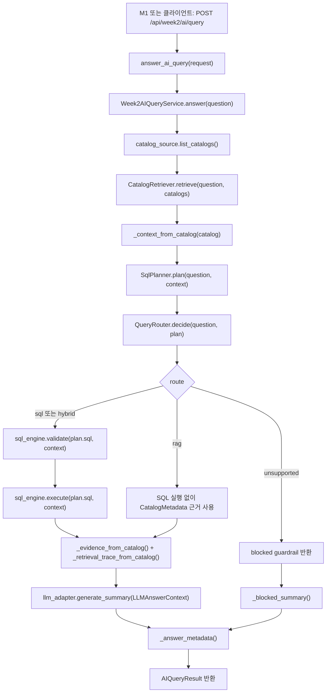

# M6 Week2 함수 흐름 공부 노트

이 문서는 M6 1~10단계에서 무엇을 만들었는지 공부하기 위한 흐름 노트다.
세부 테스트나 PR 운영 기록보다, 질문이 들어와 답변이 나가기까지 어떤 함수들이 어떤 순서로 연결되는지 이해하는 것을 목표로 한다.

## 한 문장 요약

M6는 사용자의 질문을 받아서, M5가 만든 `CatalogMetadata` 중 어떤 데이터셋을 볼지 고르고, 안전한 SQL 또는 RAG 경로를 선택한 뒤, 실행 결과와 근거를 묶어 M1 화면이 표시할 수 있는 `AIQueryResult`로 돌려준다.

## 시작 전에 있던 바닥

10단계가 시작되기 전에도 M6에는 이미 최소 뼈대가 있었다.

| 선행 기반 | 큰 의미 | 대표 코드 |
| --- | --- | --- |
| AI Query skeleton | `/api/week2/ai/query`로 질문을 받고 `AIQueryResult`를 반환하는 최소 길을 만들었다. | `backend/app/api/week2_ai_query.py`, `backend/app/services/ai_query.py` |
| Catalog source boundary | M6가 카탈로그를 직접 소유하지 않고 `CatalogSource`를 통해 읽게 했다. | `backend/app/ports/catalog_source.py` |
| Catalog retrieval scoring | 질문과 카탈로그 metadata를 비교해서 가장 관련 있는 catalog를 고르게 했다. | `backend/app/services/catalog_retriever.py` |
| M5 catalog adapter | M5가 저장한 최신 `Week2CatalogStore`를 M6가 읽을 수 있게 했다. | `backend/app/adapters/week2_catalog_store_source.py` |
| Evidence grounding | 답변에 dataset, run, schema, metric, lineage 근거를 싣게 했다. | `QueryEvidence`, `Week2AIQueryService._evidence_from_catalog()` |

이 바닥 위에서 새 M6 10단계는 SQL 실행력, RAG-lite, route, LLM, UI handoff를 순서대로 강화했다.

## 최종 실행 흐름

현재 M6의 중심 함수는 `Week2AIQueryService.answer(question)`이다.



크게 보면 다섯 덩어리다.

1. 질문을 받는다.
2. 어떤 catalog를 볼지 고른다.
3. SQL을 만들고 route를 정한다.
4. SQL, RAG, hybrid, unsupported 중 맞는 길로 답변 재료를 만든다.
5. summary, evidence, retrieval trace, answer metadata를 묶어 M1에게 준다.

## 1~10단계 큰 흐름

| 단계 | 만든 것 | 함수 단위로 보면 | 왜 필요했나 |
| --- | --- | --- | --- |
| 1 | SQL 실행 context 보강 | `Week2AIQueryService._context_from_catalog()`가 `table_name`, `allowed_columns`, `local_fallback_path`를 `SqlEngineContext`에 담는다. | SQL을 만들 정보와 실제 파일을 찾아갈 길을 CatalogMetadata에서 꺼내기 위해서다. |
| 2 | `DuckDBSqlEngine` adapter | `DuckDBSqlEngine.validate()`가 SQL 안전성을 검사하고, `execute()`가 JSONL/Parquet 파일을 실제로 읽는다. | fake row가 아니라 실제 로컬 output 파일에서 결과를 가져오기 위해서다. |
| 3 | DuckDB runtime 연결 | `AppContainer.create_sql_engine()`이 기본 SQL engine으로 `DuckDBSqlEngine`을 선택한다. | 테스트 주입용 DuckDB에서 실제 앱 기본 실행 경로로 넘어가기 위해서다. |
| 4 | SQL planner intent | `SqlPlanner.plan()`이 질문을 `top_count`, `top_rating`, `top_risk` 같은 내부 intent로 바꾸고 안전한 SELECT를 만든다. | 질문마다 SQL을 흩어놓지 않고, 허용된 컬럼으로만 SQL을 만들기 위해서다. |
| 5 | route와 retrieval trace 계약 | `AIQueryResult.route`, `retrieval_trace[]`가 추가되고 `_retrieval_trace_from_catalog()`가 왜 이 catalog를 골랐는지 남긴다. | M1이 단순 결과뿐 아니라 M6가 어떤 판단을 했는지 표시할 수 있게 하기 위해서다. |
| 6 | Catalog RAG-lite index | `CatalogRetrievalIndex.refresh()`가 catalog/schema/metric/lineage chunk를 만들고, `search()`가 질문과 가까운 chunk를 찾는다. | raw data가 아니라 안전한 CatalogMetadata 안에서 의미 검색 비슷한 흐름을 만들기 위해서다. |
| 7 | Hybrid route | `QueryRouter.decide()`가 `sql`, `rag`, `hybrid`, `unsupported` 중 하나를 고른다. | 숫자 질문, 근거 질문, 둘 다 필요한 질문, 답하면 안 되는 질문을 분리하기 위해서다. |
| 8 | LLM answer adapter | `LLMAdapter.generate_summary()` 경계를 만들고 `TemplateLLMAdapter`가 기본 summary를 생성한다. | 나중에 외부 LLM을 붙여도 M6가 허용한 rows/evidence/trace만 넘기게 하기 위해서다. |
| 9 | OpenAI adapter | `OpenAILLMAdapter.generate_summary()`가 env 설정과 API key가 있을 때만 외부 provider를 쓰고, 실패하면 template fallback을 쓴다. | 실제 LLM을 붙일 수 있는 길을 만들되, key가 없거나 provider가 실패해도 앱이 깨지지 않게 하기 위해서다. |
| 10 | Answer UX metadata | `Week2AIQueryService._answer_metadata()`가 source/provider/fallback/grounding state를 만들고, M1 `AnswerMetadataPanel`이 표시한다. | M1이 summary 문장을 해석하지 않고 답변 신뢰 상태를 바로 보여주게 하기 위해서다. |

## 최종 함수 흐름을 코드로 따라가기

### 1. API 입구

파일: `backend/app/api/week2_ai_query.py`

```python
def answer_ai_query(request: AIQueryRequest) -> AIQueryResult:
    return ai_query_service.answer(request.question)
```

여기는 문지기다.
실제 판단은 하지 않고, 질문 문자열을 `Week2AIQueryService.answer()`로 넘긴다.

### 2. M6의 중심 함수

파일: `backend/app/services/ai_query.py`

`Week2AIQueryService.answer()`는 전체 흐름의 컨트롤 타워다.

```text
catalog 고르기
-> SQL 실행 context 만들기
-> SQL plan 만들기
-> route 결정하기
-> SQL 실행 또는 RAG-only 처리
-> evidence와 retrieval_trace 만들기
-> LLMAdapter로 summary 만들기
-> answer_metadata 붙이기
-> AIQueryResult 반환
```

이 함수만 이해하면 M6의 큰 흐름은 거의 잡힌다.

### 3. 어떤 catalog를 볼지 고르기

파일: `backend/app/services/catalog_retriever.py`

```python
retrieval = self.catalog_retriever.retrieve(question, self.catalog_source.list_catalogs())
catalog = retrieval.catalog
```

`CatalogRetriever.retrieve()`는 질문과 여러 `CatalogMetadata`를 비교한다.
기본적으로는 column alias와 metadata token을 보고 점수를 매기고, 6단계 이후에는 `CatalogRetrievalIndex.search()` 결과도 점수에 더한다.

쉽게 말하면 여기서는 “어느 데이터셋을 뒤질까?”를 정한다.

### 4. CatalogMetadata를 SQL 실행용 context로 바꾸기

파일: `backend/app/services/ai_query.py`

```python
context = self._context_from_catalog(catalog)
```

`_context_from_catalog()`는 `CatalogMetadata`에서 SQL에 필요한 정보를 꺼낸다.

| CatalogMetadata 안의 정보 | 들어가는 곳 | 의미 |
| --- | --- | --- |
| `query.table_name` | `SqlEngineContext.table_name` | SQL의 `FROM` 대상 |
| `query.allowed_columns` | `SqlEngineContext.allowed_columns` | SELECT 가능한 컬럼 목록 |
| `storage.local_fallback_path` | `SqlEngineContext.local_fallback_path` | DuckDB가 읽을 실제 로컬 파일 경로 |
| `query.default_limit` | `SqlEngineContext.default_limit` | 너무 많이 읽지 않게 하는 기본 제한 |
| `schema.fields` | `SqlEngineContext.column_types` | 결과 컬럼 타입 표시용 |

여기서 중요한 감각은 이것이다.

```text
CatalogMetadata = 지도
SqlEngineContext = SQL 엔진에게 넘기는 실행용 지도 조각
```

### 5. 질문을 SQL plan으로 바꾸기

파일: `backend/app/services/sql_planner.py`

```python
plan = self.sql_planner.plan(question, context)
```

`SqlPlanner.plan()`은 질문을 내부 intent로 분류한다.

예를 들어:

| 질문 느낌 | intent | 만들어지는 SQL 방향 |
| --- | --- | --- |
| 리뷰가 많은 상품 | `top_count` | `review_count DESC` |
| 평점 높은 상품 | `top_rating` | `average_rating DESC` |
| 위험 점수 높은 상품 | `top_risk` | `risk_score DESC` |
| 부정 리뷰율 높은 상품 | `top_negative_review` | `negative_review_rate DESC` |
| 전환율 낮은 상품 | `low_conversion` | `conversion_rate ASC` |
| 배송 지연율 높은 상품 | `top_late_delivery` | `late_delivery_rate DESC` |
| 예측, 매출, 감성 같은 범위 밖 질문 | `unsupported` | SQL을 만들지 않음 |

현재 이 판단은 LLM이 아니라 백엔드 rule 기반이다.
다만 planner는 반드시 `SqlEngineContext.allowed_columns` 안에 있는 컬럼만 사용한다.

### 6. route 결정하기

파일: `backend/app/services/query_router.py`

```python
route_decision = self.query_router.decide(question, plan)
```

`QueryRouter.decide()`는 질문을 보고 어떤 길로 답할지 정한다.

| route | 뜻 | SQL 실행 여부 |
| --- | --- | --- |
| `sql` | 숫자, 정렬, 순위 질문 | 실행함 |
| `rag` | schema, lineage, catalog, 근거 설명 질문 | 실행하지 않음 |
| `hybrid` | 숫자 답과 근거 설명이 둘 다 필요한 질문 | 실행함 |
| `unsupported` | 예측, 매출, 감성처럼 현재 안전하게 답할 수 없는 질문 | 실행하지 않음 |

여기도 현재는 deterministic rule 기반이다.
즉, 특정 단어와 SQL plan 상태를 보고 route를 고른다.

### 7. SQL 실행하기

파일: `backend/app/adapters/duckdb_sql_engine.py`

SQL이 필요한 route면 다음 순서로 간다.

```python
validation = self.sql_engine.validate(plan.sql, context)
query_result = self.sql_engine.execute(plan.sql, context)
```

`DuckDBSqlEngine.validate()`는 먼저 막아야 할 것을 막는다.

| 막는 것 | 이유 |
| --- | --- |
| SELECT가 아닌 SQL | 삭제, 수정 같은 위험한 명령 방지 |
| LIMIT 없는 SQL | 너무 많이 읽는 것 방지 |
| 허용되지 않은 table | CatalogMetadata 밖의 데이터 접근 방지 |
| 허용되지 않은 column | 숨겨진 컬럼 접근 방지 |
| `local_fallback_path` 없음 | 실제 읽을 파일이 없으므로 fake 성공 방지 |

통과하면 `DuckDBSqlEngine.execute()`가 `local_fallback_path`의 JSONL/Parquet 파일을 DuckDB view로 등록하고 SQL을 실행한다.

### 8. RAG-lite 근거 만들기

파일: `backend/app/services/catalog_rag_index.py`

6단계에서 추가된 `CatalogRetrievalIndex`는 raw data 전체를 넣는 RAG가 아니다.
M5가 만든 안전한 `CatalogMetadata`만 작은 chunk로 나눈다.

chunk 대상은 대략 이렇다.

| chunk | 예 |
| --- | --- |
| catalog | dataset id, name, table, allowed columns |
| schema | field name, type, nullable |
| metric | row count, quality, semantic metric |
| lineage | pipeline id, run id, source ids |

중요한 제한도 있다.
`local_fallback_path`, 파일 경로, secret, credential처럼 prompt나 검색 text에 들어가면 안 되는 값은 index text에서 제외한다.

### 9. evidence와 retrieval trace 만들기

파일: `backend/app/services/ai_query.py`

```python
evidence = self._evidence_from_catalog(...)
retrieval_trace = self._retrieval_trace_from_catalog(...)
```

`evidence`는 답변의 근거 재료다.
dataset, run, schema, metric, lineage 같은 실제 근거를 담는다.

`retrieval_trace`는 M6가 왜 이 근거를 골랐는지 설명하는 흔적이다.
M1은 이것을 보고 “M6가 어떤 catalog/schema/metric/lineage를 참고했는지”를 표시할 수 있다.

짧게 구분하면:

```text
evidence = 답변의 근거 내용
retrieval_trace = 그 근거를 고른 과정의 흔적
```

### 10. 답변 문장 만들기

파일: `backend/app/adapters/template_llm_adapter.py`
파일: `backend/app/adapters/openai_llm_adapter.py`

성공한 route만 `LLMAdapter.generate_summary()`를 호출한다.
blocked 또는 unsupported면 LLM adapter를 부르지 않고 M6 내부 blocked summary를 반환한다.

기본값은 `TemplateLLMAdapter`다.
이 adapter는 외부 호출을 하지 않고, SQL row와 evidence를 바탕으로 deterministic summary를 만든다.

환경 변수가 준비되면 `OpenAILLMAdapter`를 쓸 수 있다.

```text
WEEK2_LLM_PROVIDER=openai
OPENAI_API_KEY=...
```

하지만 key가 없거나 provider가 실패하면 template fallback으로 돌아간다.
그래서 9단계의 목적은 “항상 외부 LLM을 쓰자”가 아니라 “외부 LLM을 안전하게 붙일 수 있는 통로를 만들자”에 가깝다.

### 11. 답변 신뢰 상태 붙이기

파일: `backend/app/services/ai_query.py`

```python
answer_metadata = self._answer_metadata(...)
```

10단계에서 추가된 `answer_metadata`는 M1이 UI에서 표시할 신뢰 상태다.

| 필드 | 의미 |
| --- | --- |
| `source` | 답변이 `template`, `external`, `internal` 중 어디서 왔는지 |
| `provider` | `template`, `openai`, `m6` 같은 실제 provider 표시 |
| `fallback_used` | OpenAI 실패 등으로 fallback을 썼는지 |
| `fallback_reason` | fallback 이유 |
| `used_evidence_indexes` | 어떤 evidence를 근거로 썼는지 |
| `grounding_state` | `grounded`, `insufficient_evidence`, `blocked` |

M1은 이 값을 표시만 한다.
M1이 route, evidence score, provider 정책을 다시 계산하지 않는다.

## 단계별로 머릿속에 넣을 말

| 단계 | 외울 문장 |
| --- | --- |
| 1 | CatalogMetadata에서 SQL 실행용 지도를 꺼낸다. |
| 2 | DuckDB가 그 지도를 보고 실제 파일을 읽는다. |
| 3 | 앱 기본 실행 경로가 fake가 아니라 DuckDB로 간다. |
| 4 | 질문을 안전한 SQL intent로 바꾼다. |
| 5 | 결과에 route와 trace를 붙여 판단 과정을 보이게 한다. |
| 6 | CatalogMetadata를 RAG-lite 검색 index로 만든다. |
| 7 | 질문을 sql, rag, hybrid, unsupported 중 하나로 보낸다. |
| 8 | 답변 생성을 LLMAdapter 뒤로 숨긴다. |
| 9 | OpenAI는 env와 key가 있을 때만 쓰고 실패하면 fallback한다. |
| 10 | M1이 답변 신뢰 상태를 UI에 표시할 수 있게 metadata를 준다. |

## 지금 구조에서 헷갈리기 쉬운 것

### RAG가 raw data를 뒤지는 것은 아니다

현재 M6 RAG-lite는 raw review 파일 전체를 vector DB에 넣는 구조가 아니다.
M5가 만든 `CatalogMetadata`의 schema, metrics, lineage, query allowlist 같은 안전한 metadata만 index로 만든다.

### SQL을 LLM이 직접 만들지 않는다

현재 SQL은 `SqlPlanner`가 rule 기반으로 만든다.
LLM은 SQL을 직접 실행하거나 임의 SQL을 만들 권한이 없다.

### DuckDB는 최종 대형 엔진이 아니라 MVP 실행 엔진이다

DuckDB는 로컬 JSONL/Parquet 검증에 좋다.
더 큰 데이터와 분산 query는 나중에 Trino 같은 엔진으로 바꿀 수 있고, 그래서 M6는 `SqlEngineAdapter` 뒤에서 엔진을 쓰게 되어 있다.

### M1은 판단하지 않고 표시한다

M1은 M6가 준 `AIQueryResult`를 보여준다.
route, trace, answer metadata의 계산 책임은 M6에 있다.

### OpenAI adapter가 있어도 기본값은 template이다

실제 key가 없으면 `OpenAILLMAdapter`를 선택하지 않거나 fallback한다.
로컬 테스트와 기본 smoke는 외부 호출 없이 돌아가도록 설계되어 있다.

## 직접 코드를 읽는 순서

처음 공부할 때는 아래 순서로 열어보면 된다.

1. `backend/app/api/week2_ai_query.py`
2. `backend/app/services/ai_query.py`
3. `backend/app/services/catalog_retriever.py`
4. `backend/app/services/sql_planner.py`
5. `backend/app/services/query_router.py`
6. `backend/app/adapters/duckdb_sql_engine.py`
7. `backend/app/services/catalog_rag_index.py`
8. `backend/app/adapters/template_llm_adapter.py`
9. `backend/app/adapters/openai_llm_adapter.py`
10. `frontend/src/app/App.jsx`의 `AnswerMetadataPanel`

이 순서가 실제 질문 처리 흐름과 가장 비슷하다.

## 복습 질문

1. `CatalogMetadata`와 `SqlEngineContext`는 각각 무엇을 담는가?
2. `SqlPlanner`가 LLM 없이도 SQL을 만들 수 있는 이유는 무엇인가?
3. `DuckDBSqlEngine.validate()`가 막는 대표적인 위험은 무엇인가?
4. `route=rag`일 때 SQL engine을 호출하지 않는 이유는 무엇인가?
5. `route=hybrid`는 `sql`과 무엇이 다른가?
6. `evidence`와 `retrieval_trace`의 차이는 무엇인가?
7. `TemplateLLMAdapter`는 왜 남겨두는가?
8. `OpenAILLMAdapter`는 어떤 경우에 fallback하는가?
9. `answer_metadata.grounding_state`가 `blocked`가 되는 경우는 언제인가?
10. M1이 route나 evidence scoring을 다시 계산하면 안 되는 이유는 무엇인가?

## 가장 중요한 전체 그림

M6의 최종 Week2 흐름은 아래처럼 기억하면 된다.

```text
질문
-> catalog 선택
-> SQL 실행 context 생성
-> SQL plan 생성
-> route 결정
-> SQL 실행 또는 Catalog RAG-lite 사용
-> evidence와 trace 구성
-> LLMAdapter로 답변 문장 생성
-> answer metadata로 신뢰 상태 표시
-> AIQueryResult로 M1에 전달
```

이 흐름을 잡고 나면, 각 단계의 코드는 “어느 칸을 더 튼튼하게 만들었는가”로 읽으면 된다.
