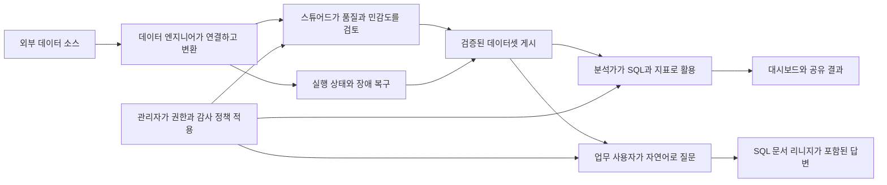
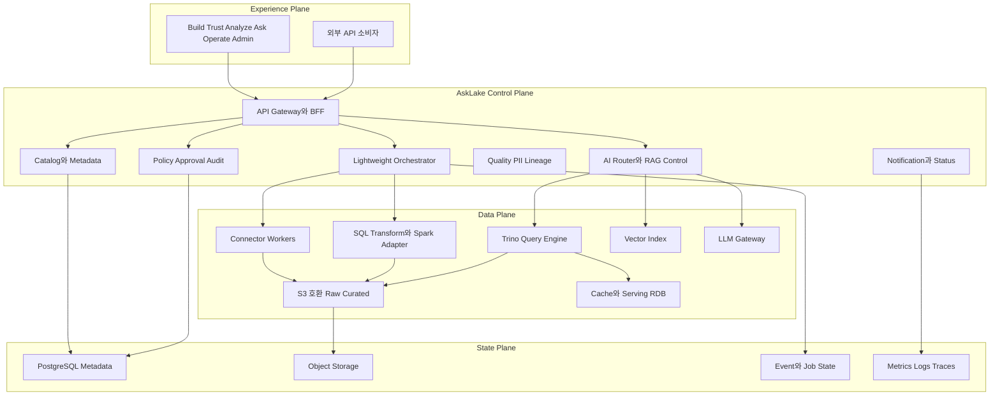
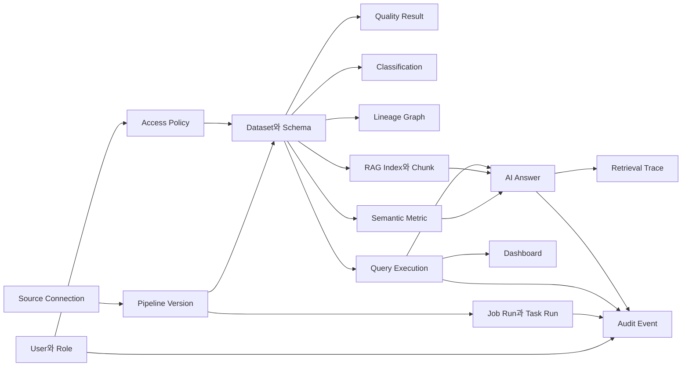

# AskLake
## 신뢰 가능한 데이터와 근거 있는 답변을 연결하는 셀프호스티드 데이터 플랫폼 기획서

- 문서 버전: 1.0
- 작성일: 2026년 6월 23일
- 문서 상태: 개발 착수 전 기준안
- 주요 독자: 제품 책임자, 기획자, 디자이너, 데이터·백엔드·AI·인프라 개발자, 보안 담당자, QA 담당자

AskLake는 기업 내부에 흩어진 데이터를 모으는 도구에 머물지 않는다. 데이터가 어떤 경로로 들어왔고, 어떤 검증을 통과했으며, 누가 사용할 수 있고, 그 데이터로 생성된 분석 결과와 AI 답변을 왜 믿을 수 있는지까지 연결하는 것을 제품의 중심 가치로 삼는다.

---

# 1. Executive Summary

AskLake는 RDB, API, 파일, 오브젝트 스토리지와 같은 서로 다른 데이터 소스를 연결해 데이터 레이크에 적재하고, 품질·민감도·권한·리니지를 적용한 뒤 SQL과 자연어 질문으로 활용하게 하는 셀프호스티드 엔터프라이즈 데이터 플랫폼이다. 사용자는 데이터 엔지니어링 도구, 카탈로그, 거버넌스, 쿼리 엔진, RAG 시스템을 각각 따로 구축하지 않고 하나의 제품 흐름 안에서 운영한다.

AskLake가 해결하려는 핵심 문제는 데이터 부족이 아니라 **신뢰할 수 있는 데이터 활용 경로의 부재**다. 기업에는 이미 많은 데이터가 있지만 소스와 도구가 분절되어 있고, 데이터의 최신성·품질·민감도·소유자·가공 이력을 한눈에 확인하기 어렵다. 이 상태에서 생성된 대시보드와 AI 답변은 결과가 그럴듯하더라도 재현하거나 검증하기 어렵다.

> AskLake는 데이터 수집부터 AI 답변까지 이어지는 모든 단계에 품질, 권한, 리니지와 감사 기록을 연결해 “왜 이 결과를 믿을 수 있는가”를 증명한다.

제품의 대표 경험은 네 가지로 압축한다. 데이터 엔지니어는 신규 소스를 연결해 검증된 데이터셋으로 게시한다. 장애가 발생하면 실패 지점과 하위 영향을 확인한 뒤 중복 없이 재처리한다. 분석가는 카탈로그에서 신뢰 가능한 데이터를 찾고 SQL과 간단한 대시보드로 공유한다. 비즈니스 사용자는 자연어로 질문하고 답변에 사용된 데이터셋, SQL, 지표 정의, 문서와 리니지를 직접 확인한다.

AskLake의 주 고객은 여러 데이터 소스를 운영하지만 대형 상용 플랫폼을 도입하기 어렵거나, 데이터가 외부 관리형 서비스로 반출되는 것을 원하지 않는 조직이다. 특히 데이터 엔지니어링 인력이 제한적이고, 자체 클라우드나 온프레미스 환경에서 분석과 AI 활용을 함께 추진해야 하는 중견 기업과 조직을 우선 대상으로 삼는다.

MVP는 모든 데이터 플랫폼 기능을 축소해 담는 제품이 아니다. 하나의 데이터를 연결하고, 품질과 보안 정책을 통과시켜 게시하고, SQL과 자연어 질문으로 사용한 뒤, 장애가 발생했을 때 안전하게 복구하는 **하나의 완결된 신뢰 루프**를 구현한다. 실시간 스트리밍, 완전한 BI 도구, 범용 Airflow 호환, 멀티 테넌시와 모든 행 데이터의 벡터화는 후속 단계로 둔다.

핵심 기술 방향은 중앙 제어 계층인 Control Plane, 제품에 필요한 범위만 직접 구현하는 경량 오케스트레이터, S3 호환 오브젝트 스토리지와 Parquet 기반 저장, Trino 기반 SQL 분석, 메타데이터·시맨틱 지표·문서를 검색하고 정형 데이터는 SQL로 계산하는 Hybrid RAG와 NL2SQL이다. 전체 구성은 Kubernetes와 Helm을 기준으로 배포하며, UI는 개별 엔진에 직접 접근하지 않고 AskLake API를 통해서만 명령과 정책을 전달한다.

---

# 2. 프로젝트 배경과 제품 전략

## 2.1 데이터가 많아질수록 활용은 더 어려워진다

기업 데이터는 하나의 데이터베이스에만 존재하지 않는다. 주문과 결제는 RDB에, 상품과 재고는 파일과 오브젝트 스토리지에, 배송 상태는 외부 API에, 클릭 행동은 이벤트 스트림에, 고객의 불만과 업무 지식은 문서에 저장된다. 데이터 종류가 늘어날수록 수집 방식과 처리 주기, 장애 형태, 보안 정책도 함께 복잡해진다.

기존에는 각 문제를 별도 제품으로 해결했다. 수집 도구, 스케줄러, 처리 엔진, 데이터 레이크, 카탈로그, 품질 도구, 쿼리 엔진, BI, 권한 시스템과 RAG 서비스를 조합했다. 이 방식은 전문 인력과 운영 경험이 충분한 조직에서는 가능하지만, 작은 팀이 구축하면 도구 간 상태와 정책이 쉽게 분리된다. 파이프라인은 성공했다고 표시되지만 데이터 품질은 실패할 수 있고, SQL에서는 차단된 컬럼이 AI 답변에는 노출되는 식의 불일치가 발생한다.

AI 활용이 확대되면서 이 문제는 더 중요해졌다. 일반적인 RAG 채팅창을 데이터 플랫폼에 추가하는 것만으로는 기업 데이터 질의가 완성되지 않는다. 어떤 데이터셋을 검색 대상으로 삼을지, 정형 데이터는 SQL과 벡터 검색 중 무엇으로 처리할지, 변경된 데이터를 어떻게 재인덱싱할지, 사용자 권한을 검색 단계에 어떻게 적용할지, 답변의 수치와 문장을 어떤 근거로 검증할지까지 운영해야 한다.

AskLake는 도구 수를 줄이는 것보다 **도구 사이의 단절을 없애는 것**에 집중한다. 데이터의 생성, 게시, 분석, 질문, 장애 복구가 하나의 메타데이터와 상태 모델을 공유하도록 설계한다.

## 2.2 목표 고객

AskLake의 초기 고객은 세 가지 조건을 동시에 가진 조직이다. 첫째, RDB와 파일, API 등 여러 소스를 이미 운영하고 있다. 둘째, 데이터 활용 요구는 빠르게 증가하지만 데이터 엔지니어와 플랫폼 운영자가 충분하지 않다. 셋째, 상용 통합 플랫폼의 비용, 벤더 종속성 또는 데이터 주권 문제 때문에 자체 환경에 배포 가능한 대안을 필요로 한다.

규모만으로 고객을 구분하지 않는다. 규제 산업의 부서 단위 플랫폼, 다수 사업부를 운영하는 중견 기업, 내부 데이터와 문서를 이용해 사내 AI를 구축하려는 조직도 주요 대상이다. 반대로 단일 데이터베이스와 단순 리포트만 필요한 조직, 완전 관리형 서비스만을 선호하는 조직, 초대규모 실시간 처리 자체가 제품의 핵심인 조직은 초기 대상에서 제외한다.

## 2.3 제품이 선택한 차별화

AskLake의 메인 차별점은 **Lineage-backed Trusted Answers**, 즉 리니지와 정책으로 추적 가능한 답변이다. 사용자는 답변을 보는 데서 끝나지 않고, 어떤 데이터셋과 지표가 사용되었는지, 데이터는 언제 갱신되었는지, 어떤 SQL이 실행되었는지, 어떤 문서가 검색되었는지, 원천 데이터가 어떤 가공 경로를 거쳤는지 확인할 수 있다.

첫 번째 보조 차별점은 가벼운 자체 오케스트레이션과 장애 복구 경험이다. AskLake는 범용 오케스트레이터 전체를 복제하지 않는다. 대신 데이터셋 게시와 신뢰 상태를 직접 제어하기 위해 DAG, 스케줄, 실행 상태, 재시도, 부분 재실행, 기간 Backfill과 동시성 제어를 제품 내부에 구현한다. 이 기능은 카탈로그, 품질, 리니지와 연결되어 장애가 어떤 대시보드와 AI 인덱스에 영향을 미치는지 보여준다.

두 번째 보조 차별점은 Kubernetes 기반 셀프호스티드 패키징이다. 여러 오픈소스를 설치하는 방법을 문서로 제공하는 수준이 아니라, AskLake Control Plane이 모듈 상태와 설정을 통합 관리하고 표준 배포 프로파일을 제공한다.

대시보드 작성, 실시간 처리와 멀티 클라우드는 중요한 기능이지만 제품의 대표 주장으로 사용하지 않는다. 이 영역은 핵심 흐름을 보완하는 수준으로 제공하고, 실제 고객 수요와 기술 검증 이후 확장한다.

## 2.4 제품이 아닌 것

AskLake는 Databricks나 Snowflake 전체를 단기간에 재현하려는 프로젝트가 아니다. 모든 종류의 커넥터, 모든 BI 기능, 모든 스트림 처리 시나리오와 범용 ML 플랫폼을 한 번에 제공하지 않는다.

AskLake는 단순한 NL2SQL 채팅 서비스도 아니다. 질문 인터페이스는 핵심이지만, 답변을 생성하기 전 데이터 온보딩, 품질 검증, 권한, 시맨틱 지표와 리니지가 먼저 구축되어야 한다.

AskLake는 오픈소스 관리 콘솔도 아니다. Trino, Spark, 오브젝트 스토리지와 벡터 저장소는 실행 엔진으로 활용할 수 있지만, 사용자 경험과 상태 모델, 메타데이터, 정책, 승인, 증거 생성과 장애 영향 분석은 AskLake가 소유한다.

---

# 3. 사용자와 협업 구조

AskLake의 핵심 사용자는 데이터 엔지니어, 데이터 스튜어드와 데이터 분석가다. 이 세 역할이 하나의 데이터를 서로 다른 책임으로 이어받는다. 데이터 엔지니어는 데이터를 정상적으로 가져오고 재처리 가능한 파이프라인을 만든다. 스튜어드는 품질과 민감도, 소유자와 공개 정책을 검토한다. 분석가는 게시된 데이터가 자신의 목적에 적합한지 판단하고 분석과 질문에 사용한다.

데이터 엔지니어가 원하는 것은 커넥터 수 자체가 아니다. 신규 데이터를 빠르게 연결하고, 실패했을 때 원인을 찾고, 안전하게 복구한 뒤, 자신이 만든 데이터가 실제로 사용되는 상태까지 확인하는 것이다. 따라서 Build와 Operate 경험은 분리되지 않아야 한다.

데이터 스튜어드는 모든 데이터를 직접 수정하는 관리자가 아니다. 데이터의 업무적 의미와 위험을 확인하고, 품질 실패를 허용할지 차단할지, 개인정보 후보가 맞는지, 누가 원본을 볼 수 있는지 결정한다. 스튜어드가 승인해야 하는 이유와 변경 내용이 명확히 보이지 않으면 승인 기능은 병목이 된다.

데이터 분석가는 많은 데이터보다 적합한 데이터를 원한다. 카탈로그에서 검색한 결과에 설명, 최신성, 품질, 소유자와 리니지가 함께 보여야 하며, Query Studio와 Ask 화면으로 자연스럽게 이어져야 한다. 권한이 부족한 경우에도 단순 오류가 아니라 마스킹된 대안이나 권한 요청 경로를 제공해야 한다.

AI 운영자는 질문 정확도와 인덱스 상태를 관리한다. 어떤 자산이 검색 대상인지, Chunking 결과가 적절한지, 원본과 인덱스가 동기화되어 있는지, 어떤 질문 유형에서 실패하는지 확인한다. 시스템 관리자는 배포, 비밀정보, 모듈 상태, 백업과 업그레이드를 관리한다. 보안 관리자는 역할과 정책, 감사 이벤트와 이상 접근을 확인한다. 경영진과 일반 업무 사용자는 별도 기술 지식 없이 Ask와 게시된 대시보드를 사용한다.

다음 흐름은 각 역할이 하나의 데이터 자산을 어떻게 이어받는지 보여준다.

제품의 홈 화면은 모든 사용자에게 같은 메뉴를 보여주지 않는다. 데이터 엔지니어에게는 실패 실행과 최근 배포를, 스튜어드에게는 승인 대기와 품질 위반을, 분석가에게는 최근 사용 데이터와 저장 쿼리를, 관리자는 정책 위반과 시스템 상태를 우선 제공한다.

---

# 4. 네 가지 핵심 사용자 여정

## 4.1 신규 데이터를 신뢰 가능한 데이터셋으로 게시한다

OmniShop Korea의 데이터 엔지니어 지민은 새 배송 파트너의 REST API를 AskLake에 연결한다. Build Workspace에서 소스 유형을 선택하고 인증 정보를 Secret으로 등록한 뒤 연결 테스트를 실행한다. AskLake는 인증 실패, 네트워크 접근 실패, API 응답 오류를 구분해 보여주며, 성공하면 사용할 수 있는 엔드포인트와 샘플 응답 구조를 탐색한다.

지민은 배송 주문 번호, 상태, 예정일과 실제 배송일을 선택하고 매시간 증분 수집하도록 Watermark를 설정한다. 원본 응답은 Raw 영역에 보존하고, 상태값과 날짜 형식을 표준화한 데이터는 Curated 영역에 Parquet으로 저장한다. 변환 단계에서는 주문 데이터와 배송 데이터를 `order_id`로 연결한다.

파이프라인을 저장하면 AskLake는 즉시 공개 데이터셋을 만들지 않는다. 먼저 카탈로그 Draft를 생성하고 스키마, 원천 소스, 예상 갱신 주기와 파이프라인 버전을 연결한다. 품질 규칙은 주문 번호의 Null과 중복, 배송 상태의 허용값, 예정일과 실제일의 유효 범위, Freshness를 기본으로 제안한다. 이메일이나 전화번호가 포함되어 있으면 PII 후보로 표시한다.

스튜어드는 Trust Workspace에서 변경된 스키마와 품질 규칙, 개인정보 후보와 기본 권한을 검토한다. 중요한 규칙이 빠졌으면 수정 요청을 남기고 반려할 수 있다. 승인된 파이프라인은 배포 상태로 전환되고 첫 실행을 시작한다.

첫 실행이 성공했다는 사실만으로 게시되지는 않는다. 필수 품질 규칙이 통과하고, 민감정보 분류가 확정되며, 데이터 소유자와 접근 정책이 지정되어야 데이터셋이 `Trusted` 상태가 된다. 그 후 카탈로그 검색과 Query Studio, Ask에서 사용 가능해진다. 실행은 성공했지만 품질이 실패한 경우 데이터는 저장되어도 `Blocked` 상태로 남고 일반 사용자에게 노출되지 않는다.

이 흐름에서 가장 중요한 제품 결정은 파이프라인 상태와 데이터셋 신뢰 상태를 분리하는 것이다. 파이프라인은 기술적으로 성공할 수 있지만 데이터셋은 품질이나 정책 때문에 게시되지 않을 수 있다. AskLake는 이 차이를 사용자에게 명확히 보여준다.

## 4.2 장애의 영향 범위를 확인하고 안전하게 복구한다

다음 날 배송 API가 `status` 필드명을 `shipment_status`로 변경해 파이프라인이 실패한다. Operate Workspace의 상태 센터는 단순히 실패 건수를 표시하지 않고, 실패한 Task와 마지막 정상 실행, Freshness SLA 초과 예상 시각, 영향을 받는 데이터셋과 대시보드를 함께 보여준다.

지민은 Run Detail에서 입력 응답과 스키마 차이, 실패 로그와 재시도 이력을 확인한다. AskLake는 오류를 “상류 API 스키마 변경”으로 분류하고, 현재 버전의 변환식이 더 이상 필드를 찾지 못한다는 요약을 제공한다. AI 요약은 보조 수단이며, 원본 로그와 실제 변경 Diff를 항상 함께 보여준다.

리니지 그래프에는 배송 원본, 정제 데이터셋, 일별 배송 KPI, 경영진 대시보드와 배송 관련 AI 인덱스가 연결되어 있다. 실패 이후 해당 자산은 `Degraded` 상태가 되고, 마지막 정상 데이터 시각을 표시한다. 사용자는 오래된 결과를 계속 볼 수 있지만 최신성 경고를 분명히 확인한다.

지민이 매핑을 수정하면 AskLake는 전체 파이프라인을 처음부터 돌리는 대신 실패 Task 이후를 재실행할 수 있게 한다. 누락된 시간 구간은 Backfill 미리보기에서 대상 파티션, 예상 처리량, 기존 데이터와 겹치는 범위를 확인한 뒤 실행한다. 각 실행은 논리 실행 구간과 출력 파티션을 멱등 키로 사용하고, 임시 위치에 기록한 후 검증이 완료된 데이터만 원자적으로 교체한다.

재처리가 끝나면 품질 검사를 다시 수행한다. 성공하면 데이터셋의 Freshness와 Trust 상태, 대시보드와 AI 인덱스 상태가 정상으로 돌아오고 구독자에게 알림이 전송된다. 실패 원인, 수정 내용, 실행자, Backfill 구간과 결과는 하나의 Incident 기록으로 남는다.

## 4.3 신뢰 가능한 데이터를 찾아 분석하고 공유한다

분석가 수현은 “사업부별 배송 지연과 매출 영향”을 분석하려고 Catalog에서 배송과 매출을 검색한다. AskLake는 검색 결과를 단순 이름 순으로 보여주지 않는다. 업무 설명과 소유자, 마지막 갱신 시각, 품질 상태, 민감도, 공식 지표 사용 여부와 최근 장애를 함께 보여준다.

수현은 배송 지연 데이터셋의 상세 화면에서 원천 API, 컬럼 정의, 샘플 데이터, 품질 이력과 상류 파이프라인을 확인한다. 주문 데이터와 Join되어 만들어진 데이터셋은 두 개 이상의 부모를 가진 그래프로 표현된다. `Fresh`, `Quality Passed`, `Policy Applied`, `Lineage Complete` 신호를 개별 배지로 보여주며, 하나의 불투명한 점수로 모든 위험을 감추지 않는다.

Query Studio로 이동하면 현재 데이터셋과 연결 가능한 공식 KPI가 자동으로 컨텍스트에 포함된다. 수현은 SQL을 직접 작성하거나 “지난달 사업부별 지연 배송 비율과 순매출을 보여줘”라고 입력해 초안을 생성한다. 실행 전 AskLake는 참조 테이블, 예상 스캔 범위, 컬럼 권한과 마스킹 정책을 검사한다.

수현에게 고객 전화번호 권한이 없다면 Query 전체를 모호하게 실패시키지 않는다. 차단된 컬럼과 필요한 권한을 표시하고, 전화번호를 제외하거나 마스킹된 뷰로 대체해 실행할 수 있게 한다. 원본 값이 꼭 필요하면 데이터 소유자에게 목적과 기간이 포함된 접근 요청을 보낸다.

결과는 저장 쿼리와 간단한 차트로 전환할 수 있다. MVP 대시보드는 복잡한 BI 저작 도구가 아니라 핵심 지표를 공유하는 보드에 집중한다. 데이터 갱신 주기, 열람 역할, 소유자와 상류 데이터 상태를 함께 게시한다. 반복 조회가 느리면 동일 쿼리를 매번 Trino에서 실행하지 않고 결과 캐시나 Serving RDB Materialization 대상으로 승격한다.

## 4.4 자연어 질문의 답변과 근거를 함께 검증한다

영업 책임자 민서는 Ask Workspace에서 “지난주 클릭률은 올랐는데 매출이 감소한 사업부와 원인을 알려줘”라고 질문한다. AskLake는 이 질문을 단순 문서 검색이나 단일 SQL로 처리하지 않는다. 수치 비교가 필요한 부분과 설명 근거가 필요한 부분을 분리한다.

먼저 사용자 권한과 질문 목적을 확인하고, 승인된 `순매출`, `클릭 전환율`, `배송 지연률` 지표를 찾는다. 데이터 카탈로그에서 관련 데이터셋과 Join 경로를 탐색한 뒤, 정형 수치는 SQL로 계산한다. 리뷰와 VOC에서는 매출이 감소한 상품과 연결된 불만 문서를 Hybrid Search로 찾는다.

답변에는 사업부와 감소 수치, 재고 품절이나 배송 지연 같은 가능성 높은 원인이 요약된다. 오른쪽 Evidence Panel에서는 실행된 SQL, 사용한 지표 버전, 데이터셋의 최신성, 참고 문서, 리니지와 검색 Trace를 확인할 수 있다. 사용자는 특정 문장을 선택해 어떤 데이터와 문서가 그 문장을 뒷받침했는지 볼 수 있다.

내부 데이터에서 답을 찾지 못하면 AskLake는 모델의 일반 지식으로 빈칸을 채우지 않는다. 미래 매출 예측처럼 지원하지 않는 요청은 현재 제공 가능한 정보와 부족한 데이터 또는 기능을 안내한다. 일반 지식 사용을 조직 정책상 허용한 경우에도 내부 근거와 모델 일반 지식을 문장 단위로 구분한다.

권한이 없는 데이터는 검색 후보, SQL 생성, 실행 결과와 최종 프롬프트 모든 단계에서 제거된다. 답변이 생성된 후 가리는 방식은 사용하지 않는다. 질문, 검색된 자산, 실행 SQL, 접근 결정, 생성 답변과 피드백은 Retrieval Trace와 Audit Event로 남는다.

---

# 5. 제품 경험과 정보 구조

AskLake는 기능 개수에 맞춰 메뉴를 늘리지 않는다. 사용자가 수행하려는 일에 따라 Build, Trust, Analyze, Ask, Operate, Admin의 여섯 Workspace로 구성한다. 동일한 정보는 여러 메뉴에 복제하지 않고 자산 상세 화면과 Context Panel을 통해 연결한다.

## 5.1 Build

Build는 데이터 소스와 파이프라인을 만드는 공간이다. 첫 화면은 연결 수가 아니라 “최근 생성한 파이프라인, 검증이 필요한 Draft, 실패한 실행”을 보여준다. 데이터 소스 등록, 스키마 탐색, 수집 방식과 변환 설정은 하나의 Wizard로 이어진다.

파이프라인 편집 화면은 노드 수를 자랑하는 범용 그래프 편집기보다 데이터셋 생성에 필요한 핵심 단계를 빠르게 구성하는 데 집중한다. Source, Transform, Quality Gate, Sink 노드를 기본으로 제공하고, 각 노드의 입출력 스키마와 예상 저장 위치를 즉시 확인한다. Retry와 Backfill은 별도 메뉴가 아니라 Run Detail 안에서 실행 맥락과 함께 제공한다.

## 5.2 Trust

Trust는 Catalog, Quality, Classification, Approval과 Lineage를 하나의 데이터 자산 관점으로 묶는다. 사용자는 데이터셋 상세에서 설명과 스키마를 확인한 뒤 별도 화면을 이동하지 않고 품질 이력, 민감 컬럼, 접근 정책과 리니지를 탭으로 탐색한다.

승인 화면은 요청 목록만 보여주지 않는다. 이전 버전과 달라진 데이터 소스, 변환, 품질 규칙, PII 분류와 정책 Diff를 요약한다. 승인자가 판단할 수 없는 요청은 생성할 수 없도록 소유자, 목적과 영향 정보가 누락되면 제출을 막는다.

## 5.3 Analyze

Analyze는 카탈로그에서 선택한 데이터셋을 SQL과 공식 지표로 분석하는 공간이다. Query Studio는 Schema Browser, SQL Editor, 실행 결과와 Evidence Summary를 한 화면에 배치한다. AI SQL은 별도 채팅 메뉴가 아니라 쿼리 작성 과정에 통합한다.

저장된 결과는 차트와 간단한 공유 보드로 전환한다. MVP는 선, 막대, 영역, 숫자 카드와 테이블형 결과 등 제한된 시각화에 집중한다. 복잡한 드릴다운과 픽셀 단위 저작 기능보다 데이터 출처, 갱신 시각과 열람 정책을 정확히 유지하는 것이 우선이다.

시맨틱 지표는 별도 대규모 모델링 도구로 시작하지 않는다. 자주 사용되는 공식 KPI의 이름, 정의, 계산식, 기준 데이터셋, 차원, 시간 단위, 소유자와 버전을 관리하고 Query와 Ask에서 재사용한다.

## 5.4 Ask

Ask는 제품의 대표 Workspace다. 화면의 중심은 채팅 기록이 아니라 질문, 답변과 증거의 관계다. 답변 본문 옆에는 사용한 데이터셋, SQL, 지표, 문서, 최신성과 권한 결정이 연결된 Evidence Panel을 고정한다.

사용자는 답변의 특정 문장을 검증하거나 SQL을 Query Studio에서 열 수 있다. 결과가 잘못되었다고 판단하면 단순 좋아요·싫어요가 아니라 “잘못된 데이터셋”, “잘못된 지표”, “SQL 오류”, “근거 부족”, “권한 문제” 중 원인을 선택해 피드백한다. 이 정보는 AI 운영자가 평가셋과 검색 정책을 개선하는 데 사용한다.

## 5.5 Operate

Operate는 시스템 모니터링 화면이 아니라 사용자 행동을 유도하는 상태 센터다. 실패 파이프라인, Freshness SLA 위반, 품질 차단, 인덱스 지연, 대시보드 갱신 실패를 자산 영향도와 함께 보여준다.

각 알림은 원인, 영향, 담당자와 가능한 다음 행동을 포함한다. 자동 재시도 중인지, 수동 수정이 필요한지, 어떤 데이터셋이 오래된 상태인지 명확해야 한다. 장애 복구가 끝나면 알림을 닫는 것이 아니라 영향을 받았던 자산 상태가 정상화되었는지 확인한다.

## 5.6 Admin

Admin은 사용자, 역할, 데이터 정책, 접근 요청, 감사 로그와 시스템 설정을 관리한다. 역할 권한과 데이터 권한을 분리해 “파이프라인을 편집할 수 있는가”와 “특정 고객 컬럼을 볼 수 있는가”를 각각 통제한다.

감사 로그는 원시 이벤트 목록과 조사용 화면을 구분한다. 조사 화면에서는 반복적인 접근 거부, 평소보다 큰 다운로드, 근무 시간 외 PII 접근, 다량의 AI 질문과 정책 변경을 묶어 확인한다. 이상 탐지는 MVP에서 규칙 기반으로 시작하고 통계적 탐지는 운영 데이터가 축적된 뒤 확장한다.

---

# 6. AskLake Trust Model

AskLake의 신뢰 모델은 하나의 점수보다 검증 가능한 신호의 연결을 우선한다. 데이터셋, 쿼리, 대시보드와 AI 답변은 같은 자산 그래프에 연결되고 각 단계의 상태가 하위 결과에 전파된다.

## 6.1 데이터셋 게시 상태

데이터셋은 파이프라인 생성과 동시에 검색 결과에 공개되지 않는다. `Draft`에서는 메타데이터와 정책을 준비하고, `Verifying`에서는 최초 실행과 필수 검사를 수행한다. 모든 게시 조건을 통과하면 `Trusted`가 되고 일반 사용자에게 공개된다.

이미 게시된 데이터셋의 상류 파이프라인이 실패하거나 Freshness SLA를 넘으면 `Degraded`로 전환한다. 잘못된 데이터가 적재되었거나 Critical 품질 규칙이 실패하면 `Blocked`로 전환해 신규 쿼리와 AI 사용을 중단한다. `Archived`는 더 이상 사용하지 않는 자산이며 기존 쿼리와 대시보드의 이력을 위해 메타데이터는 유지한다.

게시 조건은 최소한 성공한 실행 버전, 필수 품질 통과, 소유자와 스튜어드 지정, 민감정보 검토, 접근 정책과 기본 리니지 존재를 포함한다. 조직은 도메인별로 추가 조건을 설정할 수 있다.

## 6.2 품질은 점수가 아니라 정책이다

AskLake는 Null, 중복, 타입, 값 범위, 참조 무결성, Freshness와 사용자 정의 SQL 규칙을 제공한다. 모든 규칙은 경고와 차단 중 하나로 분류된다. 차단 규칙이 실패하면 데이터셋이 게시되거나 정상 상태를 유지할 수 없다.

단일 Quality Score는 참고 정보로만 사용한다. 예를 들어 95점이라는 숫자가 개인정보 노출이나 데이터 지연을 가리지 않도록, 사용자에게는 실패한 차원과 영향이 우선 표시된다. 스튜어드는 규칙의 중요도와 허용 임계치, 일시적 Waiver와 만료일을 관리한다.

품질 결과는 샘플 행을 제공할 수 있지만 민감정보는 마스킹한다. 실패 후 재검사가 성공해도 이전 실패 이력은 삭제하지 않는다. 대시보드와 AI 답변에는 사용한 데이터셋 중 가장 낮은 신뢰 신호와 가장 오래된 갱신 시각을 표시한다.

## 6.3 PII와 권한은 소비 단계까지 이어진다

개인정보와 민감정보는 스키마 이름, 데이터 패턴과 샘플을 이용해 후보를 탐지하고 스튜어드가 확정한다. 정책은 데이터셋, 테이블과 컬럼 단위로 적용한다. MVP에서는 컬럼 단위까지 지원하고 행 단위 정책은 후속 단계로 둔다.

허용 동작은 조회, SQL 실행, 다운로드, 대시보드 공유, RAG 인덱싱, 자연어 질의와 관리로 구분한다. 원본 컬럼 접근이 허용되지 않으면 마스킹 뷰로 자동 대체할 수 있고, 대체가 불가능한 경우 실행 전에 차단한다.

AI 경로는 일반 SQL과 동일한 정책을 사용한다. 인덱싱 대상 선정 시 민감 컬럼을 제외하거나 Redaction한 텍스트만 생성하고, 검색 시 사용자 정책 필터를 적용한다. 최종 답변 생성 프롬프트에는 허용된 데이터만 전달한다.

## 6.4 리니지는 장애와 답변을 연결한다

리니지는 원천 소스에서 데이터셋까지의 직선 경로가 아니다. 두 데이터셋의 Join, 여러 변환 단계, 공식 지표, 저장 쿼리, 대시보드, AI 인덱스와 답변을 그래프로 표현한다.

MVP는 Source, Pipeline Task, Dataset, Query, Metric, Dashboard와 AI Answer 사이의 데이터셋 단위 리니지를 지원한다. 컬럼 단위 리니지는 SQL 파싱이 가능한 경로부터 단계적으로 확장한다. 사용자가 수동으로 연결한 근거와 자동 추론한 근거는 구분한다.

리니지는 단순 탐색 기능이 아니라 영향 분석에 사용한다. Task 실패, 스키마 삭제, 민감도 변경, 권한 정책 수정, 지표 버전 변경이 발생하면 연결된 자산을 찾아 경고와 차단 상태를 전파한다.

## 6.5 감사는 사후 기록이 아니라 제품 기능이다

AskLake는 누가 언제 어떤 데이터셋과 컬럼을 조회했고, 어떤 SQL과 자연어 질문을 실행했으며, 어떤 권한 결정과 정책이 적용되었는지 기록한다. 파이프라인과 품질 규칙 변경, 승인, Backfill, 데이터 다운로드와 대시보드 공유도 포함한다.

Audit Event에는 사용자, 역할, 목적, 자원, 동작, 정책 결과, 실행 식별자와 시간 정보를 남긴다. SQL 원본이나 AI 프롬프트에 개인정보가 포함될 수 있으므로 감사 로그 자체도 마스킹과 접근 제어 대상이다.

일반 사용자는 자신의 실패와 요청 이력을 확인하고, 관리자는 조직 전체 패턴을 조사한다. 같은 로그를 서로 다른 관점으로 재사용하되 민감한 관리자 정보는 분리한다.

---

# 7. AI, RAG와 NL2SQL 설계

AskLake의 AI 기능은 데이터를 그럴듯한 문장으로 바꾸는 것이 아니라, 조직의 데이터 정책 안에서 재현 가능한 답변을 만드는 데 목적이 있다. 정형 데이터와 비정형 문서는 같은 검색 방식으로 처리하지 않는다.

## 7.1 Hybrid 질의 라우팅

질문이 들어오면 Query Router가 질문을 네 유형으로 구분한다. 정확한 수치와 집계가 필요한 질문은 NL2SQL로, 정책이나 리뷰처럼 문서 근거가 필요한 질문은 RAG로, 두 정보가 모두 필요한 질문은 Hybrid로 처리한다. 지원 데이터가 없거나 예측과 외부 지식이 필요한 질문은 Unsupported로 분류해 답변 범위를 제한한다.

라우팅 전에 사용자와 목적에 따른 정책 검사를 수행한다. 이후 승인된 시맨틱 지표와 카탈로그 메타데이터를 검색해 대상 데이터셋과 Join 경로를 찾는다. SQL을 생성한 뒤에는 AST 검사, 허용 자원, 스캔 비용과 문법을 검증하고 실행한다. 문서 검색 결과와 SQL 결과는 별도로 유지한 뒤 최종 응답에서 결합한다.

## 7.2 무엇을 Vector DB에 저장하는가

MVP의 기본 원칙은 대규모 정형 데이터의 모든 행을 벡터화하지 않는 것이다. 비용이 높고, 데이터가 자주 변경될 때 최신성을 유지하기 어려우며, 접근 정책이 바뀔 때 기존 임베딩을 통제하기도 어렵다.

기본 인덱싱 대상은 데이터셋 설명과 컬럼 메타데이터, 공식 지표와 비즈니스 용어, 비정형 문서다. 상품 리뷰나 VOC처럼 의미 검색이 중요한 저변경 텍스트는 선택적으로 행 또는 문서 단위 인덱싱할 수 있다. 수치와 집계는 실제 저장소에 SQL을 실행해 계산한다.

특정 저변경 마스터 데이터나 작은 참조 테이블은 대표 행을 인덱싱할 수 있지만 Opt-in 정책으로 둔다. 어떤 컬럼을 포함하는지, 민감 정보가 제거되었는지, 예상 Chunk 수와 비용을 사용자가 확인하고 승인해야 한다.

## 7.3 Chunking과 Preview

문서, 리뷰와 구조화 데이터는 서로 다른 Chunking 정책을 사용한다. PDF와 업무 문서는 제목, 문단과 페이지를 기준으로 분할하고 문서 식별자와 버전, 접근 정책을 메타데이터로 붙인다. 리뷰와 VOC는 상품이나 티켓 식별자, 작성 시각과 카테고리를 유지하며 한 레코드를 기본 Chunk로 사용한다.

구조화 데이터를 텍스트화할 때는 컬럼 이름과 값의 의미가 사라지지 않도록 템플릿을 적용한다. 예를 들어 `상품명: {name}. 카테고리: {category}. 리뷰: {review}`와 같이 출력한다. 사용자는 Chunk Preview에서 실제 임베딩 직전의 텍스트, 제외된 민감 컬럼, Chunk 크기와 예상 개수를 확인한다.

Chunking Policy는 버전으로 관리한다. 정책을 수정해 새 인덱스를 만들 때 기존 인덱스를 즉시 덮어쓰지 않고 Shadow 버전으로 구축한 후 평가셋을 통과하면 전환한다.

## 7.4 증분 인덱싱과 동기화

인덱스는 원본 데이터 수집과 별개의 스케줄로 임의 실행되지 않는다. 데이터셋 버전, 파티션, 콘텐츠 Hash와 변경 이벤트를 기준으로 새로 생기거나 수정된 항목만 임베딩한다. 삭제된 원본은 Tombstone으로 기록해 검색 결과에서 즉시 제외하고 후속 정리 작업에서 물리 삭제한다.

AskLake는 원본 데이터의 최신 시각과 인덱스가 반영한 최신 시각을 각각 표시한다. 두 시각의 차이가 허용 범위를 넘으면 인덱스를 `Stale`로 전환하고 Ask 답변에 경고하거나 사용을 차단한다. 임베딩 Job이 실패하면 실패한 Chunk만 재처리할 수 있어야 한다.

Streaming 데이터 전체를 실시간으로 임베딩하는 것은 초기 범위가 아니다. 스트림은 시간 윈도우로 집계하거나 선별된 이벤트를 문서화한 뒤 인덱싱하는 방식으로 검증한다.

## 7.5 답변 증거와 신뢰 수준

모든 답변은 사용한 데이터 자산과 실행 경로를 기록한다. 수치 문장은 SQL 결과와 연결하고, 설명 문장은 검색된 문서 Chunk와 연결한다. 공식 KPI를 사용했다면 이름과 버전, 정의를 표시한다. 데이터셋의 Freshness와 품질 상태, 상류 장애도 함께 보여준다.

신뢰 수준은 모델이 스스로 생성한 하나의 확률값으로 결정하지 않는다. SQL 실행 성공 여부, 결과 검증, 검색 점수, 근거 커버리지, 데이터 최신성과 품질 상태를 조합해 `Verified`, `Partial Evidence`, `Insufficient Evidence`로 표시한다.

근거가 부족한 경우에는 답변을 보류한다. 보류는 실패가 아니라 엔터프라이즈 환경에서 필요한 정상 동작이다. 사용자에게 부족한 데이터셋, 모호한 지표 또는 필요한 권한을 설명하고 다음 행동을 제공한다.

## 7.6 AI 운영과 평가

AI 운영자는 고정된 평가 질문과 실제 실패 질문을 함께 관리한다. 평가셋에는 단일 데이터셋 수치 질문, 여러 데이터셋 Join, 문서 검색, Hybrid 질문, 권한 거부, 근거 없는 질문, 모호한 KPI와 최신성 충돌을 포함한다.

핵심 평가지표는 정답 SQL 실행률, 결과 정확도, Retrieval Recall, 근거 커버리지, Citation 정확도, 권한 위반 건수, 적절한 보류율과 응답 지연이다. 평균 점수만 보지 않고 질문 유형별 회귀를 확인한다.

프롬프트, 모델, 임베딩, 검색 정책과 시맨틱 지표 버전은 Retrieval Trace에 기록한다. 변경 후 평가 기준을 충족하지 못하면 새 버전을 운영에 반영하지 않는다.

---

# 8. 시스템과 배포 아키텍처

AskLake 아키텍처는 Experience Plane, Control Plane, Data Plane과 State Plane으로 구분한다. UI는 데이터 처리 엔진에 직접 접근하지 않는다. 모든 명령은 Control Plane에서 인증, 정책과 상태 검증을 거쳐 실행된다.

## 8.1 Control Plane의 책임

Control Plane은 제품 고유 영역이다. 사용자 인증과 권한 검사, 파이프라인 정의와 실행 명령, 카탈로그와 데이터셋 상태, 품질과 PII 결과, 승인, 리니지, AI 인덱스 정책, 감사와 알림을 통합 관리한다. 엔진이 교체되어도 사용자와 자산의 상태 모델은 유지되어야 한다.

비동기 작업은 Job으로 생성하고 상태 이벤트를 통해 UI에 반영한다. 장기 실행 중 브라우저가 닫혀도 작업은 계속되며 사용자는 알림이나 Run Detail에서 결과를 확인한다. WebSocket 또는 Server-Sent Events는 상태 갱신에 사용하되 최종 상태는 Metadata DB에서 재조회할 수 있어야 한다.

## 8.2 경량 오케스트레이터

AskLake가 직접 구현하는 오케스트레이터는 정적 DAG, Cron과 수동 실행, Task 상태 전이, Retry와 Backoff, 동시성 제한, 부분 재실행, 기간 Backfill, 실행 로그와 알림에 집중한다. 데이터셋 게시 상태와 품질 Gate를 직접 연결하기 위해 이 범위를 제품이 소유한다.

Airflow의 모든 Operator, 복잡한 동적 DAG, 범용 Executor와 플러그인 생태계를 재현하지 않는다. 외부 Airflow를 사용하는 고객을 위해 향후 Adapter를 제공할 수 있지만, MVP의 핵심 흐름은 자체 엔진만으로 작동해야 한다.

Kafka는 직접 구현하지 않는다. 외부 Kafka의 Topic을 데이터 소스로 연결하고 Consumer 상태를 관찰한다. 실시간 처리에는 별도 기술이 필요하므로 MVP에서는 Replay 또는 Micro-batch 수준의 선택 기능으로 제한한다.

## 8.3 처리와 저장

MVP의 변환은 SQL 중심으로 시작한다. 대용량 Join이나 파일 변환이 필요한 경우 Spark Adapter를 사용하되 사용자가 엔진 차이를 의식하지 않도록 Pipeline Task로 추상화한다. Flink 기반 실시간 처리는 고객 시나리오와 운영 역량이 확인된 후 추가한다.

저장소는 S3 호환 오브젝트 스토리지를 기본으로 한다. Raw 영역은 원본 재현과 감사 목적, Curated 영역은 정제된 분석 목적을 가진다. 파일 포맷은 Parquet을 기본으로 하며, 업데이트·삭제와 스키마 진화가 복잡해지면 Lakehouse Table Format 도입을 별도 검증한다.

## 8.4 분석과 Serving

Trino는 오브젝트 스토리지의 정형 데이터를 탐색하고 분석하는 기본 Query Engine이다. AskLake는 Query 실행 전 정책과 비용을 검사하고, 결과와 실행 메타데이터를 저장한다.

반복 조회 대시보드와 애플리케이션은 매번 Data Lake를 직접 조회하지 않을 수 있다. Result Cache로 해결되지 않는 저지연 요구는 Materialization Job을 통해 관계형 Serving Store에 적재한다. Serving 데이터도 원본 데이터셋과 리니지를 유지하고 동일한 접근 정책을 적용한다.

## 8.5 AI 실행 계층

AI Router와 RAG Control은 모델과 벡터 저장소를 제품에서 분리한다. MVP는 운영 복잡도를 줄이기 위해 Metadata DB와 함께 운용 가능한 벡터 기능을 기본으로 고려하되, 규모가 커질 경우 외부 Vector DB로 전환할 수 있는 Adapter를 둔다.

LLM Gateway는 모델 호출, 프롬프트 버전, 토큰 사용량, Redaction과 재시도를 통합한다. 조직이 외부 모델 사용을 금지하면 내부 배포 모델로 교체할 수 있어야 한다. 어떤 모델을 사용하더라도 권한과 근거 검증은 AskLake Control Plane에서 수행한다.

## 8.6 Kubernetes 배포

개발 환경은 단일 노드 또는 소형 Kubernetes에서 핵심 기능을 실행하는 `dev-lite` 프로파일을 제공한다. 표준 운영 환경은 Control Plane, Worker, Trino와 AI 구성요소를 별도 Deployment로 배치하고 모듈별 확장을 허용한다.

Helm Chart는 필수 설정과 Secret, Storage Class, 외부 데이터베이스 연결을 검증한다. 설치 후 Health Check가 Metadata DB, Object Storage, Query Engine, Worker와 AI Gateway를 점검하고 초기 관리자와 기본 정책을 생성한다.

모듈 장애는 전체 서비스 장애로 이어지지 않도록 격리한다. LLM이 중단되어도 Catalog와 SQL은 사용할 수 있고, Trino가 중단되어도 파이프라인 적재와 메타데이터 탐색은 유지한다. Metadata DB는 핵심 상태 저장소이므로 백업, 복구와 고가용성 정책을 우선 적용한다.

---

# 9. MVP와 단계별 로드맵

## 9.1 MVP가 증명해야 할 것

AskLake MVP는 다음 하나의 문장을 제품으로 증명해야 한다.

> 서로 다른 데이터를 연결해 검증된 데이터셋으로 게시하고, 권한 안에서 질문한 결과의 SQL과 근거를 확인하며, 장애가 발생하면 영향 범위를 보고 안전하게 복구할 수 있다.

이 문장을 완성하지 못한 상태에서 커넥터 수나 차트 수를 늘리지 않는다. MVP의 성공은 기능 체크리스트가 아니라 전체 흐름의 완결성과 반복 가능성으로 판단한다.

## 9.2 MVP 필수 범위

데이터 소스는 PostgreSQL 또는 MySQL, REST API, CSV·JSON·Parquet 파일과 S3 호환 저장소를 우선 지원한다. 전체 적재와 Timestamp 또는 증가 키 기반 증분 수집을 제공한다. Kafka는 일정과 안정성이 허용될 때 Replay 데모만 포함한다.

파이프라인은 정적 DAG, 수동·Cron 실행, Retry, 부분 재실행, 기간 Backfill, 동시성 제한과 멱등 Commit을 지원한다. 배치 변환은 SQL을 기본으로 하고 필요한 작업에 Spark Adapter를 사용한다.

카탈로그는 파이프라인 생성 시 Draft를 자동 생성하고 최초 실행, 품질, PII 검토와 정책을 통과한 데이터셋만 게시한다. 품질 규칙은 Null, 중복, 타입, 범위, 참조 무결성, Freshness와 사용자 정의 SQL을 제공한다.

거버넌스는 데이터셋·테이블·컬럼 단위 RBAC, 컬럼 마스킹, 접근 요청과 감사 로그를 포함한다. PII는 이메일, 전화번호, 주소와 식별자 후보를 탐지하고 스튜어드가 확정한다.

분석은 Trino Query Studio, AI SQL 초안, 저장 쿼리, 제한된 차트와 공유 보드를 제공한다. 시맨틱 레이어는 공식 지표의 정의, 계산식, 버전과 소유자를 관리하는 최소 기능으로 한정한다.

Ask는 메타데이터·공식 지표·문서 RAG와 정형 데이터 NL2SQL을 결합한다. 답변에는 사용 데이터셋, SQL, 지표, 문서, Freshness, 리니지와 신뢰 상태를 표시한다. 권한 위반과 근거 부족 질문은 차단하거나 보류한다.

운영은 Status Center, Run Detail, 영향 분석, 알림, 인덱스 동기화 상태와 Kubernetes 배포를 포함한다.

## 9.3 MVP에서 의도적으로 제외하는 범위

완전한 CDC와 실시간 처리, Flink 운영, 모든 Airflow Operator 호환, 행 단위 접근 정책, 고급 이상행동 탐지, 범용 BI 저작, 복잡한 시맨틱 모델, 모든 행 데이터의 벡터화와 멀티 테넌시는 제외한다.

멀티 클라우드는 저장소 Adapter 설계까지만 반영하고 한 번에 여러 클라우드를 실제 지원하지 않는다. MVP는 S3 호환 저장소에서 안정성을 확보한 뒤 확장한다.

## 9.4 1차 고도화

첫 번째 고도화에서는 CDC, Kafka 기반 저지연 수집, 컬럼 수준 리니지 확대, 증분 인덱싱 자동화, AI 평가 Console과 Serving Materialization을 강화한다. 접근 권한에는 기간이 있는 임시 권한과 목적 기반 정책을 추가한다.

이 단계로 이동하려면 MVP 고객 여정이 안정적으로 반복되고, 가장 많이 발생하는 장애와 질문 실패 유형이 운영 데이터로 확인되어야 한다.

## 9.5 2차 고도화와 장기 범위

두 번째 고도화에서는 Flink 등 실시간 처리 엔진, 고급 데이터 품질 이상 탐지, 멀티 클라우드 Storage Adapter, 대시보드 저작 기능과 외부 애플리케이션용 Serving API를 확장한다.

장기적으로는 멀티 테넌시, 행 단위 보안, 정책 기반 Agent Action, 대규모 Vector Index와 복잡한 Orchestration Adapter를 검토한다. 장기 기능은 핵심 제품 지표와 고객 요구가 증명된 경우에만 착수한다.

---

# 10. 개발 실행과 품질 검증

## 10.1 실행 전제

초기 계획은 제품·아키텍처 책임 1명, 프론트엔드 2명, 백엔드·Control Plane 2명, 데이터 엔지니어 1명, AI 엔지니어 1명, 인프라·QA를 담당하는 1~2명의 표준 팀을 가정한다. 인원이 더 적다면 Dashboard, Kafka와 고급 PII 탐지를 먼저 제외한다.

전체 구현은 컴포넌트별로 나누기보다 사용자 흐름이 완성되는 순서로 진행한다. 각 단계는 데모 가능한 결과를 남겨 다음 단계가 실제 데이터와 정책을 사용하도록 한다.

## 10.2 단계별 개발 순서

### 1단계: Metadata와 Control Plane 기반

첫 단계에서는 사용자, 역할, 데이터 소스, 파이프라인, 실행, 데이터셋과 정책의 핵심 모델을 정의한다. API Gateway, 인증, Job 상태와 Audit Event 기반을 만든다. 이 단계가 끝나면 UI에서 가짜 상태가 아니라 Metadata DB의 실제 자산을 생성하고 조회할 수 있어야 한다.

### 2단계: 데이터 연결과 실행

RDB, REST와 파일 Connector, 오브젝트 스토리지 적재, SQL Transform과 경량 오케스트레이터를 구현한다. 수동 실행, 스케줄, Retry와 Task 상태가 동작해야 한다. 첫 번째 실제 데이터셋이 Raw와 Curated에 저장되는 것이 종료 조건이다.

### 3단계: Publish Gate와 Trust

카탈로그 Draft, 품질 규칙, PII 후보, 승인과 데이터셋 상태를 연결한다. 최초 실행이 성공해도 Trust 조건을 통과하지 않으면 게시되지 않는 흐름을 완성한다. Catalog에서 게시된 데이터셋과 차단된 데이터셋이 명확히 구분되어야 한다.

### 4단계: Query와 권한

Trino Query Studio와 권한 Preflight, 컬럼 마스킹, 저장 쿼리를 구현한다. Catalog에서 Query로 이동하고 정책에 따라 허용·마스킹·차단되는 E2E 테스트가 통과해야 한다.

### 5단계: Ask와 Evidence

시맨틱 지표, 메타데이터와 문서 인덱싱, NL2SQL Router와 Evidence Panel을 구현한다. 단일 데이터셋 질문, Join 질문, 문서 질문, Hybrid 질문과 권한 거부 질문을 고정 평가셋으로 검증한다.

### 6단계: 장애 영향과 복구

리니지와 Status Center, Schema Drift 시나리오, 부분 재실행과 Backfill을 통합한다. 실패 이후 데이터셋이 Degraded되고 복구 후 정상화되는 전체 상태 전이가 검증되어야 한다.

### 7단계: Kubernetes와 안정화

Helm 설치, Secret, Health Check, 백업과 복구, 모듈 장애 격리와 관측성을 검증한다. 데모 환경을 새 클러스터에 반복 설치하고 동일한 Seed와 평가 결과를 재현한다.

## 10.3 Critical Path

프로젝트의 Critical Path는 Metadata 모델과 상태 머신에서 시작해 오케스트레이터, Publish Gate, Query 권한, Ask Evidence로 이어진다. 이 경로 중 하나라도 늦어지면 제품의 핵심 신뢰 루프가 끊긴다.

Dashboard 고도화, Kafka와 외부 Catalog Adapter는 병렬로 진행할 수 있지만 Critical Path를 방해해서는 안 된다. 일정이 밀리면 이 기능부터 축소한다.

## 10.4 Definition of Done

기능 완료는 화면이 표시되는 것으로 판단하지 않는다. API와 상태 전이가 실제 엔진 결과를 반영하고, 권한과 감사 이벤트가 기록되며, 정상·실패·복구 E2E 테스트가 통과해야 한다. 사용자에게 오류 원인과 다음 행동이 제공되어야 한다.

데이터 관련 기능은 동일 입력의 재실행이 중복을 만들지 않고, 결과 데이터와 Metadata 상태가 일치해야 한다. AI 기능은 고정 평가셋과 권한 테스트를 통과하고, 모든 답변에 근거 또는 보류 사유가 있어야 한다.

## 10.5 테스트 전략

단위 테스트는 상태 전이, SQL 정책, 품질 규칙, PII 탐지와 Chunking 함수에 집중한다. Contract Test는 Connector, Trino, Object Storage, Vector Store와 LLM Gateway의 인터페이스를 검증한다.

통합 테스트는 데이터 적재부터 Catalog 게시, Query, Ask와 Audit까지 실제 엔진으로 수행한다. 장애 테스트에는 인증 실패, API Schema Drift, Worker 종료, 저장 중단, 중복 이벤트, Backfill 중첩, 품질 차단과 인덱스 지연을 포함한다.

보안 테스트는 직접 엔진 접근, 차단 컬럼을 사용한 SQL 우회, RAG ACL 누락, Prompt에 포함된 PII, 대량 다운로드와 권한 상승을 검증한다. 배포 테스트는 신규 설치, 업그레이드, Metadata 복구와 모듈별 재시작을 포함한다.

---

# 11. 데모 설계와 성공 지표

## 11.1 하나의 기업 시나리오

데모 기업 OmniShop Korea는 온라인몰, 홈쇼핑과 오프라인 매장을 운영한다. 주문·결제 RDB, 상품·재고 파일, 배송 API, 클릭 이벤트, 리뷰·VOC 문서와 조직 RDB를 보유한다. 모든 데이터는 `customer_id`, `order_id`, `product_id`, `division_id`와 `channel_id`를 기준으로 연결한다.

실제 공개 데이터를 그대로 연결하기 어렵다면 공개 데이터를 Seed로 사용해 공통 식별자와 업무 규칙을 가진 합성 데이터를 만든다. 합성 여부보다 제품 기능과 업무 질문을 검증할 수 있는 연결성이 중요하다.

과거 주문과 클릭 데이터는 사전에 적재한다. 현장 데모에서는 오늘 주문과 배송 변경분만 증분 적재해 실행 시간을 통제한다. 외부 API와 이벤트는 deterministic mock과 재생 가능한 데이터로 준비한다.

## 11.2 의도적으로 포함할 문제

주문 항목에는 일부 Null 상품 ID와 중복 주문을 넣고, 재고 스냅샷에는 하루 누락을 만든다. 배송 API는 데모 중 필드명을 변경해 Schema Drift를 발생시킨다. 고객 데이터에는 이메일과 전화번호를 포함해 PII 탐지와 마스킹을 보여준다.

리뷰 문서에는 특정 상품의 배송 지연 불만이 포함되고, 클릭 데이터에는 조회는 증가했지만 구매 전환이 떨어진 사업부를 만든다. 이를 통해 SQL 수치와 문서 근거를 결합한 Hybrid 답변을 시연한다.

## 11.3 15분 핵심 데모

1. 역할 기반 홈에서 승인 대기, 실패 실행과 신뢰 상태를 보여준다.
2. 배송 API 변경분을 연결하고 Schema Preview, 증분 조건과 변환을 확인한다.
3. 자동 생성된 Catalog Draft, 품질 규칙과 PII 후보를 검토하고 승인한다.
4. 실행과 Quality Gate가 성공한 뒤 데이터셋이 Trusted로 게시되는 장면을 보여준다.
5. 분석가가 Catalog에서 배송·매출 데이터셋을 찾고 AI SQL로 사업부별 지연률을 조회한다.
6. Ask에서 “클릭은 늘었는데 매출이 감소한 사업부와 원인”을 질문하고 SQL, 공식 지표, 리뷰 문서와 리니지를 확인한다.
7. 배송 API Schema Drift로 실패한 준비 상태를 열어 영향 대시보드와 인덱스를 확인하고, 수정 후 Task 재실행과 Backfill로 복구한다.
8. 전화번호 질문이 마스킹 또는 차단되고 권한 요청과 Audit Trace가 남는 것을 확인한다.

실행 시간이 긴 단계는 사전 상태를 준비하되, 적어도 하나의 증분 실행과 하나의 재처리는 실제로 수행한다. 모든 장면에는 실패 시 바로 전환할 수 있는 Seed 상태와 녹화본을 준비한다.

## 11.4 핵심 성공 지표

제품의 첫 번째 지표는 `Time to First Trusted Dataset`이다. 지원 소스를 연결한 사용자가 데이터셋을 게시하기까지 걸린 시간을 측정한다. 초기 목표는 표준 데모 소스 기준 60분 이내이며 사용성 테스트로 조정한다.

운영 신뢰성은 파이프라인 성공률, 평균 복구 시간, Retry와 Backfill 후 중복·누락률로 측정한다. 핵심 데모에서는 동일 구간 재처리 후 중복 0을 필수 기준으로 둔다.

데이터 활용은 Catalog 검색에서 첫 성공 Query까지 걸린 시간, 저장 쿼리와 데이터셋 재사용률로 본다. 초기 목표는 게시된 데이터셋을 발견한 분석가가 5분 안에 첫 Query를 실행하는 것이다.

보안은 허용되지 않은 원본 컬럼이 SQL, Dashboard와 Ask 경로에서 노출된 건수로 측정하며 목표는 0이다. 접근 요청 처리 시간과 마스킹 대안 사용률도 함께 본다.

AI 신뢰성은 SQL 실행 성공률, 정답 결과 정확도, Citation 커버리지, Grounded Answer 비율과 적절한 보류율로 측정한다. 모든 답변에 근거가 붙는 비율보다 잘못된 근거를 붙이지 않는 것이 더 중요하다.

배포 단순성은 표준 Kubernetes 환경에서 설치, 초기 관리자 생성과 Health Check 통과까지 걸린 시간으로 측정한다. 초기 목표는 문서화된 환경에서 30분 이내다.

---

# 12. 주요 위험과 미확정 의사결정

## 12.1 범위가 다시 확장될 위험

데이터 플랫폼은 모든 기능이 서로 필요해 보이기 때문에 범위가 빠르게 늘어난다. 조기 신호는 새로운 커넥터와 Dashboard 기능이 핵심 신뢰 루프보다 먼저 개발되는 것이다. 매 스프린트는 네 가지 핵심 사용자 여정 중 어떤 단계를 완성하는지 명시하고, 연결되지 않는 기능은 후속 Backlog로 이동한다.

## 12.2 자체 오케스트레이터 난이도

상태 복구, 중복 이벤트와 동시 실행은 단순 Scheduler보다 어렵다. MVP는 정적 DAG와 제한된 Task 유형으로 범위를 고정하고, 실행 상태 불변식과 멱등 키를 먼저 테스트한다. 범용 기능 요구가 커지면 외부 Airflow Adapter를 대안으로 평가한다.

## 12.3 오픈소스 조합으로 보일 위험

기술 구성만 설명하면 AskLake가 여러 도구를 설치한 제품으로 보일 수 있다. 모든 발표와 개발 우선순위는 Control Plane, Trust 상태, 권한 일관성, Evidence와 영향 분석처럼 AskLake가 직접 소유하는 영역을 중심으로 설명한다.

## 12.4 RAG 정확도와 인덱스 최신성

Chunking과 검색 품질이 낮거나 인덱스가 원본보다 늦으면 답변 신뢰가 무너진다. Preview, 버전 인덱스, 증분 동기화 상태와 평가셋을 MVP에 포함한다. 지연이 허용 범위를 넘으면 답변에 경고하거나 해당 인덱스를 사용하지 않는다.

## 12.5 AI 경로의 권한 우회

SQL 권한은 정상인데 문서 검색이나 프롬프트 조립 과정에서 민감정보가 유출될 수 있다. 정책을 검색 후보 생성 전, Retrieval, SQL 실행과 Prompt 생성 단계에 반복 적용하고 각 결정을 Trace에 남긴다. 출시 Gate에서 권한 위반은 허용하지 않는다.

## 12.6 리니지 커버리지 부족

모든 엔진과 수동 가공을 자동 추적하기 어렵다. MVP는 AskLake가 실행한 Task와 Query의 데이터셋 단위 리니지를 정확하게 보장하고, 외부 가공은 명시적 등록 방식으로 받는다. 추론된 관계는 확정 관계와 시각적으로 구분한다.

## 12.7 Trino와 Dashboard 지연

탐색 Query를 그대로 반복 대시보드에 사용하면 응답이 느릴 수 있다. Query 이력에서 반복성과 지연을 측정해 Cache와 Materialization을 추천한다. 초기에는 Serving 대상을 수동 승인하고 자동 최적화는 후속으로 둔다.

## 12.8 데모 안정성과 팀 역량

데모에서 외부 API, LLM과 다수 엔진을 동시에 사용하면 실패 지점이 늘어난다. 모든 외부 의존성에 Mock과 Seed를 준비하고 핵심 흐름을 새 환경에서 반복 리허설한다. 일정이 부족하면 Kafka, 고급 Dashboard와 AI 오류 요약을 먼저 제외한다.

## 12.9 현재 권장안이 필요한 결정

Vector Store는 MVP 운영 복잡도를 낮추는 구성을 기본으로 하되 Adapter를 통해 독립형 저장소로 교체 가능하게 한다. 평가 데이터가 수백만 Chunk를 넘거나 검색 지연과 필터 기능이 기준을 충족하지 못할 때 전용 Vector DB를 선택한다.

Lakehouse Table Format은 MVP에서 Parquet으로 시작한다. Update, Delete, Time Travel과 동시 쓰기 요구가 실제로 발생하면 Iceberg 계열 포맷을 검증한다.

Catalog는 핵심 자산과 Trust 상태를 AskLake가 직접 소유한다. 외부 Catalog 연동은 Import와 Sync Adapter로 제공하되 제품의 게시 Gate와 권한 모델을 외부 도구에 위임하지 않는다.

Dashboard는 최소 Authoring을 직접 제공한다. 복잡한 BI 기능 요구가 커지면 외부 BI Embed 또는 Export를 지원한다. MVP에서 Dashboard 확장이 Ask와 Trust 기능을 지연시키면 즉시 범위를 축소한다.

실시간과 CDC는 후속 단계로 둔다. Kafka Replay가 데모 가치를 높이고 일정에 영향이 적을 때만 선택적으로 포함한다. Flink 도입은 실제 저지연 SLA와 운영 인력이 확인된 후 결정한다.

LLM은 Gateway 뒤에 추상화한다. 외부 API와 내부 모델을 모두 고려하되, 첫 배포에서는 평가와 운영이 가능한 한 가지 경로를 선택한다. 모델 선택보다 정책, Trace와 Evidence가 먼저 완성되어야 한다.

---

# 부록 A. 핵심 Capability 명세

## CAP-01. 데이터 소스 온보딩

데이터 엔지니어는 RDB, REST API, 파일 또는 S3 호환 저장소의 연결 정보를 등록하고 즉시 연결을 검증한다. 성공하면 AskLake는 접근 가능한 스키마와 샘플을 탐색하고 수집 대상을 선택하게 한다. 인증, 네트워크, 권한과 형식 오류는 서로 다른 원인과 해결 방법으로 표시한다.

## CAP-02. 증분 수집 설정

사용자는 전체 적재와 증분 적재를 선택하고 증가 키, Timestamp Watermark 또는 API Cursor를 지정한다. AskLake는 마지막 성공 위치와 다음 수집 범위를 저장한다. 재실행 시 같은 범위를 중복 적재하지 않고 시작 위치를 변경할 때 영향 범위를 미리 보여준다.

## CAP-03. Pipeline DAG와 검증

파이프라인은 Source, Transform, Quality와 Sink Task로 구성한다. 저장 전에 순환 의존성, 누락된 입출력, 호환되지 않는 스키마와 Secret 권한을 검증한다. 배포된 버전은 수정하지 않고 새 버전으로 생성한다.

## CAP-04. 스케줄과 실행 상태

파이프라인은 수동 또는 Cron으로 실행한다. 각 Run과 Task는 명확한 상태와 Attempt를 가지며 UI는 진행 단계와 마지막 이벤트를 표시한다. 장기 작업은 백그라운드로 전환하고 완료 알림을 받을 수 있다.

## CAP-05. Retry, Rerun과 Backfill

사용자는 전체 Retry, 실패 Task 이후 재실행과 기간 Backfill을 선택한다. 실행 전 대상 파티션, 예상 처리량, 기존 데이터 중첩과 하위 영향이 표시된다. Staging과 원자적 Commit을 사용해 실패한 실행의 부분 결과가 Published 데이터에 섞이지 않게 한다.

## CAP-06. Catalog Draft 자동 생성

소스와 출력 스키마가 확정되면 AskLake는 데이터셋 Draft를 만들고 원천, 소유자, 예상 Freshness, 스키마와 파이프라인 버전을 연결한다. 설명과 태그는 자동 초안을 제공할 수 있지만 담당자가 검토한다. 성공하지 않은 데이터셋은 일반 Catalog 검색에 노출하지 않는다.

## CAP-07. Publish Gate

데이터셋은 최초 실행, 필수 품질, PII 검토, 소유자와 접근 정책, 리니지 조건을 통과해야 Trusted로 게시된다. 조건 중 하나가 실패하면 어떤 Gate가 남았는지 보여준다. 기존 Trusted 자산이 실패하면 Degraded 또는 Blocked로 전환한다.

## CAP-08. 품질 규칙과 이력

Null, 중복, 타입, 범위, 참조 무결성, Freshness와 Custom SQL 규칙을 적용한다. 규칙은 경고 또는 차단으로 분류하고 결과에는 실패 수, 비율과 마스킹된 샘플을 제공한다. Waiver는 사유와 만료일을 요구한다.

## CAP-09. PII 분류와 보호

AskLake는 컬럼 이름과 값 패턴을 이용해 PII 후보를 탐지하고 스튜어드가 확정한다. 분류 결과는 Masking, 다운로드, Dashboard와 AI 인덱싱 정책에 연결된다. 오탐과 미탐 피드백은 Detector 개선 데이터로 기록한다.

## CAP-10. 승인 Workflow

파이프라인 배포, 데이터셋 게시, 공식 지표, 민감도와 RAG 인덱싱은 승인 대상이 될 수 있다. 요청에는 변경 Diff, 영향 자산, 요청 목적과 담당자를 포함한다. 승인, 반려, 수정 요청, 취소와 만료를 지원한다.

## CAP-11. Catalog 검색과 데이터셋 상세

분석가는 키워드, 도메인, 소유자, Freshness, 품질, 민감도와 공식 여부로 검색한다. 상세 화면에서 설명, 컬럼, 샘플, 품질, PII, 사용 이력, 관련 지표, 대시보드와 리니지를 확인한다. Catalog에서 Query와 Ask로 컨텍스트를 유지한 채 이동한다.

## CAP-12. 데이터 리니지와 영향 분석

AskLake가 실행한 Source, Task, Dataset, Query, Metric, Dashboard와 AI Answer 관계를 그래프로 기록한다. Join은 여러 부모를 가진 자산으로 표시한다. 실패, 스키마 변경과 정책 변경 시 하위 자산을 찾아 상태와 알림을 갱신한다.

## CAP-13. Query Studio

Query Studio는 Catalog에서 선택한 데이터셋과 스키마, 공식 지표를 자동으로 불러온다. SQL 실행 전 권한, 위험한 문장, 스캔 범위와 비용을 검사한다. 결과는 저장, 재실행, 차트 전환과 Evidence 확인이 가능하다.

## CAP-14. AI SQL 작성 지원

사용자는 자연어로 SQL 초안을 생성할 수 있다. AskLake는 데이터셋 후보와 지표, Join 경로를 함께 보여주고 사용자가 확인한 후 실행한다. 생성 SQL은 일반 SQL과 동일한 정책과 감사 절차를 적용한다.

## CAP-15. 공식 지표 관리

지표 관리자는 KPI 이름, 업무 정의, 계산식, 기준 데이터셋, 차원, 시간 단위와 소유자를 등록한다. 지표는 테스트와 승인을 거쳐 Published가 되고 Query와 Ask에서 우선 사용된다. 중요한 계산식 변경은 새 버전과 영향 알림을 요구한다.

## CAP-16. 간단한 Dashboard와 공유

저장 Query와 공식 지표로 핵심 차트와 숫자 카드를 구성한다. 공유 시 사용자 또는 역할, 갱신 주기와 데이터 민감도를 검증한다. 상류 데이터가 Degraded되면 해당 차트와 게시 화면에 경고를 표시한다.

## CAP-17. RAG Index 설정과 Preview

AI 운영자는 데이터셋 또는 문서를 인덱싱 대상으로 선택하고 포함 컬럼, 템플릿, Chunk 크기와 메타데이터를 설정한다. Preview에서 실제 텍스트, PII 제거 결과와 예상 Chunk 수를 확인한다. 스튜어드 승인 후 인덱스를 구축한다.

## CAP-18. 증분 Embedding

원본 버전과 콘텐츠 Hash를 비교해 변경된 Chunk만 임베딩한다. 삭제 항목은 검색에서 즉시 제외한다. 원본과 인덱스의 최신 시각, 실패 Chunk와 재처리 상태를 화면에 표시한다.

## CAP-19. Hybrid Ask와 Evidence

질문을 SQL, RAG, Hybrid 또는 Unsupported로 라우팅한다. 답변에는 SQL, 데이터셋, 공식 지표, 문서 Chunk, Freshness와 Lineage를 연결한다. 근거가 부족하거나 권한이 없으면 보류하고 필요한 다음 행동을 안내한다.

## CAP-20. 접근 권한과 요청

역할과 데이터셋·테이블·컬럼 정책을 조합해 조회, SQL, 다운로드, Dashboard, RAG와 관리 권한을 결정한다. 거부 시 부족한 권한, 차단 자원, 마스킹 대안과 담당자를 보여준다. 사용자는 목적과 기간을 포함해 접근을 요청할 수 있다.

## CAP-21. Audit와 이상 접근

데이터 조회, SQL, 다운로드, AI 질문, 승인, 정책과 파이프라인 변경을 Audit Event로 기록한다. 관리자는 반복 거부, 비정상 대량 조회, PII 접근과 권한 상승을 규칙 기반으로 탐지한다. 조사 결과와 후속 조치도 함께 기록한다.

## CAP-22. Status Center와 알림

데이터 소스, Pipeline, Freshness, Quality, Query Engine, Vector Index, AI와 Dashboard 갱신 상태를 한곳에서 본다. 각 문제는 영향 자산과 담당자, 다음 행동을 포함한다. 사용자는 자산과 이벤트 유형별로 알림을 구독한다.

## CAP-23. Control Plane API

UI와 외부 클라이언트는 AskLake API만 사용한다. Control Plane은 인증, 정책, 비동기 Job, 엔진 명령, 상태와 감사 이벤트를 통합한다. 엔진 직접 접근은 운영자 예외를 제외하고 차단한다.

## CAP-24. Kubernetes 배포

Helm 기반 설치가 Metadata DB, Object Storage, Query Engine와 Worker 연결을 검증한다. 개발과 표준 운영 프로파일을 제공하고 모듈별 자원 크기를 설정할 수 있다. 설치, 업그레이드와 복구 절차는 자동 Health Check로 확인한다.

---

# 부록 B. 주요 화면과 인터랙션

## 역할 기반 Home

Home은 사용자 역할에 따라 다른 우선순위를 제공한다. 엔지니어는 실패 Run과 예정 실행을, 스튜어드는 승인과 품질 위반을, 분석가는 최근 데이터셋과 Query를, 관리자는 시스템과 보안 경고를 본다. 모든 카드에서 실제 문제를 해결할 화면으로 바로 이동한다.

## Source Onboarding Wizard

소스 유형, 연결, Schema, 수집 정책, 저장과 검증을 단계별로 구성한다. 이전 단계에서 확인할 수 없는 설정은 미리 요구하지 않는다. 연결 실패 시 입력값 전체를 지우지 않고 수정해야 할 필드와 로그를 보존한다.

## Pipeline Editor

DAG와 각 Task의 입력·출력 스키마를 함께 보여준다. 선택한 Task의 설정은 Side Panel에서 편집하고 전체 그래프를 가리지 않는다. 배포된 버전과 Draft Diff를 확인할 수 있다.

## Run Detail

Timeline에서 Task 상태, Attempt, 로그와 산출물을 확인한다. 실패 Task를 선택하면 원인 분류, Schema Diff, 영향 자산과 Retry·Rerun·Backfill Action이 하나의 화면에 나타난다. 성공한 Task부터 다시 실행할지 사용자가 명확히 선택한다.

## Catalog Search

검색창과 소수의 의미 있는 필터를 우선 제공한다. 결과 카드에는 이름뿐 아니라 설명, 소유자, Freshness, 품질과 민감도 상태를 표시한다. 검색 결과가 없으면 필터 해제, 유사 용어와 접근 요청 가능한 자산을 안내한다.

## Dataset Detail

Overview, Schema, Quality, Policy, Lineage와 Usage 탭으로 구성한다. 상단에는 현재 Trust 상태와 그 이유, 마지막 성공 데이터 시각, 소유자와 주요 Action을 고정한다. Query Studio와 Ask로 이동할 때 데이터셋 Context가 유지된다.

## Approval Review

변경된 Source, Schema, Transform, Quality, PII와 Policy Diff를 한 화면에서 검토한다. 승인자는 특정 항목에 Comment와 수정 요청을 남길 수 있다. 승인 후 실행될 범위와 영향 자산을 미리 확인한다.

## Query Studio

왼쪽에는 Dataset과 Metric Context, 가운데에는 SQL Editor, 아래에는 결과와 실행 정보가 배치된다. 권한 문제는 실행 후 긴 오류 로그가 아니라 실행 전 Preflight에서 알려준다. 결과에서 Chart, Save, Ask Context와 Evidence로 이어진다.

## Ask Workspace

질문과 답변은 중앙에, Evidence Panel은 오른쪽에 배치한다. 답변 문장을 선택하면 해당 SQL 결과나 문서 Chunk가 강조된다. 사용자는 SQL 열기, 데이터셋 상세 보기, 권한 요청과 오류 피드백을 같은 맥락에서 수행한다.

## RAG Index Console

인덱스 대상과 상태, 원본 최신 시각, 반영 시각과 실패 Chunk를 보여준다. Policy Editor와 Chunk Preview는 같은 작업 흐름에서 제공한다. 운영자는 Shadow Index 평가 후 활성 버전을 전환한다.

## Status Center

문제를 컴포넌트별로만 나열하지 않고 영향을 받는 데이터 자산과 사용자 경험으로 묶는다. 예를 들어 “Trino 장애”뿐 아니라 “3개 Dashboard와 8개 Ask Query가 중단됨”을 보여준다. 자동 복구 중인 문제와 즉시 대응할 문제를 구분한다.

## Access Request

거부된 Query나 Ask 화면에서 요청을 시작하면 차단된 자원과 필요한 권한이 자동으로 채워진다. 사용자는 목적과 기간만 보완한다. 승인자, 처리 상태와 만료일을 추적할 수 있다.

## Audit Investigation

관리자는 사용자, 자산, 동작, 시간과 정책 결과로 이벤트를 검색한다. 한 이벤트에서 관련 Query, Answer, Access Request와 정책 변경으로 이동한다. 위험 시나리오를 묶은 Investigation Case를 생성하고 조치 이력을 남긴다.

---

# 부록 C. 상태, 데이터 모델과 API 경계

## C.1 주요 상태 모델

Pipeline Version은 `Draft`, `Validating`, `Approval Pending`, `Approved`, `Deploying`, `Active`, `Suspended`, `Archived` 상태를 가진다. 개별 Run은 `Queued`, `Running`, `Succeeded`, `Partially Succeeded`, `Failed`, `Cancelled`로 관리한다. 버전 상태와 실행 상태를 혼합하지 않는다.

Dataset은 `Draft`, `Verifying`, `Trusted`, `Degraded`, `Blocked`, `Archived` 상태를 가진다. `Trusted`만 일반 검색과 Ask 기본 후보가 된다. `Degraded`는 마지막 정상 데이터를 사용할 수 있지만 경고가 필요하고, `Blocked`는 신규 소비를 막는다.

Approval은 `Pending`, `Changes Requested`, `Approved`, `Rejected`, `Cancelled`, `Expired`로 관리한다. 승인 대상의 새 버전이 생성되면 기존 Pending 요청은 자동으로 무효화한다.

RAG Index는 `Not Configured`, `Draft`, `Building`, `Ready`, `Stale`, `Failed`, `Disabled` 상태를 가진다. 데이터셋이 Blocked되거나 정책이 강화되면 연결된 Index를 즉시 Disabled 또는 Stale로 전환한다.

## C.2 핵심 데이터 관계

Source Connection은 인증 정보 자체가 아니라 Secret 참조를 저장한다. Pipeline Version은 불변 정의이며 실행은 Job Run과 Task Run으로 분리한다. Dataset은 Schema Version, 품질 결과, 분류와 정책을 연결한다.

Query Execution은 실제 SQL, 참조 자산, 정책 결정, 비용과 결과 위치를 기록한다. AI Answer는 Query Execution과 검색된 Chunk, Metric Version을 참조하고 Retrieval Trace가 모델과 검색 설정을 기록한다. 모든 주요 변경과 실행은 Audit Event로 연결한다.

## C.3 API 도메인

Source API는 연결 등록, 테스트와 Schema Discovery를 담당한다. Pipeline API는 버전 생성, 검증, 승인 요청, 배포, 실행, Retry와 Backfill을 제공한다. Catalog API는 검색, 데이터셋 상세, 게시 상태와 리니지를 제공한다.

Trust API는 품질 규칙과 실행, PII Scan과 확정, 정책, 접근 요청과 승인을 담당한다. Query API는 Preflight, SQL 실행, 저장 Query와 결과를 관리한다. Dashboard API는 차트와 보드, 게시와 권한을 관리한다.

AI API는 인덱스, Chunking Preview, Embedding Job, 질문, 답변과 Retrieval Trace를 제공한다. Operation API는 시스템 상태, 알림, Incident와 운영 지표를 제공한다. Admin API는 사용자, 역할, 설정과 Audit 검색을 담당한다.

장기 실행 API는 즉시 Job ID를 반환한다. 클라이언트는 Job 상태를 조회하거나 이벤트 스트림을 구독한다. 모든 API는 요청 사용자, 목적, 자원과 정책 결과를 감사 기록에 남긴다.

## C.4 주요 이벤트

`SourceConnected`는 연결 검증과 Schema 탐색의 시작점이다. `PipelineValidated`, `PipelineApproved`, `RunStarted`, `TaskFailed`, `RunSucceeded`는 실행 상태와 알림을 갱신한다. `QualityFailed`, `DatasetPublished`, `DatasetDegraded`는 Trust 상태를 변경한다.

`SchemaChanged`는 Pipeline 검증과 영향 분석을 시작한다. `AccessDenied`와 `AccessRequested`는 사용자 안내와 보안 모니터링에 사용한다. `RAGIndexUpdated`와 `RAGIndexStale`은 Ask 후보와 경고 상태를 제어한다. `DashboardRefreshFailed`와 `SecurityAlertRaised`는 Status Center에 표시한다.

이벤트는 중복 전달될 수 있다고 가정한다. 소비자는 이벤트 ID와 자산 버전을 이용해 멱등하게 처리한다. 중요 상태 변경은 Event만 믿지 않고 Metadata DB의 현재 상태와 검증한다.

---

# 부록 D. 기술 검증 과제

## D.1 Vector Index 범위

현재 권장안은 Metadata, Metric과 Document 중심 인덱싱이며 대규모 정형 행은 SQL로 조회하는 것이다. 저변경 마스터와 리뷰만 선택적으로 행 단위 인덱싱한다. 대표 질문 100개를 구성해 Row Vector 방식과 Hybrid 방식의 정확도, 비용, 최신성과 권한 운영을 비교한 뒤 최종 범위를 확정한다.

## D.2 Chunking 기본값

문서는 제목·문단 기반, 리뷰는 레코드 기반, 구조화 데이터는 템플릿 기반을 권장한다. 기본 Chunk 크기와 Overlap은 데이터셋마다 같게 고정하지 않는다. Preview와 Recall 평가를 통해 문서 유형별 Preset을 결정한다.

## D.3 증분 Embedding

콘텐츠 Hash와 데이터 버전을 사용해 변경분만 처리하고 삭제는 Tombstone으로 반영하는 구조를 권장한다. 대규모 Backfill, 재파티셔닝과 정책 변경 시 어떤 범위가 재임베딩되는지 부하 테스트한다. 원본과 인덱스의 허용 지연 SLA도 이 검증에서 정한다.

## D.4 SQL과 Vector Search 역할

정확한 수치, 필터와 집계는 SQL이 담당하고 의미적 문서 검색과 데이터셋 발견은 Vector와 Keyword Search가 담당한다. 모호한 질문에서 Router가 잘못된 경로를 선택하는 비율을 평가한다. 사용자가 경로를 수동 전환할 수 있는 기능이 필요한지도 검증한다.

## D.5 자체 Orchestrator 범위

MVP는 정적 DAG, Scheduler, 상태, Retry, Rerun, Backfill과 동시성만 직접 구현한다. 1만 Task 실행, Worker 종료, Scheduler 재시작, 중복 Event와 Backfill 중첩을 테스트한다. 기준을 충족하지 못하면 실행 계층을 외부 오케스트레이터로 위임하되 AskLake 상태 모델은 유지한다.

## D.6 Catalog 구현 경계

AskLake는 Trust 상태와 사용자 경험에 필요한 Dataset, Schema, Owner, Quality, Classification, Policy와 Lineage를 직접 소유한다. 외부 Catalog를 도입할 경우 Metadata Import와 Sync에 한정한다. 양방향 수정 충돌과 자산 식별자 정책을 검증한 뒤 Adapter 범위를 결정한다.

## D.7 Trino와 Serving 전략

탐색 Query는 Trino, 반복·저지연 Query는 Cache와 Serving Store를 사용하는 것이 권장안이다. 데모 KPI를 대상으로 데이터량별 p95 지연, 갱신 비용과 정책 일관성을 측정한다. 수동 Materialization이 충분한지 자동 추천이 필요한지는 운영 패턴을 보고 결정한다.

## D.8 PII와 Policy Engine

MVP는 컬럼 단위 RBAC와 Masking을 우선한다. Query Rewrite, Secure View와 Engine Native Policy 중 어떤 조합이 우회 위험과 운영 복잡도를 가장 낮추는지 검증한다. RAG 인덱싱과 검색에 동일 정책을 적용하는 통합 테스트가 출시 조건이다.

## D.9 Column-level Lineage

SQL Parser로 자동 추출 가능한 Transform과 Query부터 컬럼 리니지를 제공하는 방식을 권장한다. Spark 코드, UDF와 외부 작업은 데이터셋 단위로 시작한다. 정확도와 누락 표시 방식을 검증해 사용자에게 과도한 확신을 주지 않도록 한다.

## D.10 Streaming과 CDC

MVP 이후 실제 SLA가 확인될 때 CDC와 Flink를 도입한다. 우선 Kafka Replay와 Micro-batch로 클릭 데이터를 처리해 사용자 가치와 운영 부담을 측정한다. 초 단위 지연이 반드시 필요한 업무가 증명되기 전에는 실시간 범위를 확대하지 않는다.

---

# 결론

AskLake의 가치는 많은 기능을 한 화면에 모으는 데 있지 않다. 데이터가 들어오는 순간부터 분석과 AI 답변으로 사용되고 장애에서 복구될 때까지 동일한 품질, 권한, 리니지와 감사 규칙을 유지하는 데 있다.

MVP는 하나의 데이터셋을 빠르게 만드는 것보다 하나의 **신뢰 가능한 답변 경로**를 완성해야 한다. 소스 연결, Publish Gate, Query와 Ask, Evidence, 권한 차단, 장애 영향과 Backfill이 하나의 데모와 하나의 상태 모델로 이어질 때 AskLake의 제품 정체성이 성립한다.

